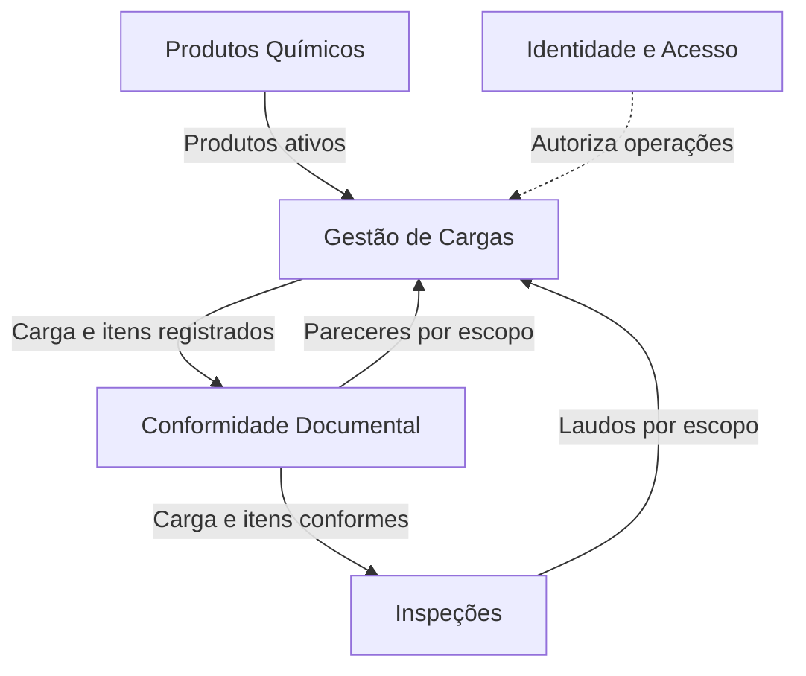
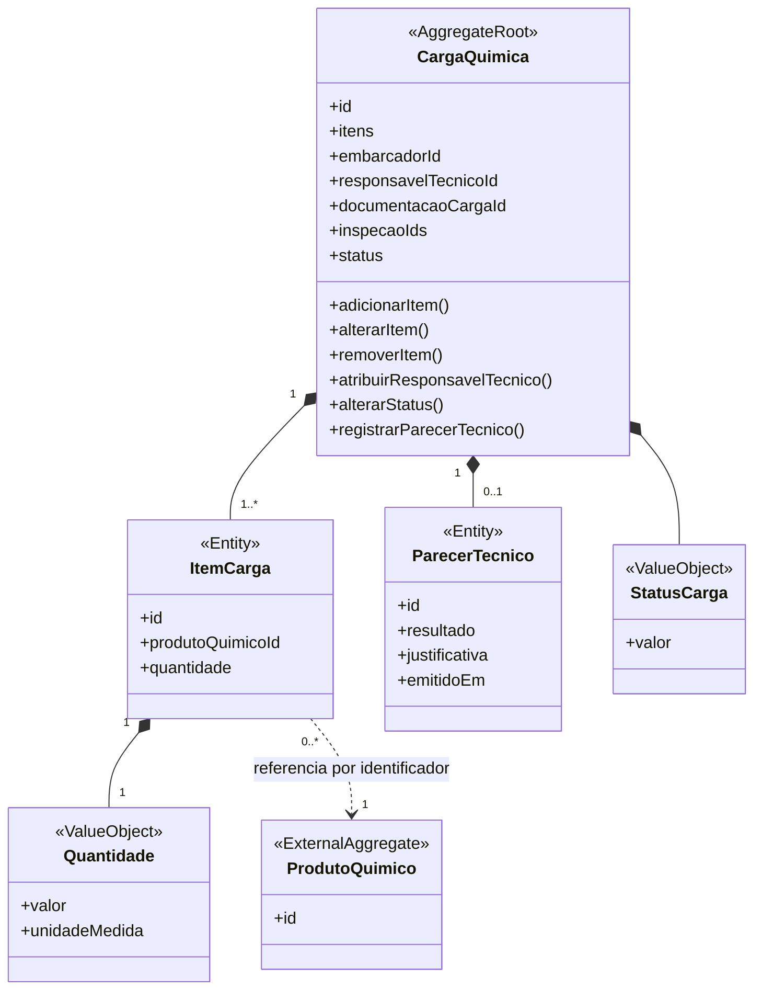
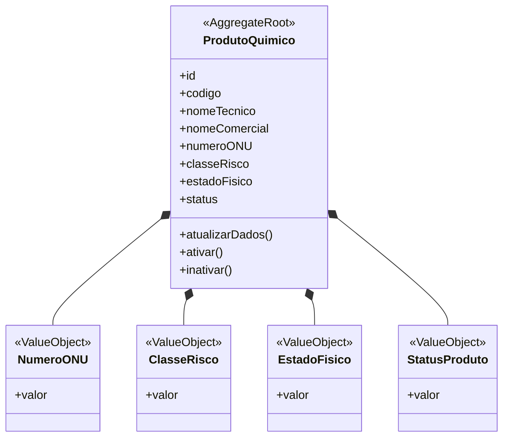
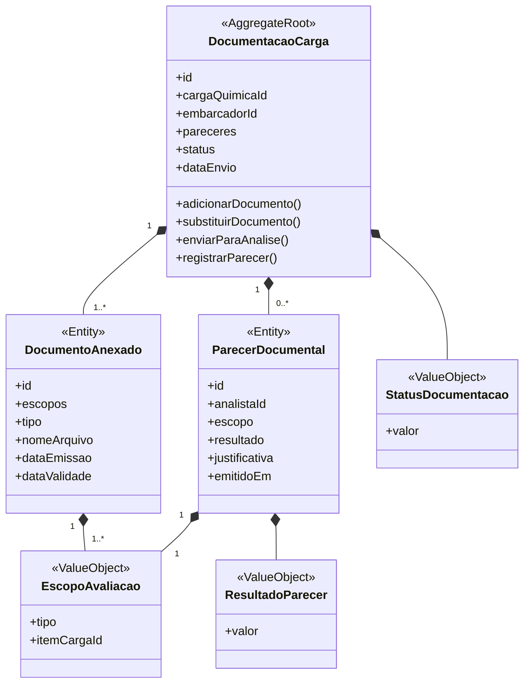
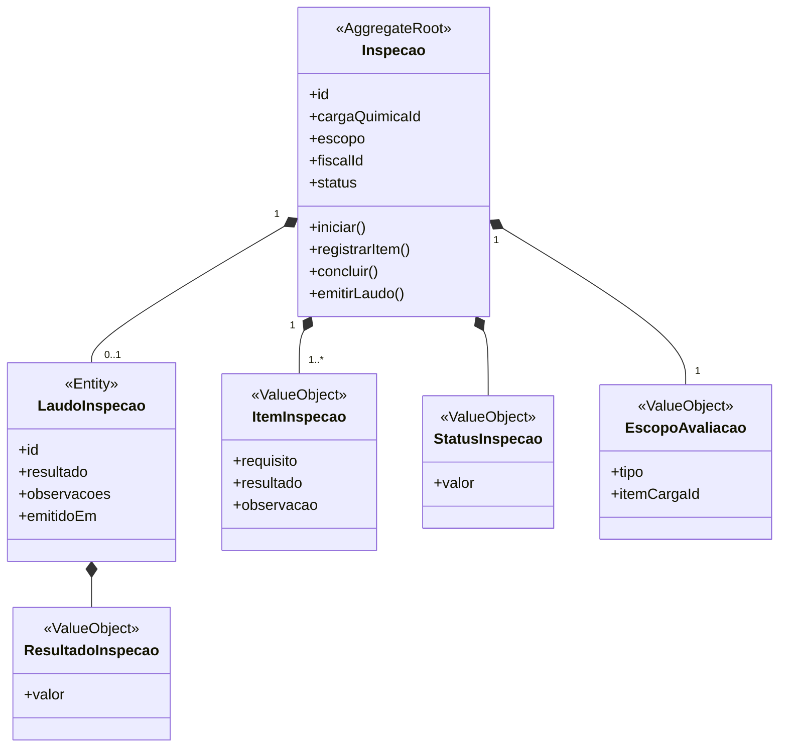
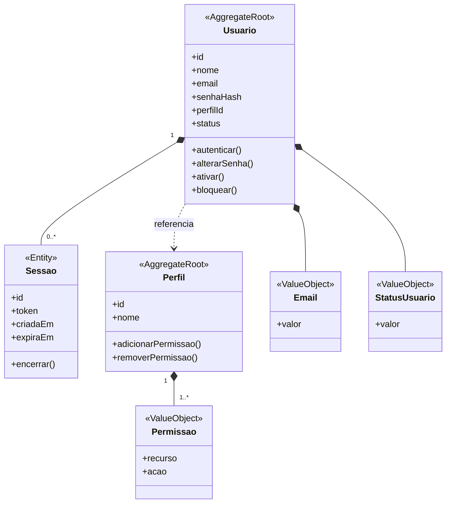

# Modelagem com Domain-Driven Design

A modelagem com **Domain-Driven Design (DDD)** organiza o Quimovia a partir dos conceitos e das responsabilidades do negócio. Nesta seção são apresentados os **contextos**, as **entidades**, os **agregados** e os **objetos de valor** que compõem o domínio.

## Contextos

O domínio foi dividido em **cinco contextos**, cada um responsável por uma parte específica do processo:

| Contexto | Responsabilidade |
|---|---|
| **Gestão de Cargas** | Controlar o registro, a composição, o acompanhamento e o ciclo de vida das cargas químicas. |
| **Produtos Químicos** | Manter o catálogo de produtos e suas características de risco. |
| **Conformidade Documental** | Controlar documentos e pareceres referentes à carga e aos produtos que a compõem. |
| **Inspeções** | Controlar as inspeções da carga e de seus produtos, com os respectivos laudos. |
| **Identidade e Acesso** | Gerenciar usuários, autenticação, perfis e permissões. |

A **Gestão de Cargas** utiliza o catálogo de **Produtos Químicos** para compor as cargas e recebe os resultados de **Conformidade Documental** e **Inspeções**, identificando se cada avaliação se refere à carga ou a um produto nela contido. O contexto **Identidade e Acesso** atende os demais contextos, garantindo que cada operação seja executada somente por usuários autorizados.

## Entidades

As entidades representam elementos que possuem identidade própria e permanecem reconhecíveis durante seu ciclo de vida.

| Entidade | Contexto | Responsabilidade |
|---|---|---|
| **Carga Química** | Gestão de Cargas | Representar o conjunto transportado, sua composição e seu ciclo de vida. |
| **Item da Carga** | Gestão de Cargas | Identificar um produto dentro da carga, com sua quantidade e unidade de medida. |
| **Parecer Técnico** | Gestão de Cargas | Registrar a avaliação final da carga, considerando os resultados do conjunto e de seus itens. |
| **Produto Químico** | Produtos Químicos | Representar um produto cadastrado e suas características. |
| **Documentação da Carga** | Conformidade Documental | Reunir os documentos e pareceres referentes à carga e a seus itens. |
| **Documento Anexado** | Conformidade Documental | Representar um arquivo enviado pelo embarcador, identificando sua aplicação à carga ou a seus itens. |
| **Parecer Documental** | Conformidade Documental | Registrar o resultado da análise da carga ou de um item identificado. |
| **Inspeção** | Inspeções | Representar a avaliação física da carga como conjunto ou do produto de um item identificado. |
| **Laudo de Inspeção** | Inspeções | Registrar os resultados e as observações da inspeção. |
| **Usuário** | Identidade e Acesso | Representar uma pessoa cadastrada no sistema. |
| **Sessão** | Identidade e Acesso | Representar um acesso autenticado com validade definida. |
| **Perfil** | Identidade e Acesso | Reunir as permissões correspondentes a uma função. |

O **Embarcador**, o **Analista**, o **Fiscal**, o **Responsável Técnico**, o **Operador Portuário**, o **Gestor Operacional** e o **Administrador do Sistema** são representados por usuários associados aos respectivos perfis. Dessa forma, essas funções não precisam ser modeladas como entidades independentes.

## Agregados

Os agregados reúnem entidades e objetos de valor que precisam permanecer consistentes durante uma operação. Cada agregado possui uma **raiz**, responsável por controlar as alterações em seus elementos internos.

| Agregado | Raiz | Elementos internos | Referências externas |
|---|---|---|---|
| **Carga Química** | Carga Química | Itens da Carga, Quantidade de cada item, Parecer Técnico e Status da Carga. | Produtos, usuários, documentação e inspeções. |
| **Produto Químico** | Produto Químico | Número ONU, Classe de Risco, Estado Físico e Status do Produto. | Usuários autorizados. |
| **Documentação da Carga** | Documentação da Carga | Documentos Anexados, Pareceres Documentais, Escopo da Avaliação, Status da Documentação e Resultado do Parecer. | Carga, itens da carga, embarcador e analista. |
| **Inspeção** | Inspeção | Laudo de Inspeção, Itens de Inspeção, Escopo da Avaliação, Status e Resultado da Inspeção. | Carga, item avaliado quando aplicável e fiscal. |
| **Usuário** | Usuário | Sessões, E-mail e Status do Usuário. | Perfil. |
| **Perfil** | Perfil | Permissões. | Usuários associados. |

Os agregados pertencentes a outros contextos devem ser relacionados por identificadores, sem serem incorporados como elementos internos. A **Carga Química** controla seus **Itens da Carga**, e cada item referencia um produto do catálogo. Produtos, documentação, inspeções e usuários permanecem fora do agregado da carga.

Essa separação preserva os limites de cada contexto e evita que a Carga Química se torne um agregado excessivamente grande e acoplado.

### Carga Química

A carga reúne **um ou mais itens**, que podem referenciar o mesmo produto ou produtos de tipos diferentes. Cada item possui identidade e quantidade próprias; assim, duas ocorrências do mesmo produto podem ser identificadas separadamente nas avaliações.

A **Quantidade** pertence ao item, não à carga inteira. O **Produto Químico** continua sendo um cadastro independente: sua presença em várias cargas ou itens não exige duplicar esse cadastro.

### Produto Químico

### Documentação da Carga

A **Documentação da Carga** reúne os arquivos e os pareceres relativos ao conjunto e aos produtos transportados. Cada parecer identifica seu alvo, e um mesmo arquivo pode ser vinculado aos diferentes alvos aos quais se aplica.

O **Escopo da Avaliação** identifica a carga inteira (`CARGA`, sem item) ou o produto de um item específico (`ITEM_CARGA`, com `itemCargaId`). A carga de referência é identificada pela Documentação da Carga ou pela Inspeção à qual esse escopo pertence.

### Inspeção

Uma carga pode possuir **diversas inspeções**, tanto do conjunto quanto de seus produtos. Cada inspeção registra seu escopo, e os produtos avaliados são identificados pelo **Item da Carga**, evitando confusão quando o mesmo produto aparece mais de uma vez.

O **Item da Carga** representa um produto transportado; o **Item de Inspeção** representa um requisito verificado. O laudo se refere ao mesmo escopo da inspeção que o originou.

### Identidade e Acesso

## Objetos de valor

Os objetos de valor representam características definidas por seus dados e não possuem identidade própria.

| Objeto de Valor | Contexto | Responsabilidade |
|---|---|---|
| **Status da Carga** | Gestão de Cargas | Representar a etapa atual da carga. |
| **Quantidade** | Gestão de Cargas | Representar a quantidade e a unidade de medida de cada Item da Carga. |
| **Número ONU** | Produtos Químicos | Representar o código internacional de identificação do produto. |
| **Classe de Risco** | Produtos Químicos | Representar os perigos associados ao produto. |
| **Estado Físico** | Produtos Químicos | Indicar se o produto é sólido, líquido ou gasoso. |
| **Status do Produto** | Produtos Químicos | Indicar a situação atual do cadastro do produto. |
| **Status da Documentação** | Conformidade Documental | Representar a etapa atual da análise documental. |
| **Resultado do Parecer** | Conformidade Documental | Indicar se a documentação está conforme ou possui pendências. |
| **Escopo da Avaliação** | Conformidade Documental e Inspeções | Identificar se o documento, parecer ou inspeção se refere à carga inteira ou ao produto de um item específico. |
| **Item de Inspeção** | Inspeções | Representar um requisito verificado durante a inspeção. |
| **Status da Inspeção** | Inspeções | Representar a etapa atual da inspeção. |
| **Resultado da Inspeção** | Inspeções | Indicar o resultado obtido após as verificações. |
| **E-mail** | Identidade e Acesso | Representar e validar o endereço eletrônico do usuário. |
| **Status do Usuário** | Identidade e Acesso | Indicar se o usuário está ativo, inativo ou bloqueado. |
| **Permissão** | Identidade e Acesso | Representar uma ação autorizada sobre um recurso. |

As regras associadas a esses elementos serão apresentadas no tópico **Regras de negócio**, evitando duplicação entre os documentos.

## Linguagem Ubíqua

Os termos abaixo formam o vocabulário adotado pelo projeto e devem ser utilizados com o mesmo significado em toda a documentação e, futuramente, no código.

| Termo | Significado no projeto |
|---|---|
| **Produto Químico** | Substância associada a uma carga e que determina requisitos como classificação de risco, documentos e inspeções. |
| **Carga Química** | Mercadoria que contém produtos químicos e será submetida ao fluxo de análise antes de sua movimentação no porto. |
| **Classificação de Risco** | Classificação dos perigos associados ao produto químico, utilizada para definir os requisitos aplicáveis. |
| **Documentação da Carga** | Conjunto de documentos enviados pelo embarcador para análise. |
| **Documento Obrigatório** | Tipo de documento exigido para determinado produto químico ou operação. |
| **Documento Anexado** | Arquivo enviado para atender a um documento obrigatório. |
| **Parecer Documental** | Resultado da análise da documentação, indicando conformidade ou pendências. |
| **Inspeção** | Verificação realizada sobre a carga para avaliar o atendimento aos requisitos definidos. |
| **Laudo de Inspeção** | Registro dos resultados e das observações obtidos durante a inspeção. |
| **Parecer Técnico** | Avaliação emitida pelo responsável técnico com base nos resultados documentais e de inspeção. |
| **Pendência** | Requisito documental, técnico ou operacional ainda não atendido e que pode impedir o avanço da carga. |
| **Status da Carga** | Estado atual da carga dentro do fluxo operacional. |
| **Movimentação da Carga** | Ação operacional permitida após o atendimento dos requisitos e o registro da decisão técnica. |
| **Registro de Auditoria** | Histórico de uma ação relevante, contendo seu responsável e o momento em que foi realizada. |