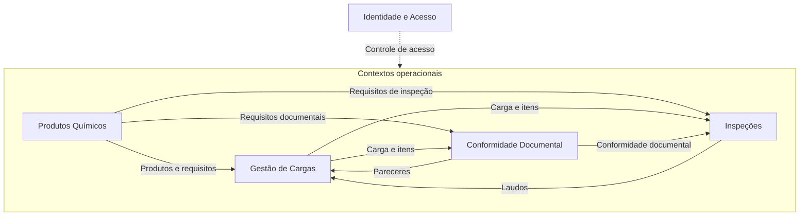
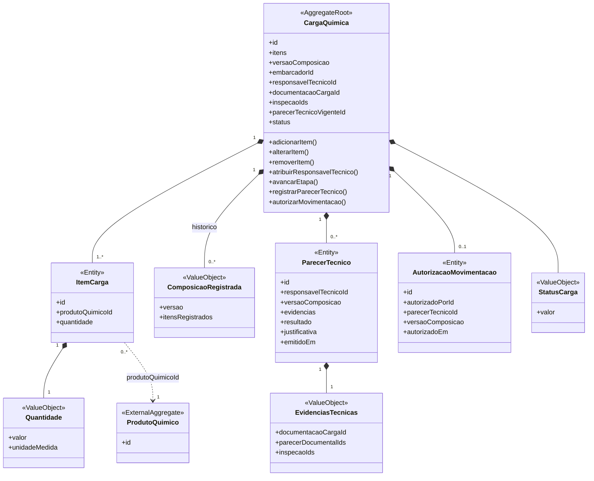
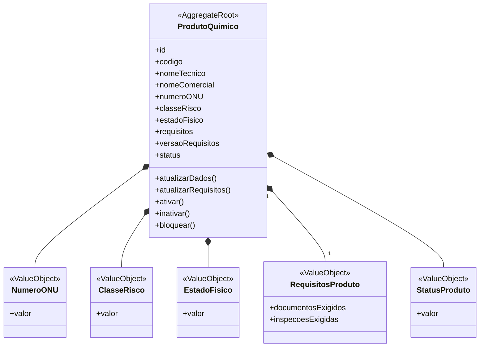
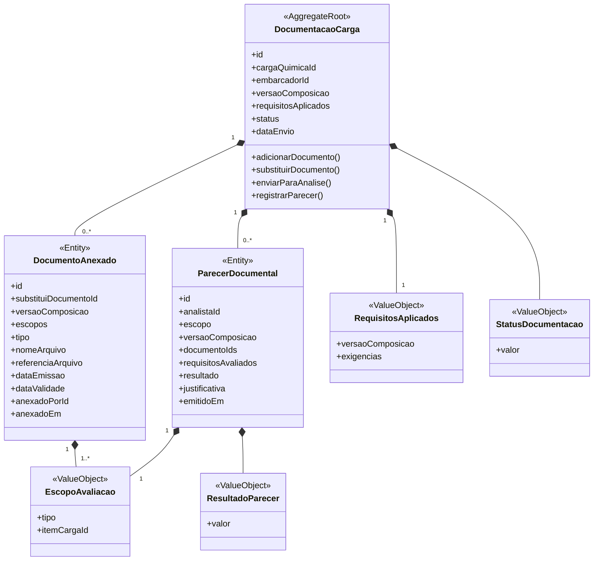
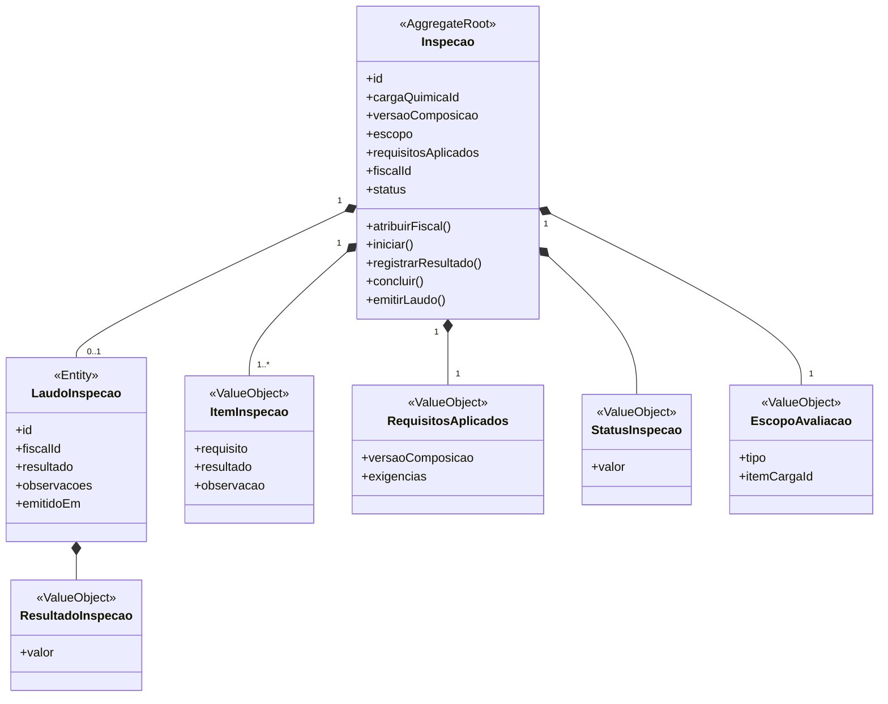
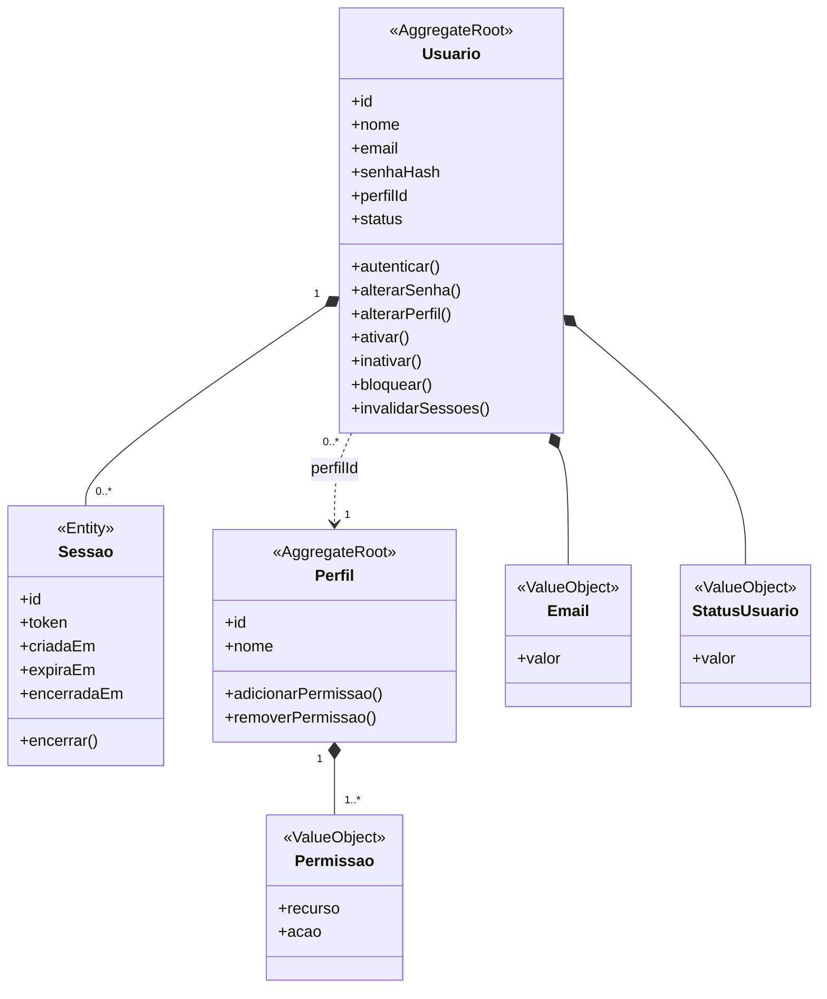

# Modelagem com Domain-Driven Design

A modelagem com **Domain-Driven Design (DDD)** organiza o Quimovia a partir dos conceitos e das responsabilidades do negócio. Esta seção apresenta os **contextos**, as **entidades**, os **agregados** e os **objetos de valor**, utilizando a composição da carga por itens estabelecida no entendimento do domínio.

Os diagramas destacam os dados e as operações essenciais da **modelagem proposta**; não representam um esquema de banco de dados nem uma implementação concluída. As condições de execução e as permissões serão detalhadas nos tópicos de regras de negócio e casos de uso.

## Contextos

O domínio está organizado em **cinco contextos**, com responsabilidades complementares:

| Contexto | Responsabilidade |
|---|---|
| **Gestão de Cargas** | Controlar o registro, a composição e o ciclo de vida da carga, incluindo pareceres técnicos e autorizações de movimentação. |
| **Produtos Químicos** | Manter o catálogo, as características dos produtos e os requisitos documentais e de inspeção associados. |
| **Conformidade Documental** | Controlar arquivos, exigências documentais aplicadas e pareceres referentes à carga inteira ou a itens específicos. |
| **Inspeções** | Controlar as verificações da carga e de seus itens, com escopos, responsáveis e laudos identificados. |
| **Identidade e Acesso** | Gerenciar usuários, autenticação, sessões, perfis e permissões utilizados pelos demais contextos. |

A **Gestão de Cargas** utiliza o catálogo para compor a carga e recebe os resultados documentais e de inspeção que apoiam a decisão técnica. Os requisitos do catálogo orientam as avaliações, mas os resultados pertencem à **carga ou ao item avaliado**, não ao cadastro genérico do produto.

As setas representam **informações utilizadas entre contextos**, não uma sequência de execução ou transações de banco de dados. Identidade e Acesso atende a todos os contextos operacionais. Esses limites organizam o domínio e **não implicam a criação de microsserviços**.

## Entidades

As entidades possuem identidade própria e permanecem reconhecíveis ao longo de seu ciclo de vida. Um parecer, por exemplo, continua identificável mesmo depois da emissão de uma nova avaliação.

| Entidade | Contexto | Responsabilidade |
|---|---|---|
| **Carga Química** | Gestão de Cargas | Identificar a carga, sua composição atual e sua situação no fluxo. |
| **Item de Carga** | Gestão de Cargas | Identificar uma ocorrência de produto na carga, com quantidade e unidade próprias. |
| **Parecer Técnico** | Gestão de Cargas | Registrar a decisão técnica, seu autor, a composição avaliada e as evidências consideradas. |
| **Autorização de Movimentação** | Gestão de Cargas | Registrar a liberação operacional, distinguindo-a do parecer técnico que a fundamentou. |
| **Produto Químico** | Produtos Químicos | Identificar um produto do catálogo, suas características e seus requisitos. |
| **Documentação da Carga** | Conformidade Documental | Reunir os arquivos, os requisitos aplicados e os pareceres documentais de uma carga. |
| **Documento Anexado** | Conformidade Documental | Identificar uma versão de arquivo enviada e os escopos que ela atende. |
| **Parecer Documental** | Conformidade Documental | Registrar o resultado documental de um escopo e quais documentos foram analisados. |
| **Inspeção** | Inspeções | Identificar uma verificação da carga inteira ou de um item específico. |
| **Laudo de Inspeção** | Inspeções | Registrar a conclusão da inspeção e a autoria do fiscal que a emitiu. |
| **Usuário** | Identidade e Acesso | Identificar uma pessoa cadastrada, seu perfil e sua situação de acesso. |
| **Sessão** | Identidade e Acesso | Identificar um acesso autenticado, com início, expiração e encerramento. |
| **Perfil** | Identidade e Acesso | Identificar uma função e reunir suas permissões. |

**Embarcador, Analista, Fiscal, Responsável Técnico, Operador Portuário, Gestor Operacional e Administrador do Sistema** são papéis desempenhados por usuários, e não entidades adicionais. O vínculo do profissional com uma carga ou inspeção é identificado no contexto responsável pela operação.

## Agregados

Cada agregado reúne elementos cuja consistência é controlada por uma **raiz**. As alterações em suas entidades e objetos de valor internos passam pelas operações dessa raiz, que preserva as condições do domínio. [Referência sobre invariantes e agregados](https://learn.microsoft.com/en-us/dotnet/architecture/microservices/microservice-ddd-cqrs-patterns/domain-model-layer-validations).

| Agregado | Raiz | Elementos internos | Referências externas |
|---|---|---|---|
| **Carga Química** | Carga Química | Itens, quantidades, composições registradas, pareceres técnicos, evidências referenciadas, autorização de movimentação e status. | Produtos, usuários, documentação e inspeções. |
| **Produto Químico** | Produto Químico | Número ONU, classe de risco, estado físico, requisitos do produto e status. | Autoria das alterações vinculada a usuários na auditoria. |
| **Documentação da Carga** | Documentação da Carga | Arquivos, pareceres documentais, requisitos aplicados, escopos, resultados e status. | Carga, itens identificados por meio da carga, embarcador e analistas. |
| **Inspeção** | Inspeção | Itens de inspeção, requisitos aplicados, escopo, laudo, resultado e status. | Carga, item quando aplicável e fiscal. |
| **Usuário** | Usuário | Sessões, e-mail e status. | Perfil. |
| **Perfil** | Perfil | Permissões. | Associação com usuários por meio de `perfilId`. |

Existem **seis agregados em cinco contextos**, pois Identidade e Acesso contém as raízes independentes **Usuário** e **Perfil**. Uma associação entre contextos utiliza identificadores e informações expostas pelas raízes; não incorpora outro agregado como elemento interno.

Nos diagramas, o **losango preenchido** indica composição, e a **seta tracejada** indica referência externa. As multiplicidades mostram quantos elementos podem existir: `1..*` significa um ou mais; `0..1`, nenhum ou um; `0..*`, nenhum ou vários.

### Carga Química

A **Carga Química** controla seus **Itens de Carga**. Dois itens podem referenciar o mesmo produto do catálogo e continuar distintos, pois cada um possui identidade e quantidade próprias. A quantidade pertence ao item, sem criar um total que some produtos ou unidades incompatíveis.

Para representar a rastreabilidade prevista nos casos de uso, a proposta mantém os **pareceres técnicos anteriores**, identifica o parecer vigente quando houver e preserva as composições substituídas. A **Autorização de Movimentação** representa o registro da liberação operacional já descrita no tópico 1; não cria uma nova etapa ou um novo perfil.

A leitura desse agregado se apoia em três distinções:

- **Composição atual e histórico:** `versaoComposicao` identifica a composição em uso. Antes de uma alteração permitida, seus valores são preservados em uma `ComposicaoRegistrada`, com os identificadores dos itens e produtos e as respectivas quantidades e unidades. A versão não é apenas um contador sem dados recuperáveis.
- **Responsável atual e autor da decisão:** a carga referencia o profissional atribuído no momento; cada parecer conserva seu próprio `responsavelTecnicoId`. Uma troca de responsável não transfere a autoria dos pareceres anteriores.
- **Aprovação e liberação:** o parecer registra a avaliação técnica; a autorização identifica quem permitiu a movimentação e qual parecer e composição fundamentaram essa decisão.

`EvidenciasTecnicas` referencia a documentação e os pareceres considerados, além das inspeções cujos laudos apoiaram a decisão. Esses resultados são consultados por meio das raízes de **Documentação da Carga** e **Inspeção**, sem transferir suas entidades para o agregado da carga. As informações identificadas devem permanecer recuperáveis mesmo depois de novas análises.

O histórico pode conter vários pareceres, mas o vínculo de parecer **vigente** não transforma automaticamente o último resultado em uma aprovação válida para uma composição modificada. A modelagem registra os elementos necessários à verificação; as condições de validade e retomada pertencem ao tópico 3.

A autorização `0..1` representa o fluxo atualmente definido, com uma liberação operacional da carga. Não são presumidos cancelamento dessa autorização ou novos ciclos após a liberação, pois essas situações ainda dependem de decisão do grupo.

### Produto Químico

O **Produto Químico** permanece independente das cargas que o utilizam. Além de suas características, ele mantém os **requisitos documentais e de inspeção**, cobrindo o cadastro previsto no UC-01.

Cada exigência informa **o tipo de documento ou inspeção e sua aplicação à carga ou ao item**. No catálogo, essa aplicação é uma definição geral: ainda não existe vínculo com um `itemCargaId` concreto.

Ao preparar as avaliações, os contextos responsáveis registram os **requisitos efetivamente aplicados**, incluindo o escopo concreto, a origem e os valores utilizados. Para exigências provenientes do catálogo, a origem inclui o produto e sua versão de requisitos. Assim, uma atualização do produto não reescreve o que foi exigido ou avaliado anteriormente.

A definição de exigências específicas da operação, bem como a combinação de requisitos de vários produtos para a carga inteira, deve ser detalhada nas regras de negócio. O modelo não presume que produtos diferentes tenham requisitos iguais ou que uma mesma exigência precise gerar arquivos duplicados.

### Documentação da Carga

A **Documentação da Carga** reúne os arquivos e os pareceres relativos a uma carga. Cada parecer possui **um escopo**, enquanto um arquivo pode atender a **mais de um escopo explicitamente identificado**.

A multiplicidade `0..*` de documentos contempla a **preparação da documentação antes do primeiro envio**; não significa que uma carga possa avançar sem os arquivos exigidos. Cada registro identifica a composição à qual seus escopos se referem. Cada substituição gera um novo registro de arquivo, relacionado ao anterior por `substituiDocumentoId`, sem reutilizar seu identificador para um conteúdo diferente.

O parecer conserva os identificadores das versões de arquivos analisadas, a composição correspondente e uma cópia dos requisitos avaliados. Os requisitos atuais da documentação podem mudar em uma correção permitida, mas **não alteram o conteúdo dos pareceres anteriores**. Arquivos e registros substituídos permanecem recuperáveis.

O **Escopo da Avaliação** utiliza `CARGA`, sem item, ou `ITEM_CARGA`, com `itemCargaId`. A carga é identificada pelo agregado ao qual o escopo pertence. No histórico, o item deve ser interpretado na composição registrada na avaliação, mesmo que já não integre a composição atual.

### Inspeção

Cada **Inspeção** identifica uma carga, **um único escopo**, a composição avaliada e o Fiscal responsável. Uma carga pode ter várias inspeções, inclusive sobre itens que referenciam o mesmo produto.

O **Item de Carga** identifica uma parte da composição; o **Item de Inspeção** representa um requisito verificado. Durante a execução, o registro de um resultado substitui o valor correspondente sob controle da raiz, sem transformar o item de inspeção em uma entidade com ciclo de vida próprio.

Após a emissão do laudo, o escopo, os requisitos e os resultados que o fundamentam permanecem preservados. O `fiscalId` do laudo registra sua **autoria histórica**, não apenas a atribuição atual da inspeção. Uma nova verificação após a conclusão é representada por **outra inspeção**, preservando o laudo anterior.

O método de atribuição representa a capacidade de vincular um Fiscal, mas **não decide quem pode realizar essa atribuição**. A preparação da inspeção e seus perfis autorizados continuam entre as definições pendentes dos casos de uso.

### Identidade e Acesso

**Usuário** e **Perfil** são raízes distintas: alterar as permissões de um perfil não exige incorporar todos os usuários a esse agregado. Cada usuário referencia um perfil; a atribuição a uma carga ou inspeção é mantida no respectivo contexto operacional.

O encerramento da sessão é representado explicitamente, além de sua expiração. A invalidação das sessões por inativação ou bloqueio do usuário pode ser registrada pelo mesmo encerramento, sem depender apenas do prazo de validade.

O perfil informa as permissões por **recurso e ação**; o contexto operacional verifica também a relação do usuário com o registro solicitado. Assim, possuir perfil técnico não equivale a ser o Responsável Técnico atribuído a qualquer carga. As verificações utilizam a situação e as permissões vigentes, não apenas as existentes no momento do login.

## Objetos de valor

Os objetos de valor são definidos por seus dados, **sem identidade própria**, e são tratados como **imutáveis**. Uma alteração produz um novo valor, aplicado pela raiz responsável, em vez de modificar internamente o objeto existente. [Referência sobre objetos de valor](https://learn.microsoft.com/en-us/dotnet/architecture/microservices/microservice-ddd-cqrs-patterns/implement-value-objects).

| Objeto de valor | Contexto | Responsabilidade |
|---|---|---|
| **Status da Carga** | Gestão de Cargas | Representar a etapa atual da carga, sem permitir uma alteração arbitrária do fluxo. |
| **Quantidade** | Gestão de Cargas | Reunir valor e unidade de medida de um Item de Carga. |
| **Composição Registrada** | Gestão de Cargas | Preservar os valores de uma composição anterior, com sua versão, itens, produtos e quantidades. |
| **Evidências Técnicas** | Gestão de Cargas | Registrar as referências da documentação, dos pareceres documentais e das inspeções considerados em um parecer técnico. |
| **Número ONU** | Produtos Químicos | Representar o número de identificação adotado para o produto no modelo. |
| **Classe de Risco** | Produtos Químicos | Representar a classificação dos perigos associados ao produto. |
| **Estado Físico** | Produtos Químicos | Representar o estado físico informado no cadastro. |
| **Requisitos do Produto** | Produtos Químicos | Reunir exigências documentais e de inspeção, com sua aplicação à carga ou ao item. |
| **Status do Produto** | Produtos Químicos | Representar a situação do cadastro, distinta do status das cargas que o referenciam. |
| **Requisitos Aplicados** | Conformidade Documental e Inspeções | Preservar as exigências utilizadas na avaliação, seus escopos concretos, origens e versão da composição. |
| **Status da Documentação** | Conformidade Documental | Representar a etapa da análise documental. |
| **Resultado do Parecer** | Conformidade Documental | Representar a conclusão documental registrada pelo Analista. |
| **Escopo da Avaliação** | Conformidade Documental e Inspeções | Identificar a carga inteira ou um item específico, dentro da carga de referência. |
| **Item de Inspeção** | Inspeções | Reunir um requisito, seu resultado e a observação correspondente. |
| **Status da Inspeção** | Inspeções | Representar a etapa atual de uma inspeção. |
| **Resultado da Inspeção** | Inspeções | Representar a conclusão registrada no laudo. |
| **E-mail** | Identidade e Acesso | Representar o endereço eletrônico do usuário. |
| **Status do Usuário** | Identidade e Acesso | Representar a situação de acesso da conta. |
| **Permissão** | Identidade e Acesso | Representar uma ação autorizada sobre um recurso. |

**Requisitos Aplicados** e **Escopo da Avaliação** expressam informações utilizadas em mais de um contexto. Essa equivalência conceitual não obriga o compartilhamento de uma mesma classe entre módulos; cada contexto mantém sua representação e protege seus próprios registros.

As regras detalhadas desses elementos pertencem às [Regras de negócio](./03-regras-de-negócio.md), e as ações que os utilizam estão nos [Casos de uso](./04-casos-de-uso.md). Os registros históricos descritos nesta modelagem complementam a auditoria das operações, sem incorporar todo o histórico dos outros contextos ao agregado da carga.

> **Revisão dos glossários:** a seção abaixo foi preservada da versão analisada da `develop`. Sua atualização ocorrerá depois do alinhamento de todos os textos, conforme o planejamento combinado.

## Linguagem Ubíqua

Os termos abaixo formam o vocabulário adotado pelo projeto e devem ser utilizados com o mesmo significado em toda a documentação e, futuramente, no código.

| Termo | Significado no projeto |
|---|---|
| **Produto Químico** | Substância associada a uma carga e que determina requisitos como classificação de risco, documentos e inspeções. |
| **Carga Química** | Mercadoria que contém produtos químicos e será submetida ao fluxo de análise antes de sua movimentação no porto. |
| **Classificação de Risco** | Classificação dos perigos associados ao produto químico, utilizada para definir os requisitos aplicáveis. |
| **Documentação da Carga** | Conjunto de documentos enviados pelo embarcador para análise. |
| **Documento Obrigatório** | Tipo de documento exigido para determinado produto químico ou operação. |
| **Documento Anexado** | Arquivo enviado para atender a um documento obrigatório. |
| **Parecer Documental** | Resultado da análise da documentação, indicando conformidade ou pendências. |
| **Inspeção** | Verificação realizada sobre a carga para avaliar o atendimento aos requisitos definidos. |
| **Laudo de Inspeção** | Registro dos resultados e das observações obtidos durante a inspeção. |
| **Parecer Técnico** | Avaliação emitida pelo responsável técnico com base nos resultados documentais e de inspeção. |
| **Pendência** | Requisito documental, técnico ou operacional ainda não atendido e que pode impedir o avanço da carga. |
| **Status da Carga** | Estado atual da carga dentro do fluxo operacional. |
| **Movimentação da Carga** | Ação operacional permitida após o atendimento dos requisitos e o registro da decisão técnica. |
| **Registro de Auditoria** | Histórico de uma ação relevante, contendo seu responsável e o momento em que foi realizada. |
