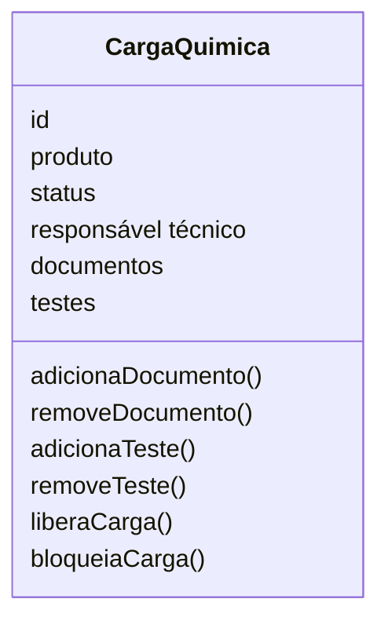
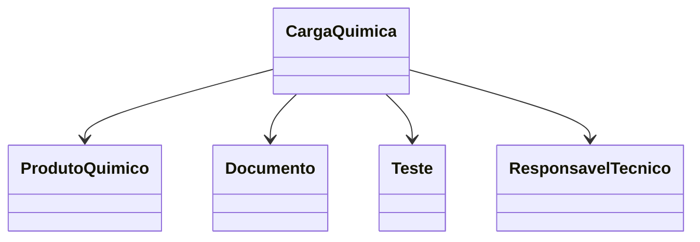
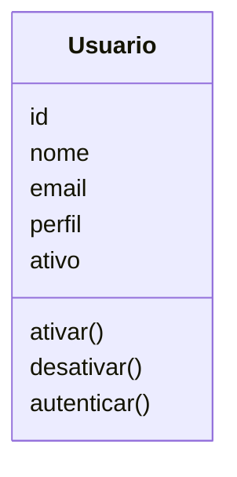
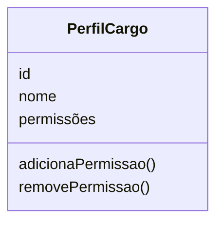
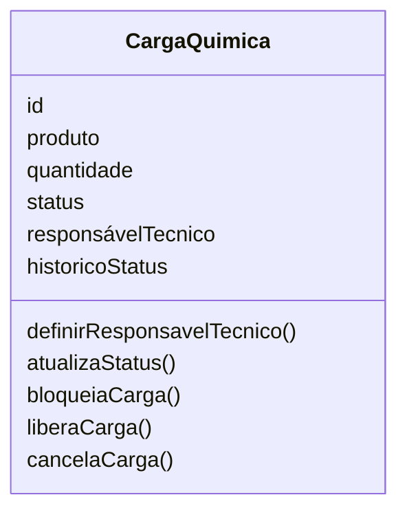
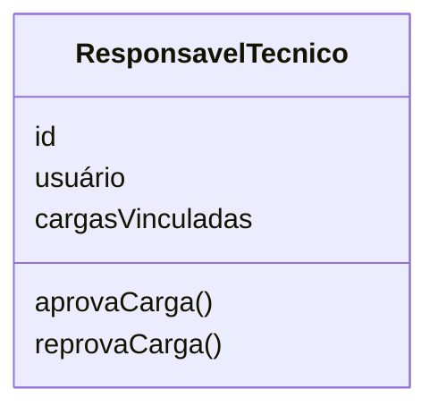
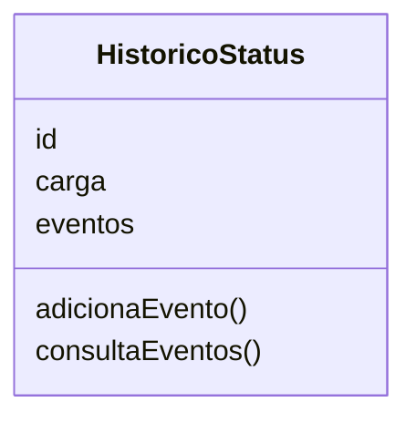
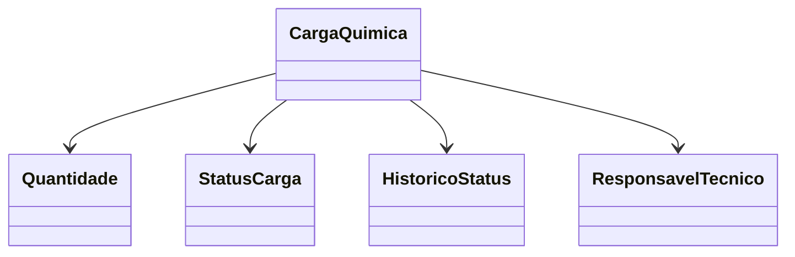
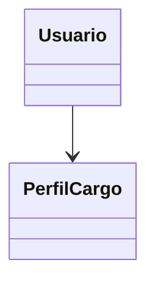

# Modelagem com Domain Driven Design
Nesse documento, vamos apresentar as entidades, objetos de valor, agregados, linguagem ubíqua.

## Entidades

### Carga Química:
**Responsabilidade:** Representar uma carga química que será transportada no porto, contendo informações sobre o produto químico, documentações e testes apresentados, status da carga e responsável técnico.

**Atributos:**
- id: Identificador único da carga química.
- produto: Produto químico associado à carga.
- status: Status atual da carga química (em análise, aprovado, reprovado)
- responsável técnico: Usuário responsável pela aprovação ou reprovação da carga química.



**Relacionamentos:**
- Possui um Produto Químico.
- Possui um Responsável Técnico.
- Possui um ou mais Documentos.
- Possui zero ou mais Testes.

**Regras:**
- Uma carga química deve ter um produto químico associado.
- Uma carga química deve ter um status definido.
- Uma carga química deve ter um responsável técnico definido.


## Objetos de Valor:
### Status da Carga:

**Responsabilidade:** Representar o estado atual de uma carga química durante seu ciclo de vida dentro do processo portuário.

O Status da Carga é um Objeto de Valor, pois não possui identidade própria e existe apenas para representar a situação atual da carga. Ele é utilizado para controlar o fluxo operacional e garantir que apenas transições de status válidas sejam realizadas.

**Valores possíveis:**
```typescript
enum StatusCarga {
    EM_ANALISE,
    APROVADA,
    REPROVADA,
    BLOQUEADA,
    LIBERADA
}
```

**Regras:**
- Toda carga deve possuir um Status definido.
- O Status da Carga deve ser alterado apenas por meio da entidade Carga Química.
- A carga deve seguir apenas transições de status permitidas pelas regras de negócio.

## Agregados

### Agregado Carga Química
A Carga Química é a raiz do agregado (Aggregate Root) e concentra todas as regras de negócio relacionadas ao processo de transporte de uma carga química no ambiente portuário.

Ela é responsável por garantir a consistência das informações e controlar todas as alterações realizadas em seus elementos internos. Nenhuma entidade pertencente ao agregado deve ser modificada diretamente sem passar pela entidade Carga Química, preservando as regras de negócio do domínio.

O agregado é composto pelos seguintes elementos:
- Carga Química (Aggregate Root)
- Produto Químico (Entidade)
- Documentos (Entidade)
- Testes (Entidade)
- Responsável Técnico (Entidade)



### Regras protegidas pelo agregado

O agregado Carga Química garante que:

- Toda carga possua um Produto Químico associado.
- Toda carga possua um Responsável Técnico definido.
- A documentação obrigatória esteja vinculada à carga.
- Os testes sejam registrados antes da aprovação, quando necessários.
- O status da carga siga apenas transições válidas.
- Apenas cargas que atendam às regras de negócio possam ser aprovadas ou liberadas.

## Linguagem Ubíqua
Na tabela abaixo esta listado os termos e significados que serão utilizados no projeto, com o objetivo de criar uma linguagem comum entre todos os envolvidos no projeto e aos leitores, garantindo que todos compreendam os termos e conceitos utilizados no sistema.

| Termo | Significado |
|-------|-------------|
| Produto Químico | Substância química que será transportada no porto, podendo ser perigosa ou não, e que possui documentações e testes de segurança obrigatórias. |
| Carga Química | Mercadoria contendo produtos químicos que será transportada no porto, após apresentações das documentações e testes de segurança obrigatórios dessa carga será decidido a liberação ou não da carga. |
| Classificação de Risco | Avaliação do risco associado a cada carga química, considerando fatores como toxicidade, inflamabilidade, reatividade e outros. |
| Documentação Obrigatória | Conjunto de documentos que devem ser apresentados para cada carga química, incluindo certificados de análise, fichas de segurança, autorizações e outros. |
| Testes de Qualidade e Segurança | Conjunto de testes que devem ser realizados em cada carga química para garantir que ela atende aos padrões de qualidade e segurança exigidos pelas regulamentações. |
| Status da Carga | Indicação do estado atual da carga química, podendo ser "Em Análise", "Aprovado", "Reprovado" ou outros status definidos pelo sistema. |
| Usuário | Pessoa que interage com o sistema, podendo ter diferentes perfis e permissões de acesso, como Operador Portuário, Embarcador, Analista, Fiscal, Administrador do Sistema e Gestor Operacional. |
| Operador Portuário | Usuário responsável pelo acompanhamento das cargas químicas no porto, alterando status, validando documentos e testes de qualidade e segurança, garantindo que todas as informações estejam corretas e atualizadas. |
| Embarcador | Usuário externo responsável pela chegada das novas cargas químicas no porto, ele irá registrar as cargas e produtos da carga, além de enviar a documentação e testes de qualidade e segurança obrigatórios para cada carga. | 
| Analista | Responsável por analisar as documentações obrigatórias de cargas químicas, e registros de documentações obrigatórias por produto. |
| Fiscal | Responsável por testes de qualidade e segurança das cargas químicas, também responsável por cadastrar os testes de qualidade e segurança obrigatórios para cada produto químico. |
| Administrador do Sistema | Usuário responsável por gerenciar os usuários e perfis do sistema, garantindo que cada usuário tenha as permissões corretas de acordo com seu perfil. |
| Gestor Operacional | Usuário responsável por acompanhar e gerenciar o status das cargas químicas, e também responsável pela auditoria do sistema, garantindo que todas as informações estejam corretas e atualizadas. |
| Responsável Técnico | Usuário responsável pelo cadastro de novos produtos químicos, documentações obrigatórias e testes de qualidade e segurança obrigatórios para cada produto químico, e também responsável pela aprovação ou reprovação de cargas químicas. |


-----------------------------------------------------------------------------

# Domínio: Usuários e Operações

## Entidades

### Usuário:
**Responsabilidade:** Representar uma pessoa cadastrada no sistema, com um papel (perfil) definido, responsável por controlar quem pode agir sobre as cargas químicas e demais operações do domínio.

**Atributos:**
- id: Identificador único do usuário.
- nome: Nome do usuário.
- email: E-mail único do usuário.
- perfil: Perfil/Cargo associado, que define suas permissões.
- ativo: Indica se o usuário está ativo e pode agir no sistema.



**Relacionamentos:**
- Possui um Perfil/Cargo.
- Pode estar vinculado a uma ou mais Cargas Químicas como Responsável Técnico.

**Regras:**
- Um usuário deve ter um e-mail único.
- Um usuário deve ter um perfil definido.
- Somente um usuário ativo pode agir no sistema.

### Perfil / Cargo:
**Responsabilidade:** Definir o conjunto de permissões e ações que um usuário pode executar dentro do sistema, de acordo com sua função (Operador Portuário, Embarcador/Motorista, Responsável Técnico, Gestor Operacional ou Administrador do Sistema).

**Atributos:**
- id: Identificador único do perfil.
- nome: Nome do perfil (ex.: Operador Portuário, Gestor Operacional).
- permissões: Conjunto de ações permitidas para esse perfil.



**Regras:**
- Todo perfil deve ter um nome definido.
- Um perfil deve possuir ao menos uma permissão associada.

### Carga Química:
**Responsabilidade:** Peça central do domínio: representar uma remessa registrada no porto, contendo o produto associado, a quantidade, o status atual e o responsável técnico vinculado.

**Atributos:**
- id: Identificador único da carga.
- produto: Produto associado à carga.
- quantidade: Quantidade da carga, com sua unidade de medida.
- status: Status atual da carga química.
- responsávelTecnico: Usuário responsável pela aprovação ou reprovação da carga.
- historicoStatus: Histórico de mudanças de status da carga.



**Relacionamentos:**
- Possui um Produto associado.
- Possui uma Quantidade.
- Possui um Responsável Técnico.
- Possui um Histórico de Status.

**Regras:**
- Uma carga não pode ser registrada sem um produto associado.
- A quantidade da carga precisa ser maior que zero.
- Toda carga precisa ter um responsável técnico definido.
- Uma carga bloqueada não pode ser movimentada.
- Uma carga cancelada não pode ser liberada.
- O status muda em uma ordem definida — não é possível pular etapas.

### Responsável Técnico:
**Responsabilidade:** Representar o profissional vinculado a uma ou mais cargas químicas, responsável por aprovar ou reprovar a liberação delas.

**Atributos:**
- id: Identificador único do responsável técnico.
- usuário: Usuário vinculado a este responsável técnico.
- cargasVinculadas: Cargas químicas sob sua responsabilidade.



**Relacionamentos:**
- Está vinculado a um Usuário.
- Está vinculado a uma ou mais Cargas Químicas.

**Regras:**
- Um Responsável Técnico deve estar vinculado a um usuário ativo.
- Somente o Responsável Técnico vinculado pode aprovar ou reprovar a liberação de uma carga.

### Histórico de Status:
**Responsabilidade:** Registrar cada mudança de status ocorrida em uma carga química, guardando quem realizou a mudança e por quê, garantindo a rastreabilidade do processo.

**Atributos:**
- id: Identificador único do histórico.
- carga: Carga química associada.
- eventos: Lista de Eventos de Histórico registrados.



**Relacionamentos:**
- Pertence a uma Carga Química.
- Possui um ou mais Eventos de Histórico.

**Regras:**
- Toda mudança de status de uma carga deve gerar um novo Evento de Histórico.
- O Histórico de Status não pode ser alterado diretamente, apenas por meio da Carga Química.

## Objetos de Valor:

### Status da Carga:

**Responsabilidade:** Representar a etapa atual de uma carga química durante seu ciclo de vida dentro do processo portuário.

O Status da Carga é um Objeto de Valor, pois não possui identidade própria e existe apenas para representar a situação atual da carga. Ele é utilizado para controlar o fluxo operacional e garantir que apenas transições de status válidas sejam realizadas.

**Valores possíveis:**
```typescript
enum StatusCarga {
    REGISTRADA,
    AGUARDANDO_DOCUMENTACAO,
    EM_INSPECAO,
    BLOQUEADA,
    LIBERADA,
    EM_MOVIMENTACAO,
    CANCELADA
}
```

**Regras:**
- Toda carga deve possuir um Status definido.
- O Status da Carga deve ser alterado apenas por meio da entidade Carga Química.
- A carga deve seguir apenas transições de status permitidas pelas regras de negócio.
- Uma carga cancelada não pode retornar a nenhum outro status.

### Quantidade:

**Responsabilidade:** Representar o valor da carga junto à sua unidade de medida (ex.: 500 kg, 200 litros).

A Quantidade é um Objeto de Valor, pois duas quantidades com o mesmo valor e unidade de medida são consideradas equivalentes, sem necessidade de identidade própria.

```typescript
class Quantidade {
    valor: number;
    unidadeMedida: string;
}
```

**Regras:**
- O valor da quantidade deve ser maior que zero.
- Toda quantidade deve possuir uma unidade de medida associada.

### Evento de Histórico:

**Responsabilidade:** Representar o registro imutável de uma única mudança de status: de onde veio, para onde foi, quando aconteceu e por quê.

O Evento de Histórico é um Objeto de Valor porque, uma vez criado, não é alterado — apenas armazenado dentro do Histórico de Status.

```typescript
class EventoHistorico {
    statusAnterior: StatusCarga;
    statusNovo: StatusCarga;
    dataHora: Date;
    responsavel: Usuario;
    motivo: string;
}
```

**Regras:**
- Um Evento de Histórico deve registrar o status anterior e o novo status.
- Um Evento de Histórico deve registrar o usuário responsável e a data/hora da mudança.

## Agregados

### Agregado Carga Química
A Carga Química é a raiz do agregado (Aggregate Root) e concentra todas as regras de negócio relacionadas ao ciclo de vida de uma carga química dentro do processo portuário.

Ela é responsável por garantir a consistência das informações e controlar todas as alterações realizadas em seus elementos internos. Nenhum elemento pertencente ao agregado deve ser modificado diretamente sem passar pela entidade Carga Química, preservando as regras de negócio do domínio.

O agregado é composto pelos seguintes elementos:
- Carga Química (Aggregate Root)
- Quantidade (Objeto de Valor)
- Status da Carga (Objeto de Valor)
- Histórico de Status (Entidade)
- Responsável Técnico (Entidade, referenciado)



### Regras protegidas pelo agregado

O agregado Carga Química garante que:

- Toda carga possua um produto associado, com quantidade válida (maior que zero).
- Toda carga possua um Responsável Técnico definido.
- O status da carga siga apenas transições válidas, sem pular etapas.
- Uma carga bloqueada não possa ser movimentada.
- Uma carga cancelada não possa ser liberada ou retornar a um status anterior.
- Toda mudança de status gere um novo Evento de Histórico.

### Agregado Usuário
O Usuário é a raiz de um segundo agregado, responsável por garantir a consistência do cadastro de usuários e seus perfis de acesso — um contexto independente do ciclo de vida das cargas químicas.

O agregado é composto pelos seguintes elementos:
- Usuário (Aggregate Root)
- Perfil/Cargo (Entidade, referenciada)



### Regras protegidas pelo agregado

O agregado Usuário garante que:

- Cada usuário possua um e-mail único no sistema.
- Todo usuário possua um perfil/cargo definido.
- Somente usuários ativos possam realizar ações no sistema.

## Linguagem Ubíqua
Na tabela abaixo esta listado os termos e significados que serão utilizados no projeto, com o objetivo de criar uma linguagem comum entre todos os envolvidos no projeto e aos leitores, garantindo que todos compreendam os termos e conceitos utilizados no sistema.

| Termo | Significado |
|-------|-------------|
| Usuário | Pessoa cadastrada no sistema, com um papel (perfil) definido, que dá acesso a determinadas ações. |
| Perfil / Cargo | Conjunto de permissões que define o que cada usuário pode fazer dentro do sistema. |
| Carga Química | Remessa registrada no porto, contendo produto, quantidade, status atual e responsável técnico vinculado. |
| Responsável Técnico | Profissional vinculado a uma ou mais cargas, responsável por aprovar ou reprovar a liberação delas. |
| Status da Carga | Etapa atual do ciclo de vida da carga, podendo ser "Registrada", "Aguardando Documentação", "Em Inspeção", "Bloqueada", "Liberada", "Em Movimentação" ou "Cancelada". |
| Quantidade | Valor da carga junto com sua unidade de medida (ex.: 500 kg, 200 litros). |
| Histórico de Status | Registro de todas as mudanças de status que uma carga já teve, com quem fez e por quê. |
| Evento de Histórico | Registro individual de uma mudança de status: de onde veio, para onde foi, quando e por quê. |
| Operador Portuário | Usuário responsável pelo acompanhamento das cargas químicas no porto, atualizando o status conforme elas avançam. |
| Embarcador / Motorista | Usuário externo responsável pela chegada de novas cargas químicas no porto, registrando a carga e seus dados no sistema. |
| Gestor Operacional | Usuário responsável por decidir sobre bloqueios, liberações e cancelamentos de cargas, além de acompanhar o status geral das cargas. |
| Administrador do Sistema | Usuário responsável por cadastrar e gerenciar os demais usuários e seus perfis de acesso. |
