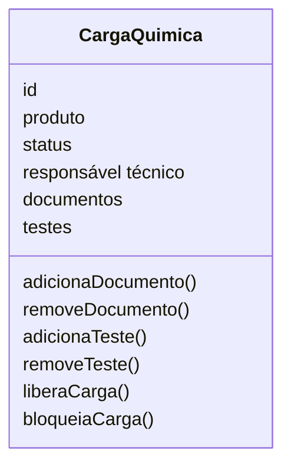
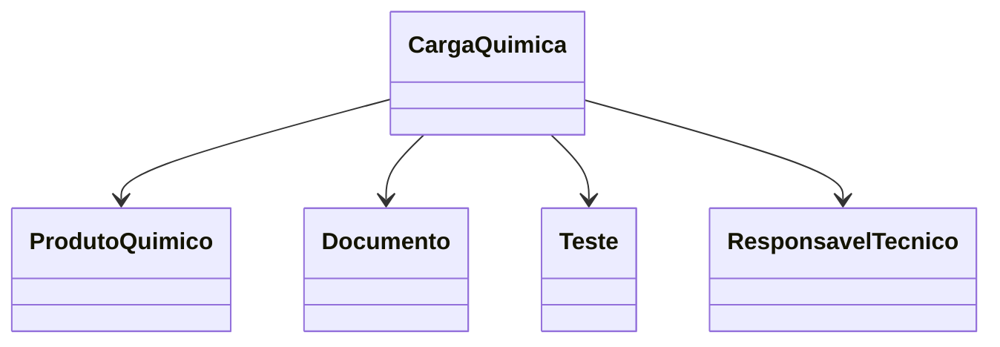

# Modelagem com Domain Driven Design
Nesse documento, vamos apresentar as entidades, objetos de valor, agregados, linguagem ubíqua.

## Entidades

### Carga Química:
**Responsabilidade:** Representar uma carga química que será transportada no porto, contendo informações sobre o produto químico, documentações e testes apresentados, status da carga e responsável técnico.

**Atributos:**
- id: Identificador único da carga química.
- produto: Produto químico associado à carga.
- status: Status atual da carga química (em análise, aprovado, reprovado)
- responsável técnico: Usuário responsável pela aprovação ou reprovação da carga química.



**Relacionamentos:**
- Possui um Produto Químico.
- Possui um Responsável Técnico.
- Possui um ou mais Documentos.
- Possui zero ou mais Testes.

**Regras:**
- Uma carga química deve ter um produto químico associado.
- Uma carga química deve ter um status definido.
- Uma carga química deve ter um responsável técnico definido.


## Objetos de Valor:
### Status da Carga:

**Responsabilidade:** Representar o estado atual de uma carga química durante seu ciclo de vida dentro do processo portuário.

O Status da Carga é um Objeto de Valor, pois não possui identidade própria e existe apenas para representar a situação atual da carga. Ele é utilizado para controlar o fluxo operacional e garantir que apenas transições de status válidas sejam realizadas.

**Valores possíveis:**
```typescript
enum StatusCarga {
    EM_ANALISE,
    APROVADA,
    REPROVADA,
    BLOQUEADA,
    LIBERADA
}
```

**Regras:**
- Toda carga deve possuir um Status definido.
- O Status da Carga deve ser alterado apenas por meio da entidade Carga Química.
- A carga deve seguir apenas transições de status permitidas pelas regras de negócio.

## Agregados

### Agregado Carga Química
A Carga Química é a raiz do agregado (Aggregate Root) e concentra todas as regras de negócio relacionadas ao processo de transporte de uma carga química no ambiente portuário.

Ela é responsável por garantir a consistência das informações e controlar todas as alterações realizadas em seus elementos internos. Nenhuma entidade pertencente ao agregado deve ser modificada diretamente sem passar pela entidade Carga Química, preservando as regras de negócio do domínio.

O agregado é composto pelos seguintes elementos:
- Carga Química (Aggregate Root)
- Produto Químico (Entidade)
- Documentos (Entidade)
- Testes (Entidade)
- Responsável Técnico (Entidade)



### Regras protegidas pelo agregado

O agregado Carga Química garante que:

- Toda carga possua um Produto Químico associado.
- Toda carga possua um Responsável Técnico definido.
- A documentação obrigatória esteja vinculada à carga.
- Os testes sejam registrados antes da aprovação, quando necessários.
- O status da carga siga apenas transições válidas.
- Apenas cargas que atendam às regras de negócio possam ser aprovadas ou liberadas.

## Linguagem Ubíqua
Na tabela abaixo esta listado os termos e significados que serão utilizados no projeto, com o objetivo de criar uma linguagem comum entre todos os envolvidos no projeto e aos leitores, garantindo que todos compreendam os termos e conceitos utilizados no sistema.

| Termo | Significado |
|-------|-------------|
| Produto Químico | Substância química que será transportada no porto, podendo ser perigosa ou não, e que possui documentações e testes de segurança obrigatórias. |
| Carga Química | Mercadoria contendo produtos químicos que será transportada no porto, após apresentações das documentações e testes de segurança obrigatórios dessa carga será decidido a liberação ou não da carga. |
| Classificação de Risco | Avaliação do risco associado a cada carga química, considerando fatores como toxicidade, inflamabilidade, reatividade e outros. |
| Documentação Obrigatória | Conjunto de documentos que devem ser apresentados para cada carga química, incluindo certificados de análise, fichas de segurança, autorizações e outros. |
| Testes de Qualidade e Segurança | Conjunto de testes que devem ser realizados em cada carga química para garantir que ela atende aos padrões de qualidade e segurança exigidos pelas regulamentações. |
| Status da Carga | Indicação do estado atual da carga química, podendo ser "Em Análise", "Aprovado", "Reprovado" ou outros status definidos pelo sistema. |
| Usuário | Pessoa que interage com o sistema, podendo ter diferentes perfis e permissões de acesso, como Operador Portuário, Embarcador, Analista, Fiscal, Administrador do Sistema e Gestor Operacional. |
| Operador Portuário | Usuário responsável pelo acompanhamento das cargas químicas no porto, alterando status, validando documentos e testes de qualidade e segurança, garantindo que todas as informações estejam corretas e atualizadas. |
| Embarcador | Usuário externo responsável pela chegada das novas cargas químicas no porto, ele irá registrar as cargas e produtos da carga, além de enviar a documentação e testes de qualidade e segurança obrigatórios para cada carga. | 
| Analista | Responsável por analisar as documentações obrigatórias de cargas químicas, e registros de documentações obrigatórias por produto. |
| Fiscal | Responsável por testes de qualidade e segurança das cargas químicas, também responsável por cadastrar os testes de qualidade e segurança obrigatórios para cada produto químico. |
| Administrador do Sistema | Usuário responsável por gerenciar os usuários e perfis do sistema, garantindo que cada usuário tenha as permissões corretas de acordo com seu perfil. |
| Gestor Operacional | Usuário responsável por acompanhar e gerenciar o status das cargas químicas, e também responsável pela auditoria do sistema, garantindo que todas as informações estejam corretas e atualizadas. |
| Responsável Técnico | Usuário responsável pelo cadastro de novos produtos químicos, documentações obrigatórias e testes de qualidade e segurança obrigatórios para cada produto químico, e também responsável pela aprovação ou reprovação de cargas químicas. |
