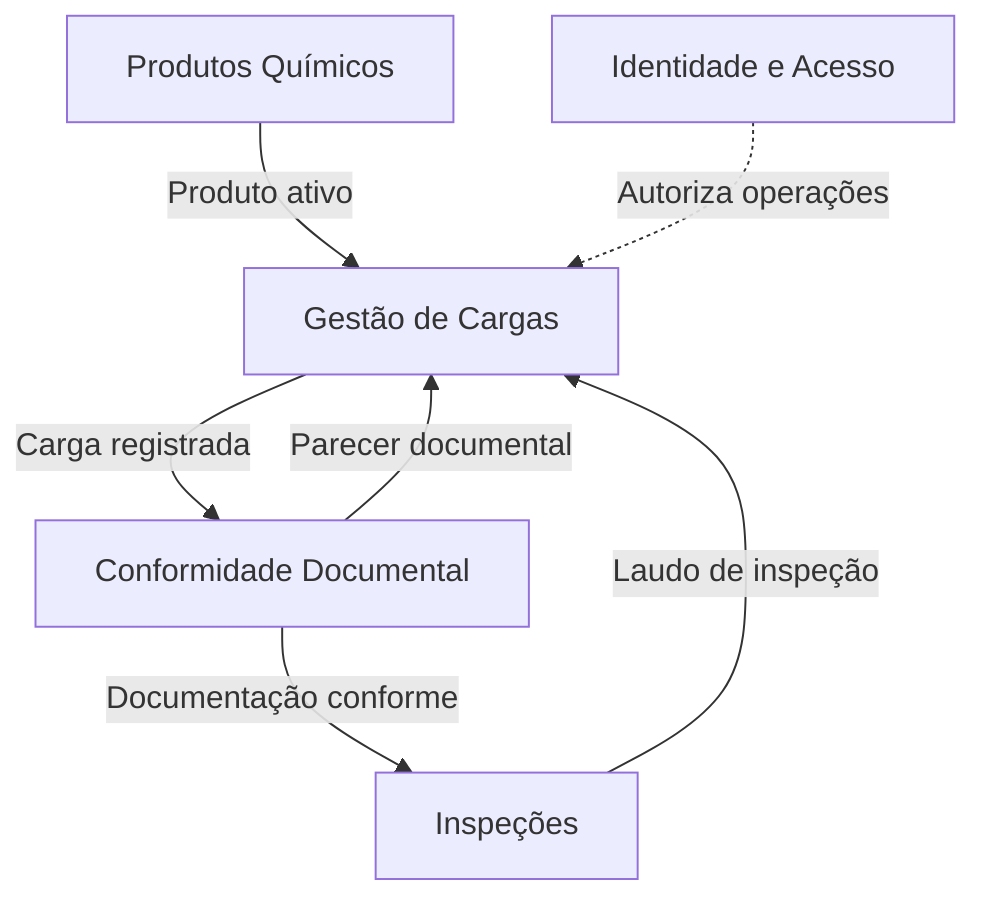
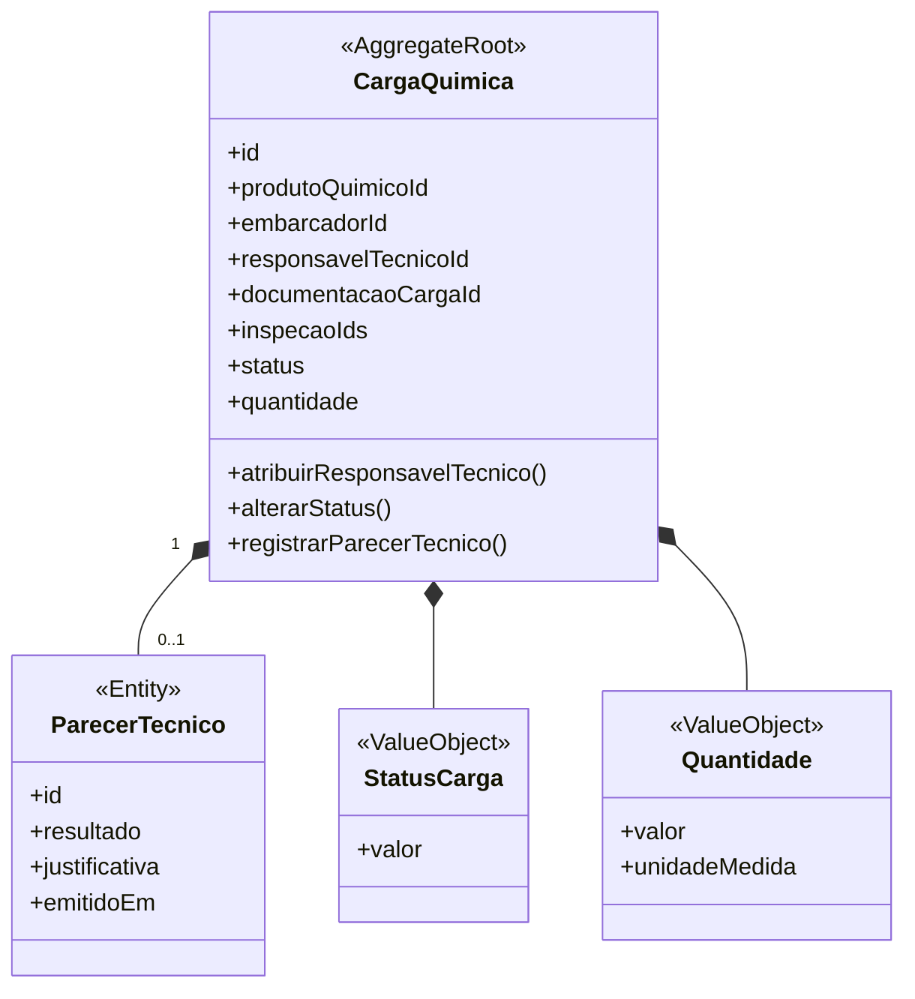
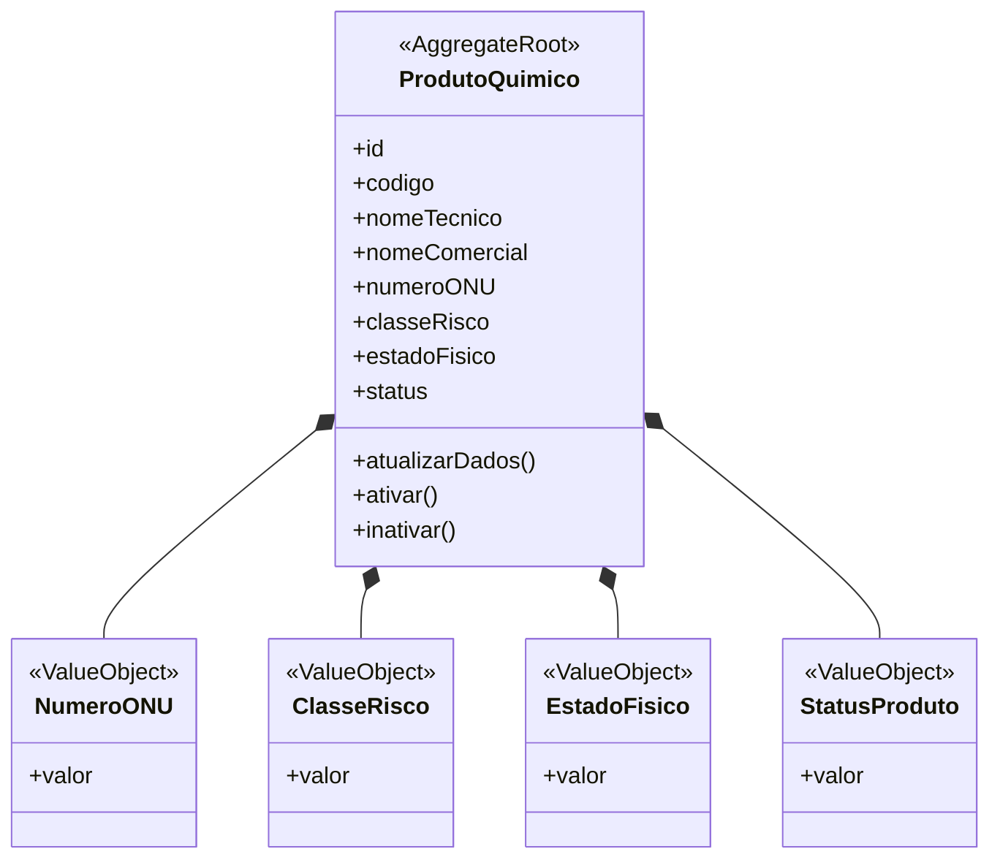
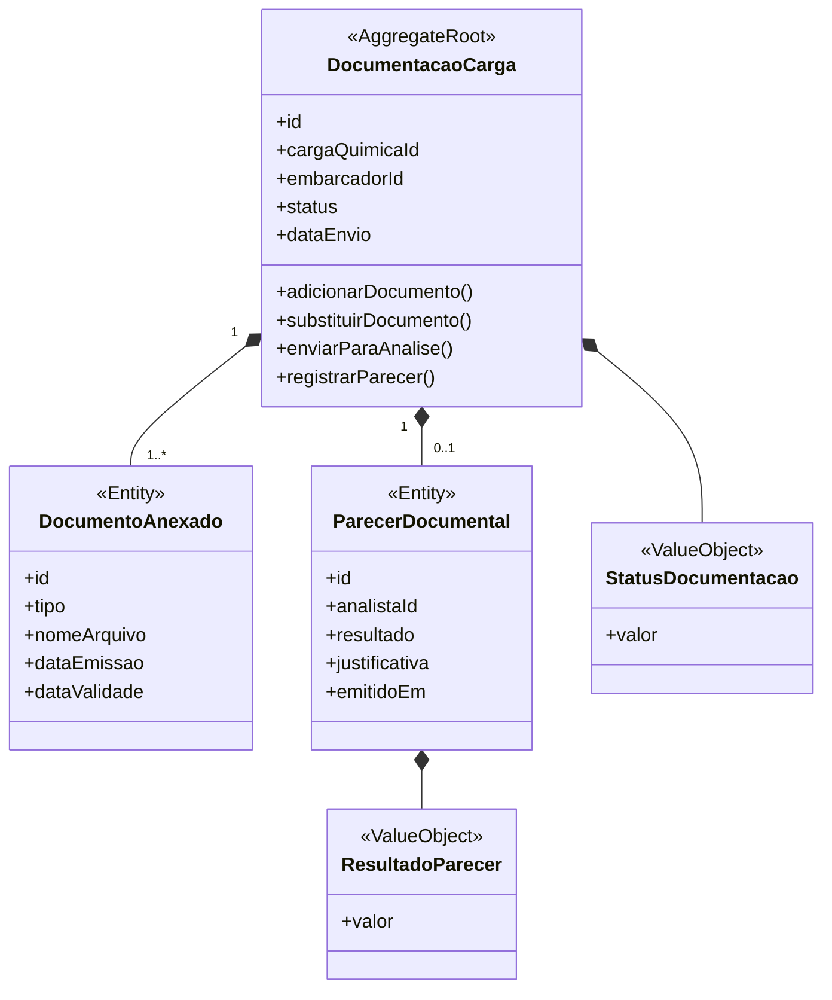
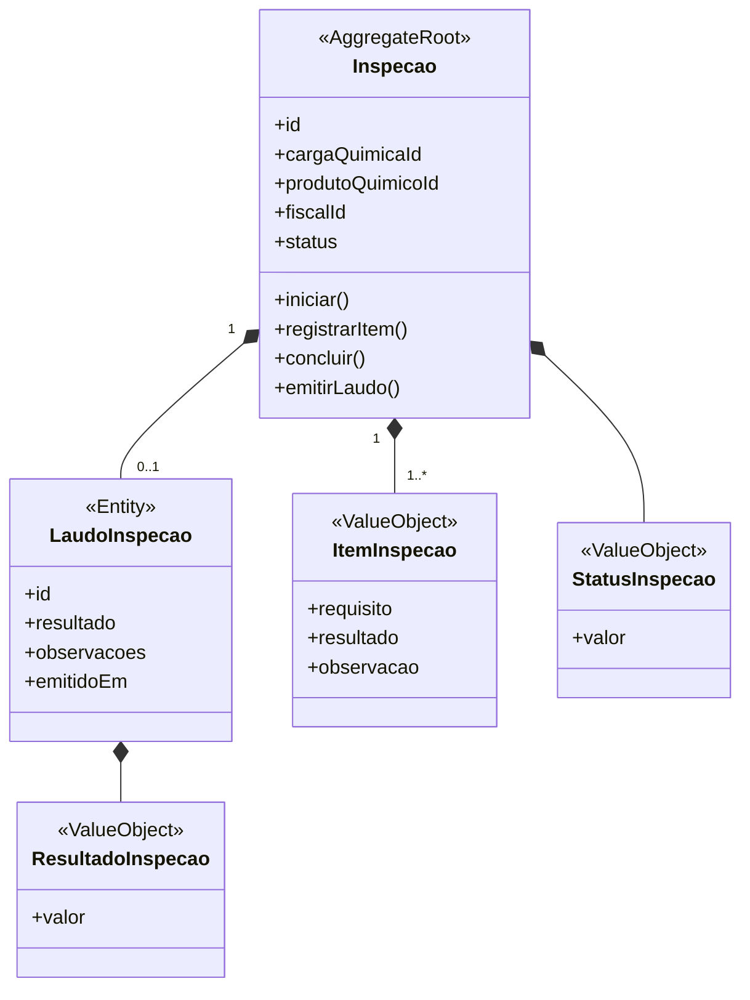
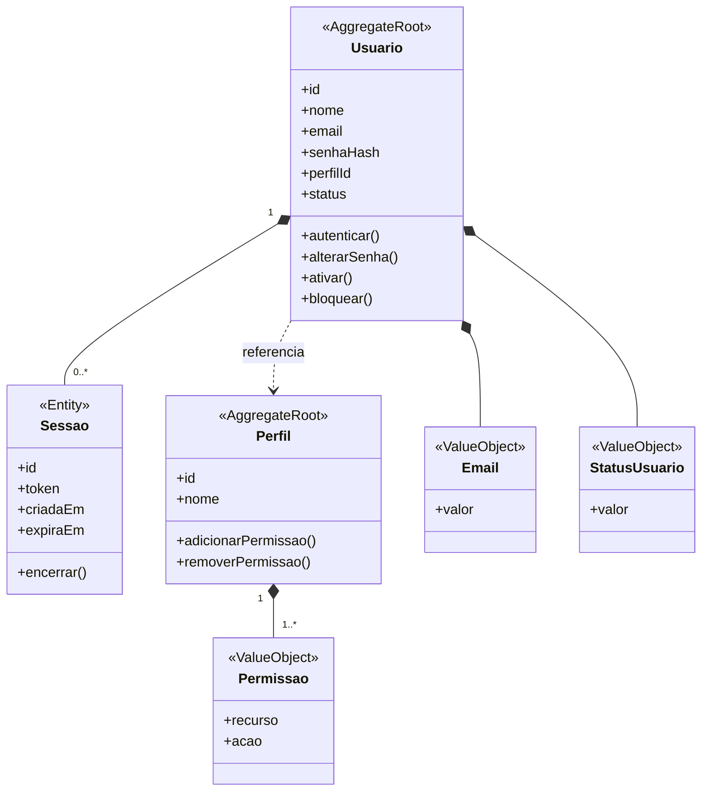

# Modelagem com Domain-Driven Design

A modelagem com **Domain-Driven Design (DDD)** organiza o Quimovia a partir dos conceitos e das responsabilidades do negócio. Nesta seção são apresentados os **contextos**, as **entidades**, os **agregados** e os **objetos de valor** que compõem o domínio.

## Contextos

O domínio foi dividido em **cinco contextos**, cada um responsável por uma parte específica do processo:

| Contexto | Responsabilidade |
|---|---|
| **Gestão de Cargas** | Controlar o registro, o acompanhamento e o ciclo de vida das cargas químicas. |
| **Produtos Químicos** | Manter o catálogo de produtos e suas características de risco. |
| **Conformidade Documental** | Controlar o envio, a análise e o parecer dos documentos da carga. |
| **Inspeções** | Controlar a realização das inspeções e a emissão dos respectivos laudos. |
| **Identidade e Acesso** | Gerenciar usuários, autenticação, perfis e permissões. |

A **Gestão de Cargas** utiliza o cadastro de **Produtos Químicos** e recebe os resultados produzidos por **Conformidade Documental** e **Inspeções**. O contexto **Identidade e Acesso** atende os demais contextos, garantindo que cada operação seja executada somente por usuários autorizados.

## Entidades

As entidades representam elementos que possuem identidade própria e permanecem reconhecíveis durante seu ciclo de vida.

| Entidade | Contexto | Responsabilidade |
|---|---|---|
| **Carga Química** | Gestão de Cargas | Representar a carga e controlar seu ciclo de vida. |
| **Parecer Técnico** | Gestão de Cargas | Registrar a avaliação emitida pelo responsável técnico. |
| **Produto Químico** | Produtos Químicos | Representar um produto cadastrado e suas características. |
| **Documentação da Carga** | Conformidade Documental | Representar o conjunto de documentos vinculados a uma carga. |
| **Documento Anexado** | Conformidade Documental | Representar um arquivo enviado pelo embarcador. |
| **Parecer Documental** | Conformidade Documental | Registrar o resultado da análise realizada pelo analista. |
| **Inspeção** | Inspeções | Representar a avaliação física realizada sobre uma carga. |
| **Laudo de Inspeção** | Inspeções | Registrar os resultados e as observações da inspeção. |
| **Usuário** | Identidade e Acesso | Representar uma pessoa cadastrada no sistema. |
| **Sessão** | Identidade e Acesso | Representar um acesso autenticado com validade definida. |
| **Perfil** | Identidade e Acesso | Reunir as permissões correspondentes a uma função. |

O **Embarcador**, o **Analista**, o **Fiscal**, o **Responsável Técnico**, o **Operador Portuário**, o **Gestor Operacional** e o **Administrador do Sistema** são representados por usuários associados aos respectivos perfis. Dessa forma, essas funções não precisam ser modeladas como entidades independentes.

## Agregados

Os agregados reúnem entidades e objetos de valor que precisam permanecer consistentes durante uma operação. Cada agregado possui uma **raiz**, responsável por controlar as alterações em seus elementos internos.

| Agregado | Raiz | Elementos internos | Referências externas |
|---|---|---|---|
| **Carga Química** | Carga Química | Parecer Técnico, Status da Carga e Quantidade. | Produto, usuários, documentação e inspeções. |
| **Produto Químico** | Produto Químico | Número ONU, Classe de Risco, Estado Físico e Status do Produto. | Usuários autorizados. |
| **Documentação da Carga** | Documentação da Carga | Documentos Anexados, Parecer Documental, Status da Documentação e Resultado do Parecer. | Carga, embarcador e analista. |
| **Inspeção** | Inspeção | Laudo de Inspeção, Itens de Inspeção, Status e Resultado da Inspeção. | Carga, produto e fiscal. |
| **Usuário** | Usuário | Sessões, E-mail e Status do Usuário. | Perfil. |
| **Perfil** | Perfil | Permissões. | Usuários associados. |

Os agregados pertencentes a outros contextos devem ser relacionados por identificadores, sem serem incorporados como elementos internos. Assim, a **Carga Química** referencia produto, documentação, inspeções e usuários, mas não controla diretamente esses elementos.

Essa separação preserva os limites de cada contexto e evita que a Carga Química se torne um agregado excessivamente grande e acoplado.

### Carga Química

Produto, documentação, inspeções e usuários são representados por identificadores e permanecem sob responsabilidade de seus próprios agregados.

### Produto Químico

### Documentação da Carga

### Inspeção

### Identidade e Acesso

## Objetos de valor

Os objetos de valor representam características definidas por seus dados e não possuem identidade própria.

| Objeto de Valor | Contexto | Responsabilidade |
|---|---|---|
| **Status da Carga** | Gestão de Cargas | Representar a etapa atual da carga. |
| **Quantidade** | Gestão de Cargas | Representar a quantidade transportada e sua unidade de medida. |
| **Número ONU** | Produtos Químicos | Representar o código internacional de identificação do produto. |
| **Classe de Risco** | Produtos Químicos | Representar os perigos associados ao produto. |
| **Estado Físico** | Produtos Químicos | Indicar se o produto é sólido, líquido ou gasoso. |
| **Status do Produto** | Produtos Químicos | Indicar a situação atual do cadastro do produto. |
| **Status da Documentação** | Conformidade Documental | Representar a etapa atual da análise documental. |
| **Resultado do Parecer** | Conformidade Documental | Indicar se a documentação está conforme ou possui pendências. |
| **Item de Inspeção** | Inspeções | Representar um requisito verificado durante a inspeção. |
| **Status da Inspeção** | Inspeções | Representar a etapa atual da inspeção. |
| **Resultado da Inspeção** | Inspeções | Indicar o resultado obtido após as verificações. |
| **E-mail** | Identidade e Acesso | Representar e validar o endereço eletrônico do usuário. |
| **Status do Usuário** | Identidade e Acesso | Indicar se o usuário está ativo, inativo ou bloqueado. |
| **Permissão** | Identidade e Acesso | Representar uma ação autorizada sobre um recurso. |

As regras associadas a esses elementos serão apresentadas no tópico **Regras de negócio**, evitando duplicação entre os documentos.
