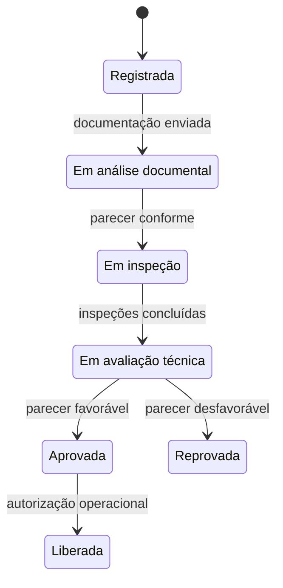

# Regras de negócio

As regras de negócio definem as **restrições e os comportamentos que orientam o Quimovia**, independentemente da interface ou da tecnologia utilizada. Elas estão organizadas de acordo com os contextos apresentados na modelagem com DDD.

## Regras gerais

Cada operação deve ser executada por um usuário **autenticado, ativo e autorizado**. Pareceres e laudos são de responsabilidade dos profissionais competentes: o sistema valida informações e registra decisões, mas **não substitui a avaliação humana**.

Durante todo o fluxo, devem ser respeitadas duas condições:

- **Tratamento de pendências:** documentos, inspeções e outros requisitos obrigatórios pendentes devem ser tratados antes do avanço da carga.
- **Preservação do histórico:** informações que fundamentaram análises ou decisões não podem ser excluídas. Correções exigem um novo registro ou uma nova versão.

## Produtos Químicos

O cadastro de um **Produto Químico** somente pode ser concluído quando atender aos seguintes requisitos:

| Informação | Regra de preenchimento |
|---|---|
| **Código e nome técnico** | Ambos são obrigatórios, e o código deve ser único. |
| **Número ONU e Classe de Risco** | Ambos são obrigatórios e devem estar em formatos reconhecidos pelo domínio. |
| **Estado Físico e status** | Ambos devem estar definidos. |

Somente produtos com status **Ativo** podem ser associados a novas cargas. A inativação ou o bloqueio impede novas associações, mas preserva os vínculos com cargas já registradas.

Os **requisitos do produto** determinam os documentos e as inspeções exigidos para a carga. Alterações nesses requisitos ou na classificação de risco devem ser auditadas e não podem modificar retroativamente análises já concluídas.

## Gestão de Cargas

O registro de uma **Carga Química** exige um produto químico ativo, um embarcador e uma quantidade maior que zero, acompanhada de sua unidade de medida. No modelo atual, cada carga corresponde a **um único produto**; operações com produtos diferentes devem ser representadas por cargas distintas.

O **Responsável Técnico** deve ser atribuído antes do início da avaliação técnica. Depois de iniciado o fluxo, a carga não deve ser excluída: quando necessário, seu processamento deve ser cancelado ou bloqueado, preservando o histórico.

### Fluxo de status

O status representa a etapa atual da carga. Sua alteração depende do atendimento às condições da próxima etapa, sem ignorar etapas ou executá-las fora de ordem. O diagrama apresenta o fluxo principal:

As situações abaixo complementam o fluxo principal:

| Situação | Comportamento exigido |
|---|---|
| **Bloqueio** | Pode ocorrer durante o processamento diante de irregularidade, risco ou pendência impeditiva. Deve registrar o motivo e a etapa em que ocorreu. |
| **Desbloqueio** | Exige o tratamento da causa e o retorno à etapa adequada para reavaliação. |
| **Retorno de uma carga reprovada** | Exige a correção das pendências e autorização para uma nova avaliação. |
| **Carga liberada** | Deve permanecer disponível para consulta e auditoria, com todo o histórico que fundamentou a decisão. |

## Conformidade Documental

A **Documentação da Carga** pertence a uma única carga e reúne os documentos obrigatórios definidos para o produto associado. Apenas o **embarcador responsável** pode adicionar ou substituir arquivos, antes do envio para análise ou durante uma etapa formal de correção.

O tratamento da documentação deve respeitar as seguintes regras:

- **Envio:** todos os documentos obrigatórios devem estar anexados antes do envio para análise.
- **Análise:** a documentação permanece bloqueada para alterações. Apenas o **Analista** pode emitir o parecer, com resultado, data de emissão e identificação do responsável.
- **Resultado:** um parecer **Conforme** permite seguir para inspeção; um parecer **Não Conforme** exige justificativa e identificação das pendências.

Quando houver correções, a documentação deve ser enviada novamente e passar por uma nova análise. O parecer anterior permanece preservado, sem ser substituído pelo novo resultado.

## Inspeções

Cada **Inspeção** deve identificar a carga, o produto avaliado e o fiscal responsável. Seu início depende da conformidade documental, e apenas o **Fiscal responsável** pode registrar os resultados dos itens avaliados e emitir o laudo.

A conclusão e o registro dos resultados devem atender a estas condições:

- Todos os **itens obrigatórios** devem ser avaliados antes da conclusão da inspeção.
- O **Laudo de Inspeção** somente pode ser emitido após a conclusão, com resultado, data de emissão e identificação do fiscal.
- Um resultado **Não Conforme** deve descrever as irregularidades e impedir o avanço da carga até seu tratamento.
- Todas as inspeções obrigatórias devem estar concluídas antes do início da **avaliação técnica**.

O laudo emitido **não pode ser alterado**. Quando for necessária uma nova verificação, deve ser registrada uma nova inspeção ou reinspeção, preservando o resultado anterior.

## Avaliação técnica e movimentação

Apenas o **Responsável Técnico atribuído à carga** pode emitir o Parecer Técnico, após a conclusão da análise documental e de todas as inspeções obrigatórias. A avaliação deve considerar o Parecer Documental, os Laudos de Inspeção e as pendências registradas, sem alterar os resultados produzidos por outros profissionais.

O parecer deve conter **resultado, data de emissão e identificação do responsável**. Um resultado desfavorável exige justificativa. A decisão técnica e a autorização operacional produzem efeitos diferentes:

| Decisão | Condições necessárias | Efeito sobre a carga |
|---|---|---|
| **Aprovação técnica** | Documentação conforme, inspeções obrigatórias concluídas sem impedimentos e parecer técnico favorável. | A carga fica **Aprovada**, mas ainda não está autorizada para movimentação. |
| **Reprovação técnica** | Parecer técnico desfavorável, acompanhado de justificativa. | A carga fica **Reprovada** e depende das condições de reavaliação para retornar ao fluxo. |
| **Liberação operacional** | Carga aprovada, sem bloqueios ou pendências, e autorização do usuário habilitado para a operação portuária. | A carga fica **Liberada** para movimentação. A liberação deve ser registrada separadamente do parecer técnico. |

## Identidade e Acesso

Cada **Usuário** deve possuir nome, e-mail único, status e **um único perfil** associado à sua função. Cada perfil deve ter nome único e ao menos uma permissão, sem duplicar combinações de recurso e ação.

O acesso ao sistema deve respeitar as seguintes restrições:

- Somente usuários **Ativos** podem autenticar-se e iniciar sessões.
- Usuários **inativos ou bloqueados** não podem executar operações, e suas sessões vigentes devem perder a validade.
- Toda sessão deve possuir prazo de expiração e não pode ser reutilizada após seu encerramento ou vencimento.

Apenas o **Administrador do Sistema** pode cadastrar usuários, alterar seus status e gerenciar perfis e permissões. Mudanças de perfil ou permissão devem produzir efeito nas próximas operações autorizadas pelo sistema.

## Auditoria

Cada **Registro de Auditoria** deve identificar o usuário, a data e hora, a operação realizada e o elemento afetado. Nas alterações de status, devem constar os valores anterior e atual, além da justificativa quando exigida.

Devem gerar registros de auditoria:

- **mudanças cadastrais relevantes** e alterações de status;
- **emissões de pareceres e laudos**;
- **bloqueios, desbloqueios, reprovações e liberações**.

Os registros devem permanecer vinculados à carga, ao produto, ao documento, à inspeção ou ao usuário que originou a ação. Os usuários do fluxo operacional **não podem alterá-los ou excluí-los**.
