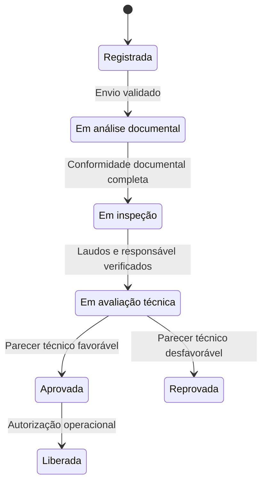

# Regras de negócio

As regras de negócio definem as **restrições e os comportamentos que orientam o Quimovia**, independentemente da interface ou da tecnologia utilizada. Este documento estabelece as condições de cadastro, avaliação, avanço e preservação do histórico de uma carga composta por **um ou mais itens**, com produtos iguais ou diferentes.

A estrutura dos elementos está na [Modelagem com DDD](./02-modelagem-com-ddd.md); as ações dos atores serão detalhadas nos [Casos de uso](./04-casos-de-uso.md). Os identificadores das regras permitem referenciá-las nesses documentos e nos testes, sem reproduzir seu conteúdo. As decisões ainda abertas estão reunidas ao final.

## Regras gerais

**RN-GER-01 — Acesso autorizado.** As operações sobre cargas, produtos, documentos, inspeções e cadastros de acesso exigem usuário **autenticado, ativo e autorizado** para a ação e o registro solicitado. Permissão de consulta não autoriza alteração, emissão de parecer ou liberação. A autenticação é a etapa que estabelece a sessão, conforme as regras de Identidade e Acesso.

**RN-GER-02 — Decisão humana.** Pareceres, laudos e autorizações são decisões dos profissionais habilitados para cada ação. O sistema verifica as condições, registra as decisões e aplica seus efeitos ao fluxo, mas **não emite avaliações técnicas por conta própria**.

Durante todo o processo, devem ser respeitados dois cuidados:

- **RN-GER-03 — Pendências:** um requisito obrigatório não atendido impede o avanço que depende dele. Isso não impede as ações autorizadas de correção nem significa, por si só, que foi registrado um bloqueio formal.
- **RN-GER-04 — Histórico:** informações que fundamentaram uma avaliação ou decisão devem permanecer recuperáveis. Correções geram novos registros ou versões, sem apagar os dados, os resultados e a autoria anteriores.

## Produtos Químicos

**RN-PRO-01 — Cadastro válido.** O cadastro deve atender às condições abaixo. O nome comercial é complementar e não substitui a identificação técnica.

| Informação | Condição de cadastro |
|---|---|
| **Código e nome técnico** | São obrigatórios, e o código deve ser único no catálogo. |
| **Número ONU e Classe de Risco** | São obrigatórios no recorte acadêmico adotado e devem pertencer aos formatos e valores aceitos pelo domínio. |
| **Estado Físico e status** | Devem estar definidos com valores reconhecidos pelo cadastro. |

**RN-PRO-02 — Situação do produto.** Somente produtos **Ativos** podem receber novas associações a itens, tanto em uma carga nova quanto na inclusão ou troca de produto em uma carga existente. A inativação ou o bloqueio do cadastro impede novas associações, mas **não apaga os vínculos anteriores**. Preservar esses vínculos não garante o avanço das cargas: o efeito da alteração sobre operações em andamento precisa ser avaliado segundo a política aplicável.

**RN-PRO-03 — Requisitos aplicáveis.** Cada exigência documental ou de inspeção deve indicar seu tipo e sua aplicação à **carga inteira ou ao item**. Ao preparar as avaliações, devem ser registrados os requisitos efetivamente exigidos, os escopos concretos e sua origem; quando vierem do catálogo, a origem deve identificar o produto e a versão dos requisitos utilizada.

A composição deve considerar as exigências de **todos os seus produtos**, sem descartar uma delas apenas porque outra possui o mesmo nome. Um documento pode atender a mais de uma exigência, desde que a cobertura seja identificada e validada. Alterações posteriores no catálogo não reescrevem requisitos ou avaliações históricos. Os critérios para combinar exigências e aplicar mudanças às cargas em andamento dependem das definições ao final deste documento.

## Gestão de Cargas

**RN-CAR-01 — Composição válida.** O registro exige um Embarcador e **pelo menos um Item de Carga**. Cada item deve ter identidade própria, referência a um produto do catálogo, **quantidade maior que zero e unidade de medida informada**. O mesmo produto pode aparecer em vários itens; essa repetição não deve ser rejeitada como duplicação do cadastro do produto.

As quantidades permanecem associadas aos itens. Produtos ou unidades diferentes não podem ser somados em um total sem significado para o negócio. Após qualquer edição permitida, a carga deve continuar com pelo menos um item válido.

**RN-CAR-02 — Responsabilidade técnica.** O Responsável Técnico pode ser informado no cadastro ou atribuído posteriormente, mas deve estar definido **antes da entrada em avaliação técnica**. O profissional indicado deve estar ativo e habilitado no sistema para essa atuação. Uma substituição permitida deve ser auditada e **não transfere a autoria dos pareceres anteriores**.

**RN-CAR-03 — Alteração da composição.** A inclusão, alteração ou remoção de itens depende de permissão específica e de uma etapa que admita a operação. Cada alteração confirmada deve preservar a composição anterior e identificar a nova versão, os requisitos afetados e as avaliações que precisam ser refeitas.

Uma correção não estende automaticamente uma aprovação anterior à nova composição. Enquanto houver avaliação afetada sem tratamento, o avanço dependente dela permanece impedido. **Não se presume que cargas aprovadas ou liberadas possam ser editadas**; as etapas permitidas e o retorno correspondente ainda precisam ser validados.

### Escopos das avaliações

**RN-CAR-04 — Vínculo com o que foi avaliado.** Documentos, pareceres e inspeções devem distinguir a avaliação do conjunto da avaliação de um item específico:

| Aplicação | Vínculo exigido | Restrição |
|---|---|---|
| **Carga inteira** | Carga e versão da composição avaliada, sem item específico. | Um resultado do conjunto não substitui, por si só, as avaliações exigidas individualmente. |
| **Item de Carga** | Carga, versão da composição e identificador do item. | O item deve pertencer àquela composição; apenas o identificador do produto não é suficiente. |

Na consulta ao histórico, o vínculo deve ser interpretado na composição registrada na avaliação, mesmo que o item tenha sido removido posteriormente.

Por exemplo, se os itens **A e B** referenciam o mesmo produto e ambos exigem inspeção individual, um laudo conforme do item A **não comprova a conformidade do item B**. Uma pendência obrigatória de B pode impedir o avanço da carga inteira.

### Fluxo de status

**RN-FLU-01 — Transições controladas.** O status não pode ser alterado livremente. Cada avanço exige a conclusão da etapa anterior e a verificação das condições atuais da carga, de seus itens e das evidências utilizadas. O diagrama representa o **fluxo principal**, sem presumir as transições de correção, bloqueio ou retomada ainda pendentes de definição.

As condições resumidas abaixo complementam as setas. A ausência de uma condição **impede a transição**, sem transformar uma pendência em aprovação ou reprovação técnica automática.

| Transição | Condição de avanço | Regras relacionadas |
|---|---|---|
| **Registrada → Em análise documental** | Documentação submetida pelo Embarcador responsável, com os arquivos obrigatórios e seus vínculos válidos. | RN-DOC-01 e RN-DOC-02 |
| **Em análise documental → Em inspeção** | Pareceres aplicáveis cobrem com conformidade todos os requisitos documentais exigidos para a carga e seus itens. | RN-DOC-03 e RN-DOC-04 |
| **Em inspeção → Em avaliação técnica** | Documentação permanece conforme; todas as inspeções obrigatórias estão concluídas, com laudos emitidos e sem pendências impeditivas; há Responsável Técnico atribuído. | RN-CAR-02 e RN-INS-03 |
| **Em avaliação técnica → Aprovada** | Parecer favorável emitido pelo Responsável Técnico atribuído, com as condições de avaliação atendidas. | RN-TEC-01 e RN-TEC-02 |
| **Em avaliação técnica → Reprovada** | Parecer desfavorável emitido pelo Responsável Técnico atribuído, com justificativa e as condições de avaliação atendidas. | RN-TEC-01 e RN-TEC-02 |
| **Aprovada → Liberada** | Aprovação válida para a composição atual, ausência de bloqueios ou pendências impeditivas e autorização operacional registrada. | RN-TEC-03 |

O fluxo principal não representa todos os impedimentos possíveis. As situações abaixo exigem tratamento próprio:

| Regra | Situação | Comportamento exigido |
|---|---|---|
| **RN-FLU-02** | **Bloqueio formal** | Exige ação autorizada, motivo, escopo afetado, autoria, data e situação anterior. Impede o avanço da carga; uma irregularidade em um único item pode motivá-lo. As etapas em que pode ocorrer ainda devem ser validadas. |
| **RN-FLU-03** | **Retomada após bloqueio ou reprovação** | Exige tratamento da causa, evidências da correção e autorização específica. Deve identificar a etapa de retorno e as avaliações afetadas, sem saltar diretamente para aprovação ou liberação. |
| **RN-FLU-04** | **Preservação do ciclo de vida** | Cargas com processamento iniciado não devem ser excluídas; pendências e decisões precisam ser tratadas com preservação do histórico. Cargas liberadas permanecem consultáveis. Cancelamento e novos ciclos após a liberação não são operações presumidas pelo fluxo atual. |

## Conformidade Documental

A **Documentação da Carga** pertence a uma única carga. Cada arquivo deve identificar os requisitos e os escopos atendidos, e **um mesmo arquivo pode atender a vários escopos**, desde que os vínculos estejam explícitos. Cada Parecer Documental, por sua vez, avalia **um único escopo**.

| Regra | Etapa | Comportamento exigido |
|---|---|---|
| **RN-DOC-01** | **Preparação e envio** | Apenas o Embarcador responsável pode adicionar ou substituir arquivos, antes do envio ou durante uma fase formal de correção. A documentação pode estar vazia durante a preparação, mas o envio exige todos os arquivos obrigatórios, com dados e vínculos válidos. |
| **RN-DOC-02** | **Proteção da análise** | A submissão registra a data do envio e disponibiliza os arquivos para análise. Enquanto ela estiver em andamento, inclusões, substituições e mudanças nos vínculos documentais são recusadas, até a abertura de uma fase formal de correção. |
| **RN-DOC-03** | **Emissão do parecer** | Somente um Analista autorizado à carga pode emitir o parecer. O registro deve conter autor, data, escopo, composição avaliada, documentos considerados, requisitos avaliados e resultado. Um resultado **Não Conforme** exige justificativa e identificação das pendências e dos requisitos não atendidos. |
| **RN-DOC-04** | **Correção e reanálise** | A substituição gera um novo registro de arquivo vinculado ao anterior. Os documentos corrigidos devem ser submetidos a nova análise, preservando versões e pareceres anteriores. Um resultado favorável anterior não aprova automaticamente os dados corrigidos. |

A conformidade documental deve considerar **todos os requisitos e escopos exigidos**, não apenas a existência de um parecer Conforme. Os resultados utilizados no avanço precisam continuar aplicáveis aos documentos, à composição e aos requisitos atuais da avaliação. O parecer mais recente da carga não substitui indiscriminadamente os pareceres dos demais escopos.

Se uma alteração permitida da composição afetar a análise, aplica-se a **RN-CAR-03**: as evidências anteriores são preservadas, mas não autorizam a continuidade até o tratamento do impacto identificado.

## Inspeções

**RN-INS-01 — Escopo e responsabilidade.** Cada inspeção deve identificar a carga, a composição avaliada, **um único escopo**, ao menos uma verificação prevista e o Fiscal responsável. Seu início depende da conformidade documental exigida para a carga e seus itens. Somente o **Fiscal atribuído à inspeção**, ativo e autorizado, pode registrar seus resultados e emitir o laudo.

O **Item de Inspeção** é uma verificação a realizar, não um item transportado. Inspeções diferentes podem avaliar a carga inteira ou itens que referenciam o mesmo produto, sem transferir resultados entre esses escopos.

| Regra | Condição | Efeito |
|---|---|---|
| **RN-INS-02** | **Conclusão e emissão do laudo** | Todos os itens obrigatórios da inspeção precisam ter resultado antes da conclusão. O laudo somente pode ser emitido após essa conclusão e deve registrar resultado, observações aplicáveis, data e autoria do Fiscal, mantendo o escopo da inspeção. Uma não conformidade exige a descrição das irregularidades. |
| **RN-INS-03** | **Avaliação do conjunto** | A entrada em avaliação técnica exige todas as inspeções obrigatórias concluídas, com laudos emitidos e aplicáveis, e ausência de pendências impeditivas. Uma não conformidade em um escopo impede esse avanço até seu tratamento, mesmo que os demais estejam conformes. |

**RN-INS-04 — Preservação e nova verificação.** O laudo emitido e as informações que o fundamentaram **não podem ser alterados**. Se houver necessidade de nova verificação, deve ser registrada outra inspeção, vinculada à carga e ao escopo correspondente, com indicação do resultado anterior que motivou a reavaliação.

O resultado anterior permanece no histórico. Seu tratamento deve ser identificável por meio das novas evidências; a simples criação de outra inspeção não resolve a irregularidade nem autoriza o avanço.

## Avaliação técnica e movimentação

**RN-TEC-01 — Condições da avaliação.** Somente o **Responsável Técnico atribuído à carga** pode emitir o Parecer Técnico, quando ela estiver **Em avaliação técnica**, com documentação conforme, inspeções obrigatórias concluídas com laudos e sem pendências impeditivas nos escopos exigidos. Possuir o perfil técnico, isoladamente, não autoriza emitir parecer para qualquer carga.

A avaliação deve considerar a composição atual e o conjunto de evidências aplicáveis. O responsável pode registrar sua conclusão técnica, mas **não altera os pareceres documentais ou laudos emitidos por outros profissionais**. Se uma evidência obrigatória estiver ausente, desatualizada para a avaliação ou com impedimento não tratado, a emissão não deve ser concluída.

**RN-TEC-02 — Registro e efeito do parecer.** O parecer deve registrar autor, data, resultado, composição avaliada e referências às evidências consideradas. O resultado **favorável** torna a carga **Aprovada**; o **desfavorável** exige justificativa e a torna **Reprovada**. O atendimento às etapas anteriores não obriga o profissional a emitir uma conclusão favorável.

Uma nova avaliação produz outro parecer e preserva o anterior. Deve ser possível identificar o parecer vigente e os registros que o fundamentam, sem considerar o último parecer automaticamente válido para uma composição modificada. Uma reprovação depende da retomada autorizada prevista na **RN-FLU-03** para voltar ao fluxo.

**RN-TEC-03 — Liberação operacional.** A autorização de movimentação exige uma carga **Aprovada**, com parecer válido para sua composição atual e sem bloqueios ou pendências impeditivas. Ela depende de uma ação explícita de usuário com permissão operacional específica; **não ocorre automaticamente após a aprovação técnica**.

O registro da autorização deve identificar a carga, o usuário, a data, a composição e o parecer que fundamentou a liberação, alterando o status para **Liberada**. No fluxo atual, uma carga já liberada deve apresentar sua autorização existente, sem gerar uma segunda liberação para a mesma decisão.

**A liberação representa a permissão para movimentar a carga, não a comprovação de que a movimentação física ocorreu.** O perfil autorizado a liberar e eventuais operações posteriores à liberação ainda dependem das definições do grupo.

## Identidade e Acesso

**RN-ACE-01 — Cadastros de acesso.** Os cadastros devem respeitar as seguintes condições:

| Cadastro | Restrições |
|---|---|
| **Usuário** | Nome, e-mail único, status definido e **um único perfil** associado à sua função. |
| **Perfil** | Nome único e pelo menos uma permissão, sem repetir a mesma combinação de recurso e ação. |

**RN-ACE-02 — Autenticação.** Uma sessão somente pode ser iniciada quando as credenciais forem válidas e a conta estiver **Ativa**. A sessão deve permanecer vinculada ao usuário e possuir prazo de expiração. Sua existência não substitui a verificação de permissão para cada operação.

**RN-ACE-03 — Validade da sessão.** O acesso protegido deve ser recusado quando a sessão estiver expirada, encerrada ou invalidada. A inativação ou o bloqueio do usuário invalida suas sessões vigentes. A reativação da conta **não reativa sessões encerradas ou invalidadas**; o usuário precisa autenticar-se novamente.

**RN-ACE-04 — Administração e efeito das permissões.** Apenas o **Administrador do Sistema** autorizado pode cadastrar usuários, alterar sua situação e gerenciar perfis e permissões. Mudanças de perfil ou permissão devem produzir efeito nas próximas operações, sem depender apenas das permissões existentes no momento do login. A verificação deve considerar também o vínculo operacional exigido, como a atribuição à carga ou à inspeção.

## Auditoria

**RN-AUD-01 — Conteúdo do registro.** Cada Registro de Auditoria deve identificar **quem realizou a ação, quando ocorreu, qual foi a operação e quais registros foram afetados**. Alterações devem permitir recuperar os valores anteriores e atuais e a justificativa, quando exigida. Em operações sobre a composição ou as avaliações, devem ser identificadas a carga, a versão e o item ou escopo correspondente.

Uma alteração no catálogo deve ser distinguida de uma ação sobre um produto transportado: nesta última, apenas o identificador do produto não basta para localizar o Item de Carga afetado.

**RN-AUD-02 — Eventos e preservação.** Devem ser auditadas:

- **alterações de cadastro, requisitos e composição**, incluindo inclusão, alteração e remoção de itens;
- **atribuições de responsáveis e mudanças de acesso**, incluindo situação de usuários, perfis e permissões;
- **envios e substituições de documentos, emissões de pareceres e laudos e decisões do fluxo**, incluindo alterações de status, bloqueios, retomadas, reprovações e liberações.

Os registros devem permanecer associados aos elementos que originaram a ação. Usuários do fluxo operacional **não podem alterá-los ou excluí-los**, e sua consulta exige permissão específica. A auditoria complementa a preservação dos documentos, composições e decisões; um registro de que houve uma alteração não substitui as evidências que precisam continuar recuperáveis.

## Definições a validar

As regras acima consolidam o comportamento já descrito nos tópicos anteriores. Os pontos abaixo ainda precisam de decisão para completar as permissões, os critérios de aplicabilidade e os fluxos alternativos. **Uma definição pendente não deve ser interpretada como autorização irrestrita.**

| Ponto | Definição necessária |
|---|---|
| **Perfis responsáveis** | Validar quem gerencia o catálogo, edita a composição, atribui ou substitui responsáveis e autoriza liberação, bloqueio e retomada. As propostas de perfis do tópico 4 não são permissões já confirmadas. |
| **Edição e substituição de responsáveis** | Definir em quais estados essas alterações são permitidas, quais condições devem ser atendidas e qual o tratamento de cargas já aprovadas. |
| **Conteúdo e combinação dos requisitos** | Definir valores aceitos no catálogo, exigências por produto e operação, critérios de validade e equivalência entre exigências. Compartilhar um nome ou tipo de documento não comprova equivalência. |
| **Aplicabilidade das evidências** | Definir como selecionar os pareceres e laudos vigentes por requisito e escopo, registrar a superação de pendências e identificar quais avaliações precisam ser refeitas após mudanças de composição, classificação, requisitos ou situação do produto. O histórico permanece preservado em todos os casos. |
| **Preparação das inspeções** | Definir quem cria as inspeções, seleciona seus requisitos e designa os Fiscais. Confirmar se há operações sem inspeção obrigatória e como essa situação seria registrada; ausência de cadastro não equivale a dispensa. |
| **Bloqueio e retomada** | Definir os estados que admitem cada ação e a etapa exata de retorno conforme a causa e as avaliações afetadas. A autorização de retomada não substitui uma nova avaliação exigida. |
| **Cancelamento e pós-liberação** | Definir se essas operações integrarão o escopo e, em caso positivo, seus atores, condições, efeitos e registros. Não adicionar estados ou transições antes dessa decisão. |

Os requisitos regulatórios utilizados no projeto têm **finalidade acadêmica**. Sua aplicação em uma operação real exigiria validação por especialistas, incluindo as exigências para produtos distintos presentes na mesma carga.
