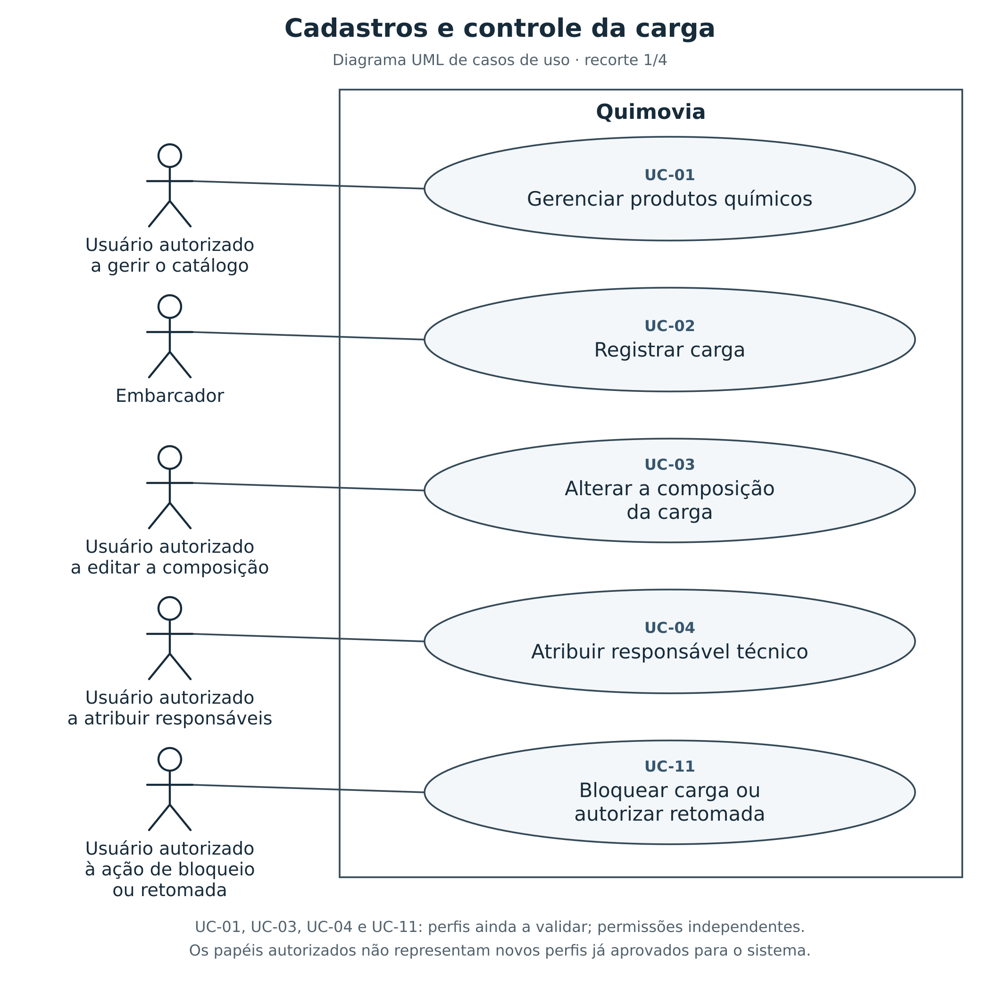
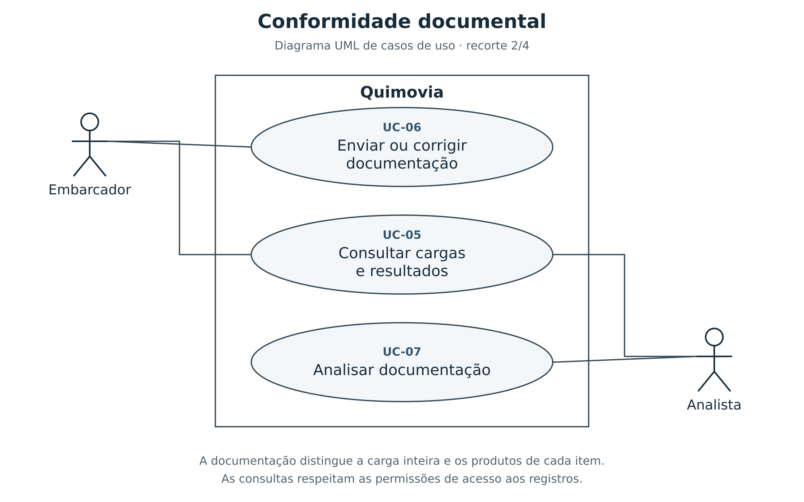
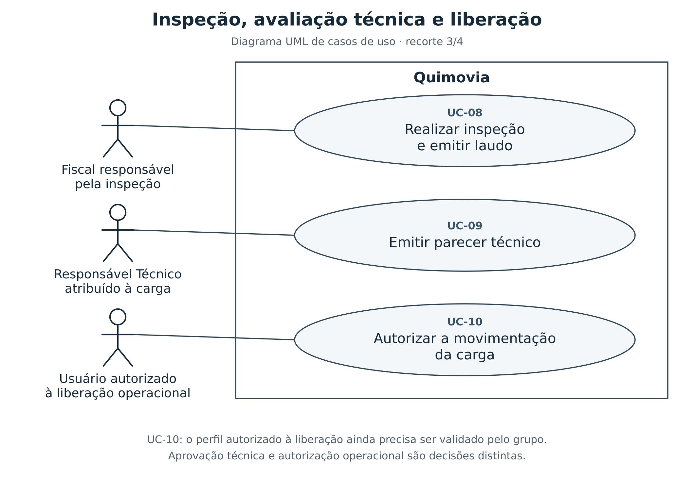
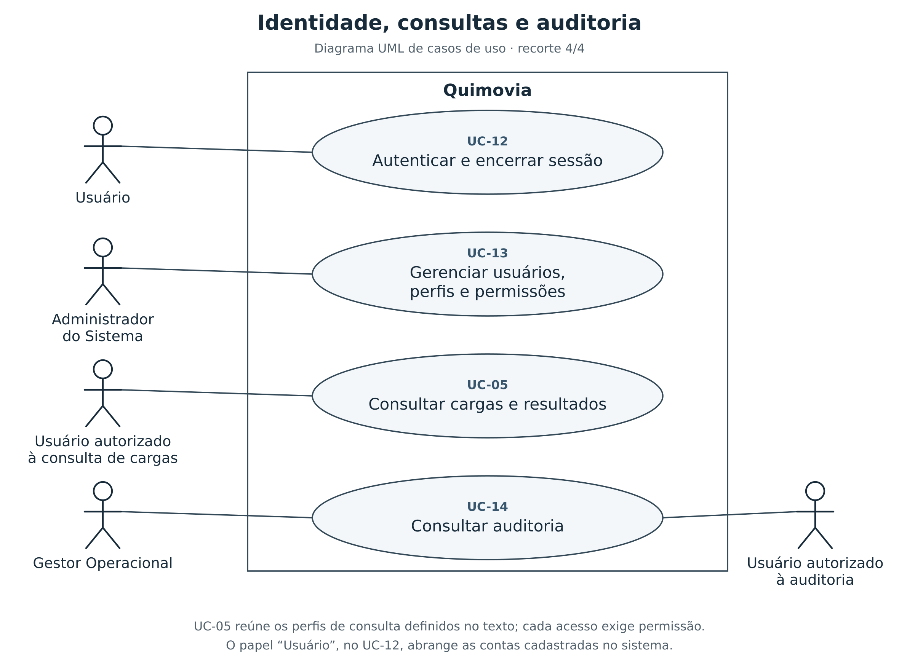

# Casos de uso

Os casos de uso descrevem como os atores interagem com o **Quimovia**, desde o cadastro dos produtos até a liberação da carga. Cada caso apresenta **atores, entradas, saídas, ações, regras e exceções**, utilizando a modelagem do tópico 2 e as regras de negócio do tópico 3.

Uma carga pode reunir **um ou mais itens**, com produtos iguais ou diferentes. Por isso, as ações de análise e inspeção devem distinguir o que se aplica à **carga como um todo** e o que se aplica ao **produto de cada item**.

## Visão geral

| Caso de uso | Ator principal | Resultado esperado |
|---|---|---|
| **UC-01 — Gerenciar produtos químicos** | Usuário autorizado a gerir o catálogo | Produto e requisitos cadastrados ou atualizados. |
| **UC-02 — Registrar carga** | Embarcador | Carga registrada com seus itens e responsáveis informados. |
| **UC-03 — Alterar a composição da carga** | Usuário autorizado a editar a carga | Composição atualizada, com indicação das avaliações afetadas. |
| **UC-04 — Atribuir responsável técnico** | Usuário autorizado a atribuir responsáveis | Responsável técnico vinculado à carga. |
| **UC-05 — Consultar cargas e resultados** | Usuário autorizado à consulta | Situação da carga, de seus itens e de suas pendências apresentada. |
| **UC-06 — Enviar ou corrigir documentação** | Embarcador | Documentação submetida à análise. |
| **UC-07 — Analisar documentação** | Analista | Pareceres documentais registrados por escopo. |
| **UC-08 — Realizar inspeção e emitir laudo** | Fiscal | Verificações concluídas e laudo registrado. |
| **UC-09 — Emitir parecer técnico** | Responsável Técnico | Carga aprovada ou reprovada tecnicamente. |
| **UC-10 — Autorizar a movimentação da carga** | Usuário autorizado pela operação portuária | Carga liberada para movimentação. |
| **UC-11 — Bloquear carga ou autorizar retomada** | Usuário autorizado para a ação | Bloqueio registrado ou retorno autorizado à etapa adequada. |
| **UC-12 — Autenticar e encerrar sessão** | Usuário | Sessão iniciada ou encerrada. |
| **UC-13 — Gerenciar usuários, perfis e permissões** | Administrador do Sistema | Acessos cadastrados ou atualizados. |
| **UC-14 — Consultar auditoria** | Gestor Operacional ou usuário autorizado | Histórico das ações apresentado para consulta. |

Os atores descritos como **usuários autorizados** dependem de permissões específicas, não apenas de uma sessão ativa. As atribuições de perfil que ainda precisam de decisão do grupo estão reunidas ao final do documento.

### Leitura dos diagramas

Os diagramas utilizam a **notação UML de casos de uso**: os bonecos representam atores externos, as elipses representam funcionalidades e o retângulo delimita o **Quimovia**. As linhas indicam participação, **não a ordem das etapas**. Entradas, saídas, regras e exceções permanecem nas descrições textuais.

Os quatro recortes mantêm os identificadores **UC-01 a UC-14**. O UC-05 aparece em mais de uma visão por ser uma consulta compartilhada, não por representar casos diferentes. Papéis descritos como autorizados a uma ação não constituem novos perfis aprovados; a definição das permissões continua sujeita à validação indicada neste documento.

## Condições comuns

As condições abaixo se aplicam aos casos de uso, exceto quando a própria ação é iniciar uma sessão:

- O usuário deve estar **autenticado, ativo e autorizado** a executar a ação sobre o registro solicitado.
- Alterações relevantes devem produzir **registros de auditoria**. Correções preservam os registros anteriores e a autoria das decisões.
- Antes de concluir uma ação, o sistema deve verificar a **situação atual da carga e dos itens envolvidos**, impedindo o uso de documentos, resultados ou permissões que já não sejam aplicáveis.

## Produtos químicos

### UC-01 — Gerenciar produtos químicos

Permite manter o catálogo utilizado na composição das cargas e os requisitos associados a cada produto.

| Campo | Descrição |
|---|---|
| **Ator** | Usuário com permissão para gerenciar o catálogo; perfil a validar. |
| **Entradas** | Código, nome técnico, nome comercial quando informado, número ONU, classe de risco, estado físico, situação cadastral e requisitos documentais e de inspeção. |
| **Pré-condições** | Permissão correspondente à operação solicitada: cadastrar, atualizar ou alterar a situação do produto. |
| **Saídas** | Produto cadastrado ou atualizado, com identificação dos requisitos e registro da alteração. |

**Ações**

1. O usuário informa os dados de um novo produto ou seleciona um produto existente para atualização.
2. O sistema verifica os campos obrigatórios, a validade dos valores e a exclusividade do código.
3. O usuário confirma a operação; o sistema registra a versão atual do cadastro e o histórico da alteração.

**Regras aplicáveis:** somente produtos ativos podem receber novas associações a itens de cargas. A inativação ou o bloqueio do produto preserva os vínculos anteriores. Alterações de classificação ou requisitos não modificam retroativamente análises já concluídas. Referência: **Produtos Químicos**, no tópico 3.

**Exceções e alternativas**

- **Dados inválidos ou código duplicado:** o sistema indica os campos a corrigir e não conclui a gravação.
- **Alteração de requisitos:** a nova definição fica registrada, sem transformar resultados anteriores em aprovações para requisitos diferentes.

## Gestão de cargas

### UC-02 — Registrar carga

Permite ao embarcador identificar a carga e os produtos transportados, sem limitar sua composição a um único produto.

| Campo | Descrição |
|---|---|
| **Ator** | Embarcador. |
| **Entradas** | Dados da carga e do embarcador; produto, quantidade e unidade de medida de cada item; responsável técnico, quando já definido. |
| **Pré-condições** | Produtos disponíveis no catálogo e ativos no momento da associação. |
| **Saídas** | Carga com status **Registrada**, identificadores próprios para seus itens e requisitos aplicáveis identificados. |

**Ações**

1. O embarcador informa os dados da carga e adiciona um ou mais itens.
2. Para cada item, seleciona o produto e informa a quantidade e a unidade de medida.
3. O sistema valida a composição e registra a carga, relacionando os requisitos da carga como um todo e dos produtos de seus itens.

**Regras aplicáveis:** a carga deve possuir um embarcador e pelo menos um item, com quantidade positiva e unidade informada. O mesmo produto pode aparecer em mais de um item, cada um com identidade própria. As quantidades permanecem associadas aos itens, sem somar produtos ou unidades diferentes em um total sem significado. Referência: **Gestão de Cargas**, no tópico 3.

**Exceções e alternativas**

- **Carga sem itens, quantidade inválida ou produto inativo:** o registro não é concluído até a correção.
- **Mesmo produto em vários itens:** a composição é aceita; o sistema não trata essa repetição como duplicação do cadastro do produto.

### UC-03 — Alterar a composição da carga

Permite corrigir os itens de uma carga quando a etapa do processo e as permissões admitirem essa alteração.

| Campo | Descrição |
|---|---|
| **Ator** | Usuário com permissão para editar a composição; perfil e etapas permitidas a validar. |
| **Entradas** | Identificação da carga, itens a incluir, alterar ou remover e respectivos produtos, quantidades e unidades. |
| **Pré-condições** | Carga em uma etapa que permita edição da composição. |
| **Saídas** | Composição atualizada, histórico preservado e requisitos e avaliações afetados identificados para reavaliação. |

**Ações**

1. O usuário consulta a composição e informa as alterações necessárias.
2. O sistema verifica a permissão, a etapa da carga e a validade de cada item, identificando os requisitos e resultados afetados.
3. Após a confirmação, registra a nova composição e indica o que precisa de nova análise ou inspeção antes da continuidade do fluxo.

**Regras aplicáveis:** a carga deve continuar com pelo menos um item válido. A alteração não apaga evidências anteriores nem permite aplicar automaticamente à nova composição uma aprovação obtida para a composição anterior. Não se presume que cargas aprovadas ou liberadas possam ser editadas. Referência: **Gestão de Cargas**, no tópico 3.

**Exceções e alternativas**

- **Etapa sem permissão de edição:** o sistema recusa a alteração e mantém a composição existente.
- **Remoção do último item ou dados inválidos:** a gravação é impedida.
- **Resultados afetados pela alteração:** o avanço permanece impedido até a reavaliação exigida; o histórico anterior continua consultável.

### UC-04 — Atribuir responsável técnico

Permite definir o profissional que realizará a avaliação técnica final da carga.

| Campo | Descrição |
|---|---|
| **Ator** | Usuário com permissão para atribuir responsáveis; perfil a validar. |
| **Entradas** | Identificação da carga e do usuário que assumirá a responsabilidade técnica. |
| **Pré-condições** | Usuário indicado ativo, com perfil e permissão para atuar como Responsável Técnico. |
| **Saídas** | Responsável técnico vinculado à carga e atribuição registrada no histórico. |

**Ações**

1. O usuário autorizado seleciona a carga e indica o responsável técnico.
2. O sistema verifica se o profissional está habilitado no sistema para essa atuação.
3. A atribuição é confirmada e passa a orientar a autorização para emissão do parecer técnico.

**Regras aplicáveis:** a carga deve possuir responsável técnico antes de entrar em avaliação técnica. A atribuição não transfere a autoria de pareceres já emitidos. Referências: **Gestão de Cargas** e **Avaliação técnica e movimentação**, no tópico 3.

**Exceções e alternativas**

- **Usuário inativo ou sem permissão técnica:** o vínculo é recusado.
- **Substituição de responsável:** depende de uma política de troca e de etapas permitidas ainda a validar; não deve ser tratada como uma edição irrestrita.

### UC-05 — Consultar cargas e resultados

Permite acompanhar a situação consolidada da carga e identificar a qual item cada documento, inspeção ou pendência se refere.

| Campo | Descrição |
|---|---|
| **Atores** | Embarcador, Analista, Fiscal, Responsável Técnico, Operador Portuário e Gestor Operacional, conforme suas permissões de consulta. |
| **Entradas** | Identificador da carga ou filtros de pesquisa, como período e status. |
| **Pré-condições** | Permissão de acesso às cargas e informações solicitadas. |
| **Saídas** | Composição, responsáveis, status, documentos, pareceres, inspeções, laudos e pendências acessíveis ao usuário. |

**Ações**

1. O usuário pesquisa as cargas disponíveis para seu acesso e seleciona um registro.
2. O sistema apresenta a situação geral e permite consultar os resultados vinculados à carga ou a cada item.
3. O usuário consulta as pendências e o histórico disponibilizado para compreender o que impede ou permite a próxima etapa.

**Regras aplicáveis:** uma avaliação favorável de um item não representa aprovação dos demais nem da carga inteira. Cargas liberadas permanecem disponíveis para acompanhamento histórico. A consulta não concede permissão de alteração ou decisão. Referências: **Gestão de Cargas**, **Identidade e Acesso** e **Auditoria**, no tópico 3.

**Exceções e alternativas**

- **Nenhum resultado encontrado:** o sistema informa a ausência de cargas para os filtros utilizados.
- **Registro ou informação sem permissão de acesso:** o conteúdo não é apresentado.

## Conformidade documental

### UC-06 — Enviar ou corrigir documentação

Permite ao embarcador atender às exigências documentais da carga e dos produtos presentes em seus itens.

| Campo | Descrição |
|---|---|
| **Ator** | Embarcador responsável pela carga. |
| **Entradas** | Arquivos, tipos de documento, datas aplicáveis e indicação dos requisitos e escopos atendidos. |
| **Pré-condições** | Carga registrada; documentação ainda não submetida ou em fase formal de correção. |
| **Saídas** | Documentação enviada, carga no status **Em análise documental** e edição dos arquivos bloqueada durante a análise. |

**Ações**

1. O embarcador consulta as exigências e anexa os documentos, indicando se atendem à carga inteira ou a itens específicos.
2. O sistema confere os vínculos e verifica se todos os documentos obrigatórios foram anexados.
3. O embarcador submete a documentação; o sistema registra o envio e disponibiliza os arquivos para análise.

**Regras aplicáveis:** um mesmo arquivo pode atender a vários escopos, desde que cada vínculo esteja registrado. Todo item indicado deve pertencer à carga. Apenas o embarcador responsável pode adicionar ou substituir arquivos nas fases permitidas; substituir um documento não elimina a versão nem o parecer anterior. Referência: **Conformidade Documental**, no tópico 3.

**Exceções e alternativas**

- **Documento obrigatório ausente ou vínculo com item de outra carga:** o envio é impedido, com indicação da inconsistência.
- **Documentação em análise:** a inclusão ou substituição é recusada enquanto não houver fase formal de correção.
- **Correção solicitada:** o embarcador envia os documentos corrigidos para uma nova análise, sem reaproveitar automaticamente o parecer anterior.

### UC-07 — Analisar documentação

Permite ao analista registrar a conformidade documental de cada escopo exigido e indicar o que precisa de correção.

| Campo | Descrição |
|---|---|
| **Ator** | Analista. |
| **Entradas** | Documentação submetida, escopo avaliado, resultado, justificativa e pendências, quando existentes. |
| **Pré-condições** | Documentação disponível para análise e acesso autorizado à carga. |
| **Saídas** | Parecer documental com autor, data, resultado e escopo; pendências registradas ou avanço para **Em inspeção**, quando todos os requisitos estiverem atendidos. |

**Ações**

1. O analista seleciona a carga e o escopo da análise: carga inteira ou produto de um item.
2. Examina os documentos aplicáveis e registra o resultado, descrevendo as pendências quando houver não conformidade.
3. O sistema grava o parecer e verifica se os pareceres atuais cobrem, com conformidade, todos os requisitos documentais da carga e de seus itens.

**Regras aplicáveis:** cada parecer possui um único escopo, e qualquer item avaliado deve pertencer à carga em análise. O avanço depende do conjunto de pareceres atuais, não de uma aprovação isolada. O parecer é uma decisão do analista; o sistema apenas valida e registra os requisitos para a continuidade do fluxo. Referência: **Conformidade Documental**, no tópico 3.

**Exceções e alternativas**

- **Não conformidade:** o parecer é registrado com justificativa e pendências, e a carga não avança para inspeção.
- **Justificativa obrigatória ausente:** a emissão do parecer é impedida até o preenchimento.
- **Documento, escopo ou composição alterados:** a análise deve considerar a situação atual; um parecer anterior não aprova automaticamente os novos dados.

## Inspeções

### UC-08 — Realizar inspeção e emitir laudo

Permite registrar as verificações físicas e o resultado de uma inspeção da carga ou do produto de um de seus itens.

| Campo | Descrição |
|---|---|
| **Ator** | Fiscal responsável pela inspeção. |
| **Entradas** | Inspeção vinculada à carga, escopo, verificações obrigatórias, resultados e observações. |
| **Pré-condições** | Conformidade documental da carga e de seus itens; inspeção com escopo definido e fiscal responsável indicado. |
| **Saídas** | Inspeção concluída e laudo emitido; avanço para **Em avaliação técnica** quando todas as inspeções obrigatórias estiverem concluídas, sem impedimentos, e houver responsável técnico atribuído. |

**Ações**

1. O fiscal acessa a inspeção sob sua responsabilidade e confirma a carga e o escopo a verificar.
2. Realiza as verificações obrigatórias e registra os resultados e as observações de cada uma.
3. Conclui a inspeção e emite o laudo; o sistema registra o documento e verifica se ainda existem inspeções ou pendências impeditivas na carga ou em seus itens.

**Regras aplicáveis:** cada inspeção possui um único escopo: carga inteira ou produto de um item identificado, que deve pertencer à carga inspecionada. O laudo conserva esse mesmo escopo. **Item de inspeção** é uma verificação a realizar, não um item da composição da carga. Somente o fiscal responsável registra os resultados e emite o laudo. Referência: **Inspeções**, no tópico 3.

**Exceções e alternativas**

- **Verificação obrigatória sem resultado:** a conclusão e a emissão do laudo são impedidas.
- **Não conformidade:** a irregularidade é registrada e impede o avanço da carga até seu tratamento, mesmo que outras inspeções estejam conformes.
- **Nova verificação necessária após a emissão:** deve ocorrer em nova inspeção ou reinspeção, preservando o laudo anterior, que não pode ser editado.

## Avaliação técnica e movimentação

### UC-09 — Emitir parecer técnico

Permite ao responsável técnico avaliar o conjunto de evidências e registrar a decisão técnica sobre a carga.

| Campo | Descrição |
|---|---|
| **Ator** | Responsável Técnico atribuído à carga. |
| **Entradas** | Composição atual, pareceres documentais, laudos de inspeção, resultado técnico e justificativa. |
| **Pré-condições** | Carga no status **Em avaliação técnica**, com documentação conforme, inspeções obrigatórias concluídas e sem pendências impeditivas nos escopos exigidos. |
| **Saídas** | Parecer técnico registrado com autor e data; carga **Aprovada** ou **Reprovada**. |

**Ações**

1. O responsável técnico consulta os pareceres e laudos atuais da carga e dos produtos de todos os seus itens.
2. Avalia os resultados em conjunto e registra seu parecer favorável ou desfavorável.
3. O sistema verifica os requisitos da decisão, registra o parecer e atualiza o status correspondente.

**Regras aplicáveis:** somente o responsável técnico atribuído pode emitir o parecer final. Ele não altera as conclusões documentais ou de inspeção de outros profissionais. Um parecer favorável resulta em aprovação técnica apenas quando os requisitos estão atendidos; **aprovação não equivale à autorização de movimentação**. Referência: **Avaliação técnica e movimentação**, no tópico 3.

**Exceções e alternativas**

- **Parecer desfavorável:** exige justificativa e leva a carga para **Reprovada**.
- **Evidência obrigatória ausente, desatualizada ou com impedimento pendente:** a decisão não é concluída e o sistema indica o requisito a tratar.
- **Usuário diferente do responsável atribuído:** a emissão é recusada, mesmo que possua o perfil técnico.

### UC-10 — Autorizar a movimentação da carga

Permite registrar a autorização operacional após a aprovação técnica, mantendo as duas decisões separadas.

| Campo | Descrição |
|---|---|
| **Ator** | Usuário com permissão de liberação na operação portuária; perfil a validar. |
| **Entradas** | Identificação da carga e confirmação da autorização de movimentação. |
| **Pré-condições** | Carga **Aprovada**, sem bloqueios ou pendências impeditivas na carga ou em qualquer item. |
| **Saídas** | Carga **Liberada** e autorização registrada com responsável, data e histórico da mudança. |

**Ações**

1. O usuário consulta a carga aprovada e solicita a liberação operacional.
2. O sistema verifica a aprovação e a ausência de bloqueios e pendências na situação atual da carga e de seus itens.
3. O usuário confirma a autorização; o sistema registra a decisão e altera o status para **Liberada**.

**Regras aplicáveis:** a liberação exige uma ação de usuário autorizado e não ocorre automaticamente após o parecer favorável. A autorização registrada representa a permissão para movimentação, não a comprovação de que a movimentação física já ocorreu. Referência: **Avaliação técnica e movimentação**, no tópico 3.

**Exceções e alternativas**

- **Ausência de aprovação, bloqueio ou pendência impeditiva:** a liberação é recusada e o status permanece inalterado.
- **Carga já liberada:** o sistema apresenta a autorização existente, sem registrar uma segunda liberação para a mesma decisão.

### UC-11 — Bloquear carga ou autorizar retomada

Permite interromper o avanço diante de um impedimento e controlar a retomada após seu tratamento ou após uma reprovação.

| Campo | Descrição |
|---|---|
| **Ator** | Usuário com permissão específica para bloquear, desbloquear ou autorizar nova análise; perfis a validar. |
| **Entradas** | Carga, motivo, escopo afetado e, para retomada, evidências da correção e autorização correspondente. |
| **Pré-condições** | Situação da carga compatível com a ação solicitada e permissão específica para essa ação. |
| **Saídas** | Bloqueio registrado com etapa de origem ou retorno autorizado à etapa de reavaliação aplicável. |

**Ações**

1. O usuário seleciona a carga, informa a ação e identifica o motivo e o escopo envolvido.
2. O sistema verifica as condições do bloqueio ou da retomada e quais avaliações precisam ser refeitas.
3. A decisão é registrada com autoria, justificativa e situação anterior; a carga permanece impedida ou retorna à etapa adequada, conforme a ação autorizada.

**Regras aplicáveis:** uma irregularidade em um item pode impedir o avanço da carga inteira. O desbloqueio exige tratamento da causa, e uma carga reprovada só retorna ao fluxo após correções e autorização de nova análise. Nenhuma dessas ações permite saltar diretamente para aprovação ou liberação. Referências: **Fluxo de status** e **Auditoria**, no tópico 3.

**Exceções e alternativas**

- **Motivo ausente ou item de outra carga:** o bloqueio não é registrado até a correção dos dados.
- **Causa ainda não tratada ou autorização de retomada ausente:** a carga permanece impedida de avançar.
- **Transição não permitida:** a solicitação é recusada; os resultados e o histórico anteriores são preservados.

## Identidade e acesso

### UC-12 — Autenticar e encerrar sessão

Permite iniciar uma sessão para acessar as operações autorizadas e encerrá-la ao finalizar o uso do sistema.

| Campo | Descrição |
|---|---|
| **Ator** | Usuário. |
| **Entradas** | E-mail e senha para entrada; sessão atual para encerramento. |
| **Pré-condições** | Conta cadastrada e ativa para iniciar uma sessão; sessão existente para encerrá-la. |
| **Saídas** | Sessão ativa vinculada ao usuário ou sessão encerrada e sem possibilidade de reutilização. |

**Ações**

1. O usuário informa suas credenciais; o sistema verifica os dados e a situação da conta.
2. Se as condições forem atendidas, o sistema inicia a sessão e permite apenas as operações autorizadas pelo perfil.
3. Ao solicitar a saída, o usuário encerra a sessão, que deixa de autorizar novas operações.

**Regras aplicáveis:** contas inativas ou bloqueadas não podem operar. A inativação ou o bloqueio invalida as sessões existentes. Sessões expiradas ou encerradas não podem ser reutilizadas. Referência: **Identidade e Acesso**, no tópico 3.

**Exceções e alternativas**

- **Credenciais inválidas ou conta sem acesso ativo:** a autenticação é recusada.
- **Sessão expirada, encerrada ou invalidada:** a operação protegida é impedida; o acesso exige nova autenticação e uma conta ativa.

### UC-13 — Gerenciar usuários, perfis e permissões

Permite administrar quem pode acessar o sistema e quais operações cada perfil está autorizado a executar.

| Campo | Descrição |
|---|---|
| **Ator** | Administrador do Sistema. |
| **Entradas** | Nome, e-mail, situação e perfil do usuário; nome do perfil e permissões por recurso e ação. |
| **Pré-condições** | Administrador autenticado, ativo e autorizado à gestão de acesso. |
| **Saídas** | Usuários e perfis cadastrados ou atualizados, com permissões vigentes e sessões invalidadas quando necessário. |

**Ações**

1. O administrador seleciona o cadastro de usuário ou perfil e informa os dados ou as alterações.
2. O sistema verifica a exclusividade do e-mail ou nome do perfil, os campos obrigatórios e a composição das permissões.
3. Após a confirmação, registra a alteração e aplica seus efeitos às operações seguintes e, quando necessário, às sessões existentes.

**Regras aplicáveis:** cada usuário possui um único perfil. Cada perfil tem nome exclusivo e pelo menos uma permissão, sem repetição da mesma combinação de recurso e ação. Mudanças de permissão afetam as operações seguintes; inativação e bloqueio de usuários invalidam suas sessões. Referência: **Identidade e Acesso**, no tópico 3.

**Exceções e alternativas**

- **E-mail ou nome de perfil já utilizado:** a gravação é recusada até a correção.
- **Perfil sem permissões, permissão repetida ou usuário sem perfil:** o sistema indica a inconsistência e não conclui a operação.

## Auditoria

### UC-14 — Consultar auditoria

Permite reconstruir as ações e decisões do processo, identificando quem atuou e quais registros foram afetados.

| Campo | Descrição |
|---|---|
| **Atores** | Gestor Operacional e usuários com permissão específica de consulta à auditoria. |
| **Entradas** | Filtros por período, usuário, ação ou elemento afetado, como carga, item, produto, documento ou inspeção. |
| **Pré-condições** | Permissão de consulta ao histórico solicitado. |
| **Saídas** | Registros com autor, data, ação, elemento afetado e, quando aplicável, valores anterior e atual e motivo da alteração. |

**Ações**

1. O usuário informa os filtros e solicita a pesquisa.
2. O sistema apresenta os registros permitidos e permite consultar os detalhes de cada ação.
3. O usuário acompanha a sequência de eventos, distinguindo ações sobre o catálogo de produtos, sobre a carga e sobre seus itens.

**Regras aplicáveis:** ações sobre um produto transportado devem permitir identificar o item correspondente, não apenas o produto do catálogo. Registros de auditoria não podem ser alterados ou excluídos pelos usuários operacionais. Referência: **Auditoria**, no tópico 3.

**Exceções e alternativas**

- **Nenhum registro encontrado:** o sistema informa que não há resultados para os filtros utilizados.
- **Consulta sem autorização ou tentativa de alteração:** a ação é recusada; o conteúdo e a integridade do histórico são preservados.

## Definições a validar

Os casos acima detalham o fluxo já descrito nos tópicos anteriores. Alguns pontos ainda precisam de decisão do grupo para que as permissões e os fluxos alternativos possam ser implementados sem suposições.

| Ponto | Proposta ou definição necessária |
|---|---|
| **Gestão do catálogo — UC-01** | Validar o Responsável Técnico como perfil responsável e distinguir as permissões de cadastro, requisitos e situação do produto. |
| **Edição da composição — UC-03** | Validar o Embarcador responsável como ator e definir as etapas em que a edição é permitida, inclusive o tratamento de cargas já aprovadas. |
| **Atribuição de responsáveis — UC-04 e UC-08** | Validar quem atribui ou substitui o responsável técnico e quem prepara as inspeções e designa os fiscais. O Gestor Operacional é uma proposta de ator para essa coordenação. |
| **Liberação operacional — UC-10** | Validar o Operador Portuário como perfil autorizado a liberar a carga. A permissão de consulta, isoladamente, não autoriza a liberação. |
| **Bloqueio e retomada — UC-11** | Definir os perfis autorizados a cada ação, as etapas em que ela se aplica e a regra de retorno à reavaliação. Gestor Operacional e Responsável Técnico são propostas, não atribuições já confirmadas. |
| **Cancelamento de carga** | O tópico 3 menciona essa possibilidade, mas ainda não define ator, condições e status resultante. O caso específico deve ser incluído após essa definição. |

Essas propostas não substituem as regras de negócio. Após a validação, os tópicos **3 e 4** devem refletir as mesmas permissões e condições.
