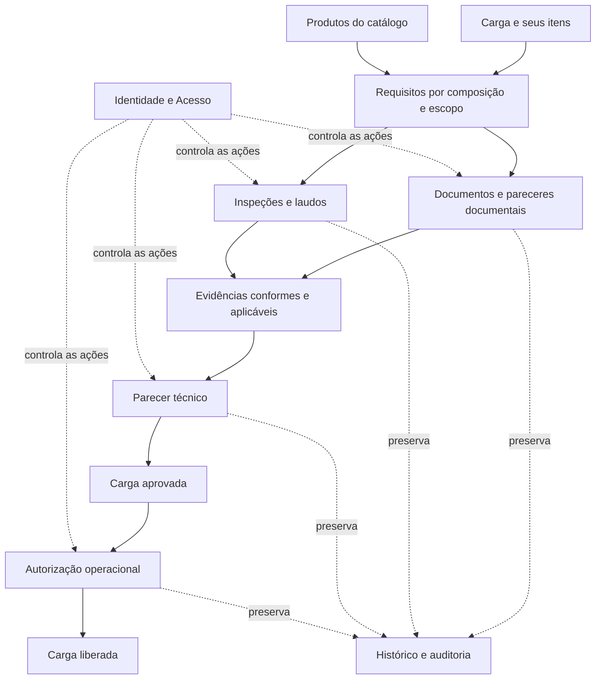
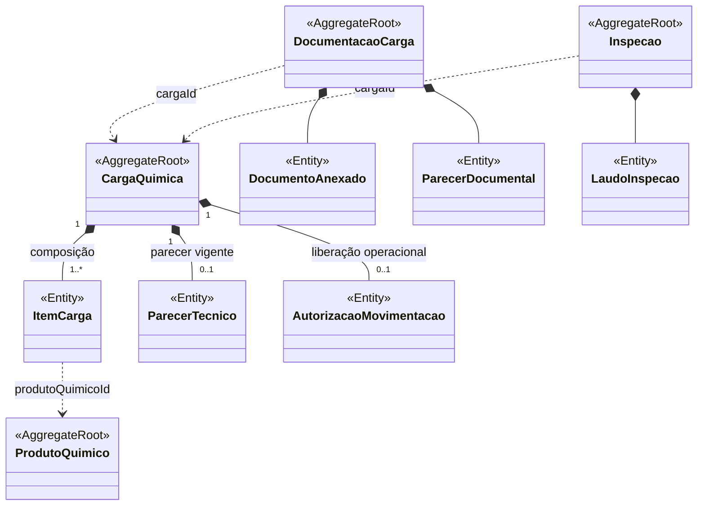
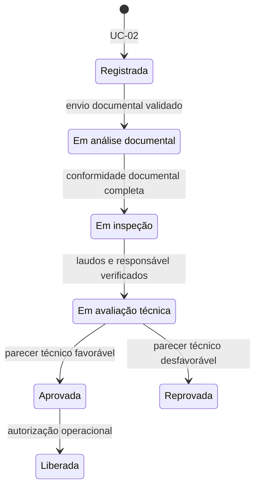

# Diagramas

## Objetivo deste documento

Os tópicos anteriores apresentam o Quimovia por perspectivas diferentes: o **tópico 1** explica o problema e o processo; o **tópico 2** organiza a estrutura do domínio; o **tópico 3** define as condições do negócio; e o **tópico 4** descreve as ações dos atores. Este documento reúne essas perspectivas visualmente para mostrar **como a composição da carga, as exigências, as avaliações e as decisões formam um único fluxo**.

Ao final da leitura, deve ser possível compreender:

- por que uma carga possui um ou mais itens, inclusive do mesmo produto;
- como os produtos determinam requisitos para a carga e para seus itens;
- como documentos e inspeções produzem evidências para a avaliação técnica;
- por que aprovação técnica e liberação operacional são decisões diferentes;
- como atores, permissões e histórico acompanham todo o processo.

O tópico 5 **não cria novas regras nem substitui as modelagens detalhadas**. Sua função é permitir que o leitor enxergue as relações entre elas antes de consultar os detalhes em seus documentos de origem.

| Leitura visual | Pergunta respondida | Origem da definição |
|---|---|---|
| **Panorama do processo** | Como uma carga passa da composição às decisões que permitem sua movimentação? | Tópicos 1 a 4 |
| **Estrutura do domínio** | Quais elementos pertencem à carga e quais permanecem em agregados independentes? | Tópico 2 |
| **Ciclo de vida da carga** | Em qual ordem as etapas acontecem e o que cada mudança de status representa? | Tópicos 3 e 4 |
| **Cenário aplicado** | Como as regras se comportam quando a carga possui vários itens e produtos? | Tópicos 1 a 4 |

## 1. Panorama do processo

O primeiro diagrama apresenta a relação de causa e resultado que orienta o sistema. A **composição da carga** e os **produtos referenciados** determinam os requisitos aplicáveis. Documentação e inspeções registram evidências sobre esses requisitos; as evidências fundamentam a decisão técnica e, quando favorável, permitem uma decisão operacional posterior.

Esse panorama deve ser lido de cima para baixo. Ele mostra que a existência de um documento ou laudo isolado **não aprova a carga**: todas as evidências obrigatórias precisam cobrir a composição e os escopos exigidos. O Responsável Técnico atribuído registra a conclusão técnica, enquanto um usuário com permissão operacional específica registra a liberação. Em todas as etapas, o sistema verifica o acesso e preserva os registros que fundamentaram as decisões.

## 2. Estrutura do domínio

Enquanto o panorama anterior explica **como o processo se conecta**, o diagrama abaixo mostra **quem controla cada informação**. Ele destaca os principais agregados envolvidos na análise e as entidades sob sua responsabilidade. A relação entre eles não transforma produtos, documentos e inspeções em partes do agregado da carga.

O **losango preenchido** indica composição dentro de um agregado; a **seta tracejada** indica referência a outro agregado por identificador. A multiplicidade `1..*` representa um ou mais itens; `0..1`, nenhum ou um. O parecer técnico vigente é mostrado sem detalhar o armazenamento do histórico: novas avaliações não podem apagar decisões anteriores.

A **Autorização de Movimentação** registra a liberação operacional e identifica o usuário, a data, a composição e o parecer que fundamentaram a decisão. Ela não se confunde com o Parecer Técnico. Sua multiplicidade representa o fluxo atual, sem presumir novas liberações ou ciclos posteriores ainda não definidos.

O contexto de **Identidade e Acesso** atende a todas essas operações. Embarcador, Analista, Fiscal e Responsável Técnico são usuários referenciados nos registros pertinentes, e não entidades incorporadas ao agregado da carga. Os agregados de acesso, os objetos de valor e os demais detalhes permanecem na [Modelagem com DDD](./02-modelagem-com-ddd.md).

### Escopos das evidências

Não basta relacionar uma evidência a um produto do catálogo: dois itens da mesma carga podem referenciar esse produto e precisar de avaliações distintas. O **escopo** identifica se a evidência se aplica à carga inteira ou a um item específico, sempre vinculado à **versão da composição avaliada**. No histórico, o item é consultado como existia naquela versão, mesmo que tenha sido alterado ou removido depois.

| Registro | Relação com a carga e seus itens |
|---|---|
| **Documento Anexado** | Pertence à documentação da carga e declara os escopos que atende. Um arquivo pode atender a mais de um escopo, desde que os vínculos sejam explícitos. |
| **Parecer Documental** | Registra a conclusão da análise de um escopo: a carga ou um item identificado, preservando a composição, os documentos e os requisitos considerados. A conformidade documental depende do conjunto de pareceres aplicáveis aos escopos exigidos. |
| **Inspeção e Laudo de Inspeção** | A inspeção identifica um escopo e registra seu resultado no laudo. Seus itens de verificação não são os itens que compõem a carga. |
| **Parecer Técnico** | Registra a decisão técnica sobre a carga, a composição avaliada e as referências às evidências utilizadas. Não substitui os pareceres documentais nem os laudos. |

Assim, **a conformidade de um item não comprova a conformidade dos demais**. Requisitos referentes à carga inteira também precisam ser atendidos, quando aplicáveis.

## 3. Ciclo de vida da carga

O diagrama de estados muda o foco da estrutura para o comportamento: ele mostra **em qual ordem a carga percorre as etapas** e qual decisão provoca cada mudança. As transições dependem dos requisitos aplicáveis à **composição atual da carga**, considerando todos os escopos exigidos. As ações exigem usuário autenticado, ativo e autorizado, e o Responsável Técnico deve estar atribuído antes do início da avaliação técnica.

**Aprovada** significa que houve decisão técnica favorável. **Liberada** significa que a autorização operacional também foi registrada. A segunda decisão não é automática e não comprova que a movimentação física já ocorreu.

A passagem para **Em avaliação técnica** exige documentação ainda conforme, todas as inspeções obrigatórias concluídas, **laudos emitidos e aplicáveis**, ausência de pendências impeditivas e Responsável Técnico atribuído. Concluir as verificações, sem emitir os laudos exigidos, não atende a essa condição. Os critérios completos estão nas regras **RN-CAR-02**, **RN-INS-03** e **RN-TEC-01** do [tópico 3](./03-regras-de-negocio.md).

### Participação dos atores no ciclo

Cada mudança reúne uma ação humana e as validações do sistema. A tabela conecta o fluxo às responsabilidades descritas no tópico 1 e aos casos de uso do tópico 4, sem reproduzir seus passos e exceções. Os diagramas UML de atores e funcionalidades permanecem no [documento de Casos de uso](./04-casos-de-uso.md).

| Momento do fluxo | Participação principal | Referência |
|---|---|---|
| **Registro e preparação** | O Embarcador registra os itens e envia a documentação. Alterações de composição e atribuição do responsável seguem as permissões previstas. | UC-02 a UC-04 e UC-06 |
| **Análise documental** | O Analista registra os pareceres para os escopos exigidos. Pendências impedem o avanço. | UC-07 |
| **Inspeção** | O Fiscal atribuído registra as verificações e emite o laudo. O avanço considera o conjunto de inspeções e laudos obrigatórios, não apenas um resultado isolado. | UC-08 |
| **Avaliação técnica** | O Responsável Técnico atribuído à carga considera as evidências e emite o parecer final. | UC-09 |
| **Liberação operacional** | O usuário autorizado registra a permissão para movimentar, vinculando-a ao parecer válido e à composição atual, após verificar os impedimentos. O perfil responsável ainda depende de validação do grupo. | UC-10 |

Durante essas etapas, três cuidados permanecem válidos:

- **Pendência não equivale a bloqueio formal:** uma avaliação ainda não concluída impede o avanço, mas o registro de bloqueio exige a ação e as condições próprias do UC-11.
- **Correção exige reavaliação:** quando uma alteração de composição ou evidência for permitida, as avaliações afetadas precisam ser revistas, preservando as versões e decisões anteriores.
- **Retomada não permite atalhos:** desbloqueio e nova análise após reprovação não concedem aprovação ou liberação por si sós.

O diagrama mostra apenas o **fluxo principal**. Os estados de origem permitidos para bloqueio e os destinos de retomada ainda precisam ser formalizados nas [Regras de negócio](./03-regras-de-negócio.md) e nas definições pendentes de [Casos de uso](./04-casos-de-uso.md). A inclusão de cancelamento ou de novos ciclos após a liberação depende de uma decisão de escopo. Não são representadas transições ainda não acordadas.

## 4. Cenário aplicado

O cenário a seguir demonstra por que os diagramas utilizam **Carga**, **Item de Carga** e **escopo da avaliação** como conceitos distintos. Considere uma carga com três itens: **I-01** e **I-02** referenciam o Produto A; **I-03** referencia o Produto B. Cada item mantém sua própria quantidade e unidade. Neste exemplo, foram definidos requisitos documentais e de inspeção tanto para a carga quanto para os três itens. Os laudos já emitidos não apresentam impedimentos e permanecem aplicáveis à composição avaliada.

| Escopo exigido | Produto associado | Situação documental | Inspeção e laudo |
|---|---|---|---|
| **Carga inteira** | Conjunto dos itens | Conforme | Concluída, com laudo emitido |
| **I-01** | Produto A | Conforme | Concluída, com laudo emitido |
| **I-02** | Produto A | Conforme | Pendente |
| **I-03** | Produto B | Conforme | Concluída, com laudo emitido |

A carga permanece **Em inspeção**, pois falta uma verificação obrigatória do item I-02. O resultado do item I-01 não cobre essa pendência apenas porque ambos referenciam o Produto A. Esse requisito pendente, por si só, também não significa que tenha sido registrado um bloqueio formal.

Após a conclusão da inspeção de I-02 **e a emissão de seu laudo**, o conjunto é verificado novamente. Se todos os laudos obrigatórios estiverem emitidos e aplicáveis, a documentação permanecer conforme, não houver impedimentos e o Responsável Técnico estiver atribuído, a carga poderá seguir para **Em avaliação técnica**.

Um parecer favorável do Responsável Técnico atribuído, com as condições de avaliação atendidas, tornará a carga **Aprovada**. Somente uma autorização operacional posterior, fundamentada nesse parecer e na composição atual e sem impedimentos, a tornará **Liberada**. O atendimento às etapas anteriores não obriga o profissional a emitir parecer favorável.

Se a composição for alterada em uma etapa que permita essa ação, uma nova versão será registrada e o impacto sobre as exigências e evidências deverá ser avaliado. Resultados anteriores continuam vinculados à composição que os originou, mas não são automaticamente estendidos a novos itens ou à composição modificada. As avaliações afetadas precisam ser tratadas antes do avanço que depende delas.

## 5. Onde consultar os detalhes

Os diagramas deste documento oferecem a visão integrada, mas cada definição continua no documento responsável. Essa separação evita repetir regras extensas ou manter versões concorrentes da mesma informação.

| Documento | Conteúdo mantido na origem |
|---|---|
| [01 - Entendimento do domínio](./01-entendimento-do-dominio.md) | Explica por que o Quimovia existe, quem participa do processo e quais informações precisam ser controladas. |
| [02 - Modelagem com DDD](./02-modelagem-com-ddd.md) | Contextos, entidades, agregados, objetos de valor e suas modelagens detalhadas. |
| [03 - Regras de negócio](./03-regras-de-negocio.md) | Define as condições representadas nas transições, os impedimentos e as decisões ainda pendentes. |
| [04 - Casos de uso](./04-casos-de-uso.md) | Detalha quem executa cada ação, quais informações fornece, quais resultados recebe e como as exceções são tratadas. |

Ao mudar uma definição, a atualização deve começar no documento que a estabelece e depois ser refletida nesta visão. **O tópico 5 permite compreender o conjunto; os tópicos 1 a 4 continuam sendo as fontes das definições.**
