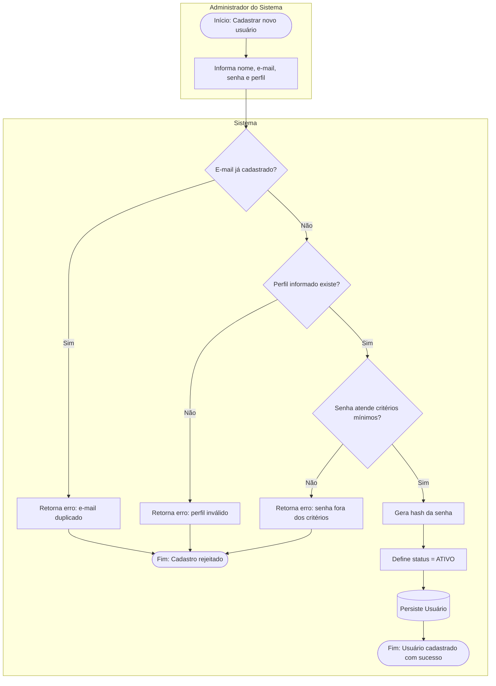
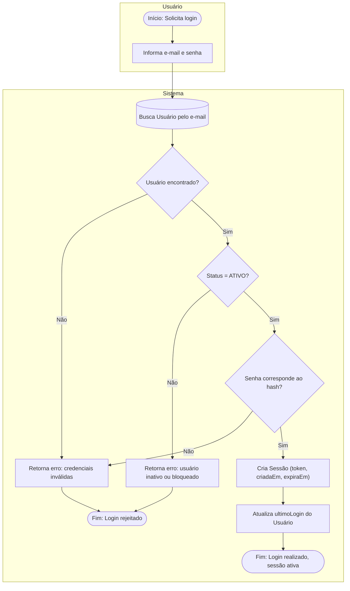
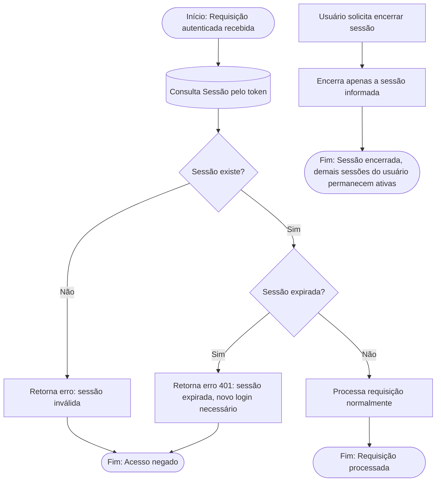
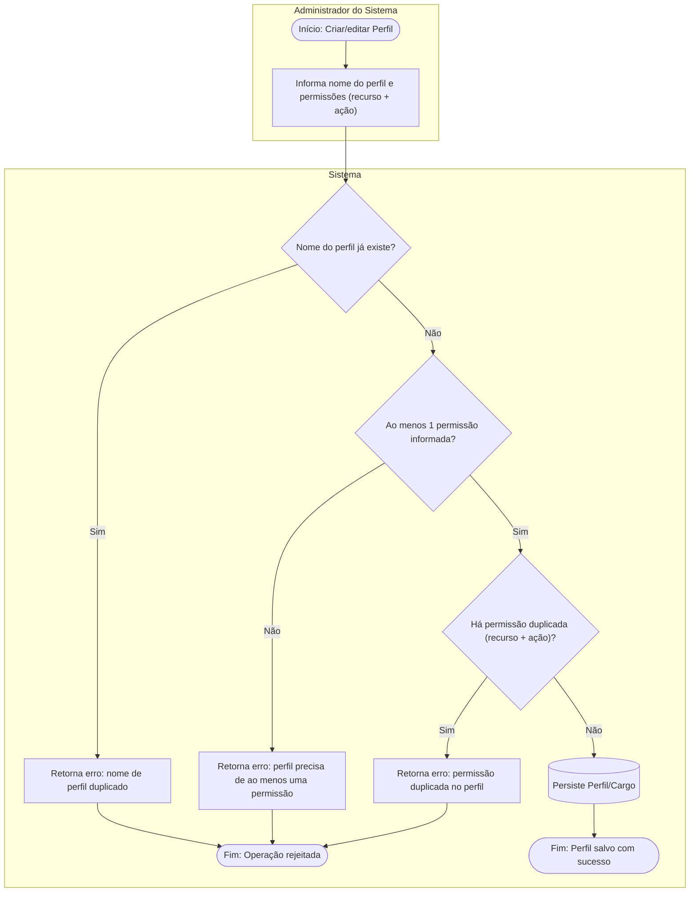
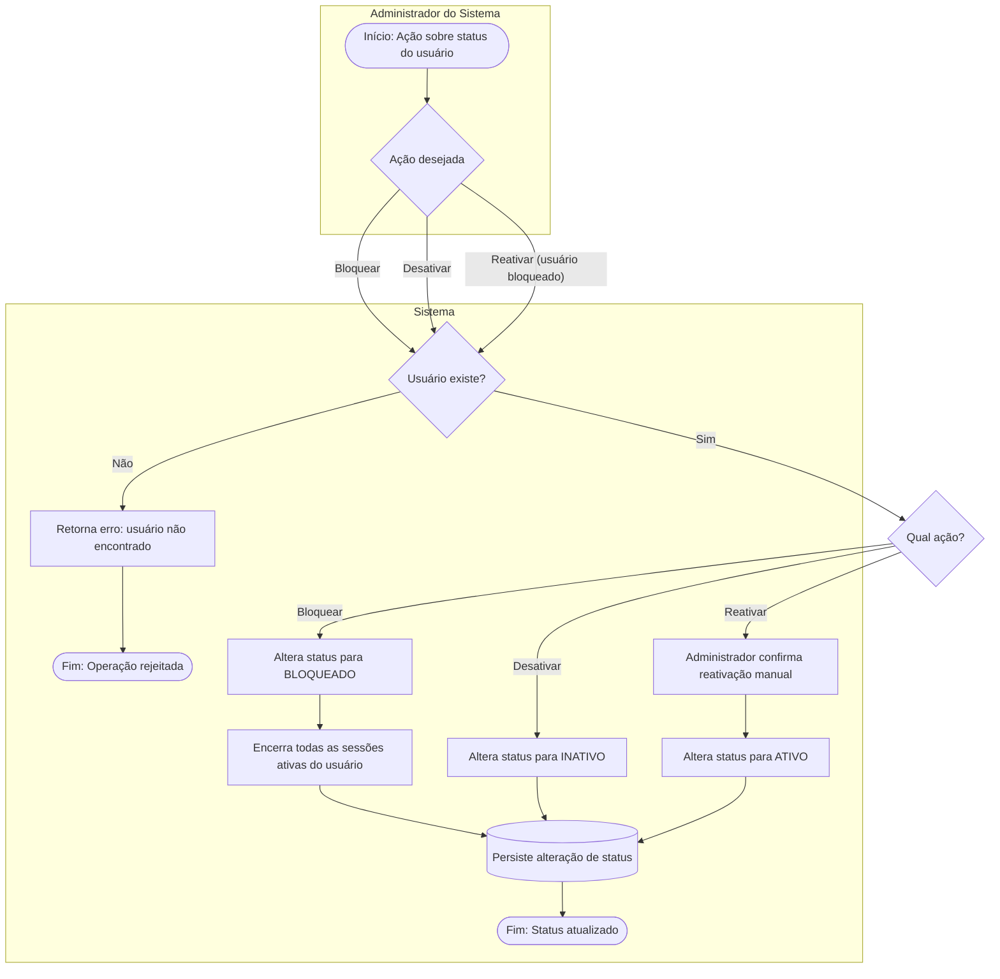

# Diagramas
Para facilitar a compreensão da solução proposta, primeiro iremos apresentar os dois diagramas necessários do tech challenge e em sequência os diagramas de casos de uso que fizemos para cada dominio para explicar os comportamentos de cada um.

## Fluxo de transição de status da carga:

## Diagrama de Domínio

## Opcionais:
Tivemos diversos diagramas de casos de uso que fizemos para cada domínio, e explicamos cada um deles quando estavamos apresentando a modelagem e os casos de uso. Mas tivemos alguns fluxogramas para usuário para explicar melhor o funcionamento de cadastro e gerenciamento de perfis de usuário.

## Mapeamento de Processos — Usuários e Operações

### 1. Fluxo: Cadastro de Usuário

**Ator principal:** Administrador do Sistema
**Regras aplicadas:** e-mail único, perfil obrigatório, senha com critérios mínimos de segurança.

---

### 2. Fluxo: Autenticação (Login)

**Ator principal:** Usuário do Sistema (qualquer perfil)
**Regras aplicadas:** somente usuário ativo autentica; sessão só é criada para usuário válido e ativo.

---

### 3. Fluxo: Gestão de Sessão (Renovação e Encerramento)

**Ator principal:** Sistema (acionado por Usuário ou por expiração)
**Regras aplicadas:** sessão expirada não pode ser reutilizada, apenas renovada por novo login; encerrar uma sessão não afeta as demais sessões ativas do mesmo usuário.

---

### 4. Fluxo: Gerenciamento de Perfis e Permissões

**Ator principal:** Administrador do Sistema
**Regras aplicadas:** nome do perfil único, perfil deve ter ao menos uma permissão, permissões não podem se repetir (mesmo recurso + ação) em um perfil.

---

### 5. Fluxo: Bloqueio, Desbloqueio e Desativação de Usuário

**Ator principal:** Administrador do Sistema
**Regras aplicadas:** status alterado apenas via entidade Usuário; usuário bloqueado não pode ser reativado automaticamente — exige ação do Administrador.

---

