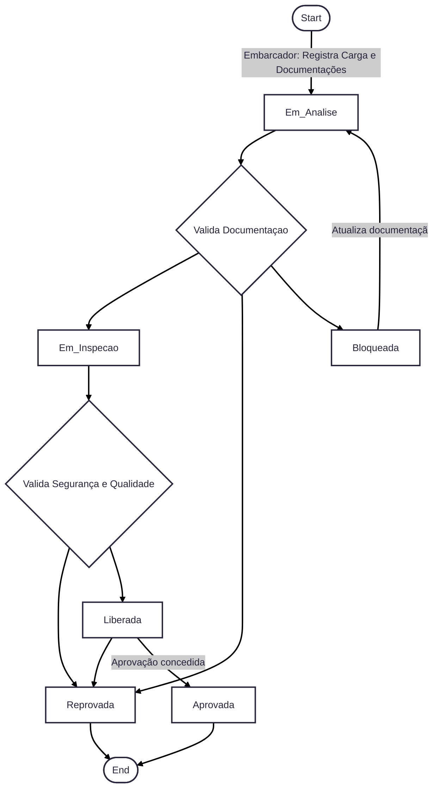

# Diagramas
Para facilitar a compreensão da solução proposta, primeiro iremos apresentar os dois diagramas necessários do tech challenge e em sequência os diagramas de casos de uso que fizemos para cada dominio para explicar os comportamentos de cada um.

## Fluxo de transição de status da carga:
