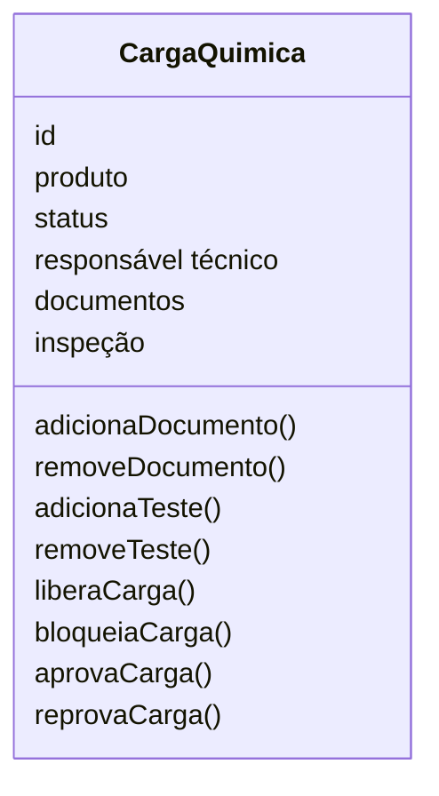
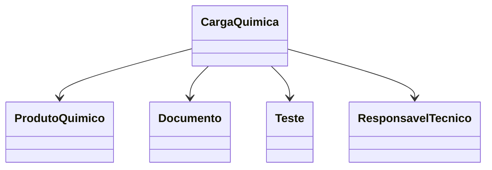

# Modelagem com Domain Driven Design
Nesse documento, vamos apresentar as entidades, objetos de valor, agregados relacionado ao dominio Cargas Químicas.s

## Entidades

### Carga Química:
**Responsabilidade:** Representar uma carga química que será transportada no porto, contendo informações sobre o produto químico, documentações e testes apresentados, status da carga e responsável técnico.

**Atributos:**
- id: Identificador único da carga química.
- produto: Produto químico associado à carga.
- status: Status atual da carga química (em análise, aprovado, reprovado)
- responsável técnico: Usuário responsável pela aprovação ou reprovação da carga química.



**Relacionamentos:**
- Possui um Produto Químico.
- Possui um Responsável Técnico.
- Possui um ou mais Documentos.
- Possui zero ou mais Testes.

**Regras:**
- Uma carga química deve ter um produto químico associado.
- Uma carga química deve ter um status definido.
- Uma carga química deve ter um responsável técnico definido.


## Objetos de Valor:
### Status da Carga:

**Responsabilidade:** Representar o estado atual de uma carga química durante seu ciclo de vida dentro do processo portuário.

O Status da Carga é um Objeto de Valor, pois não possui identidade própria e existe apenas para representar a situação atual da carga. Ele é utilizado para controlar o fluxo operacional e garantir que apenas transições de status válidas sejam realizadas.

**Valores possíveis:**
```typescript
enum StatusCarga {
    EM_ANALISE,
    EM_INSPECAO,
    APROVADA,
    REPROVADA,
    BLOQUEADA,
    LIBERADA
}
```

**Regras:**
- Toda carga deve possuir um Status definido.
- O Status da Carga deve ser alterado apenas por meio da entidade Carga Química.
- A carga deve seguir apenas transições de status permitidas pelas regras de negócio.

## Agregados

### Agregado Carga Química
A Carga Química é a raiz do agregado (Aggregate Root) e concentra todas as regras de negócio relacionadas ao processo de transporte de uma carga química no ambiente portuário.

Ela é responsável por garantir a consistência das informações e controlar todas as alterações realizadas em seus elementos internos. Nenhuma entidade pertencente ao agregado deve ser modificada diretamente sem passar pela entidade Carga Química, preservando as regras de negócio do domínio.

O agregado é composto pelos seguintes elementos:
- Carga Química (Aggregate Root)
- Produto Químico (Entidade)
- Documentos (Entidade)
- Testes (Entidade)
- Responsável Técnico (Entidade)



### Regras protegidas pelo agregado

O agregado Carga Química garante que:

- Toda carga possua um Produto Químico associado.
- Toda carga possua um Responsável Técnico definido.
- A documentação obrigatória esteja vinculada à carga.
- Os testes sejam registrados antes da aprovação, quando necessários.
- O status da carga siga apenas transições válidas.
- Apenas cargas que atendam às regras de negócio possam ser aprovadas ou liberadas.