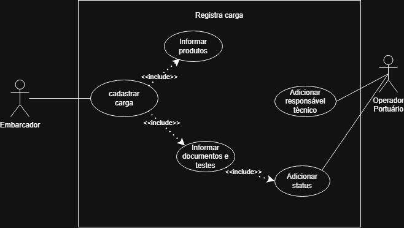
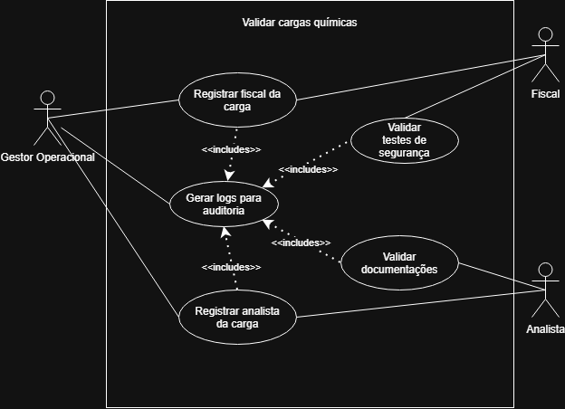
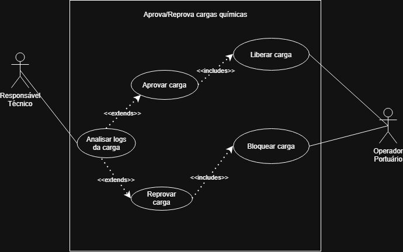

## Carga Química
### Caso de Uso: Registrar Carga Química
**Atores:** Embarcador, Operador Portuário

**Descrição:** Este caso de uso permite que o embarcador registre uma nova carga química no sistema, fornecendo informações detalhadas sobre o produto químico, documentação necessária e testes realizados.

Logo em seguida, o operador portuário irá colocar a carga química em análise e adicionar o responsável técnico para que ele possa aprovar ou reprovar a carga química.

#### Diagrama de caso de uso:

### Caso de Uso: Validar Carga Química
**Atores:**  Gestor Operacional, Fiscal e Analista.

**Descrição:** Gestor Operacional seleciona o fiscal e o analista para validar as documentações e testes da carga química. Gerando logs de auditoria para o sistema, garantindo que todas as informações estejam corretas e atualizadas.

#### Diagrama de caso de uso:

### Caso de Uso: Aprovar/Reprovar Carga Química
**Atores:** Responsável Técnico e Operador Portuário
**Descrição:** O responsável técnico irá analisar os logs de auditoria vendo se a carga química está com a documentação e testes corretos, podendo aprovar ou reprovar a carga química. O operador portuário irá liberar ou bloquear a carga química de acordo com a decisão do responsável técnico.

#### Diagrama de caso de uso:

