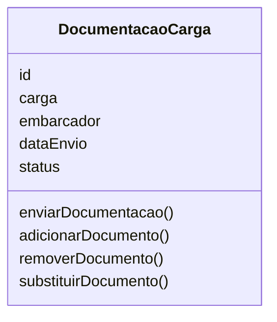
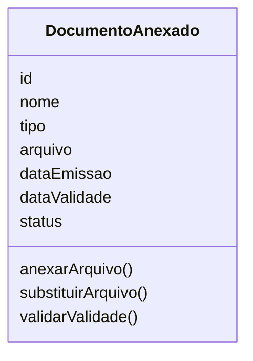
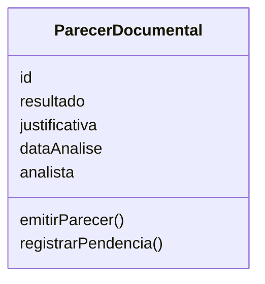
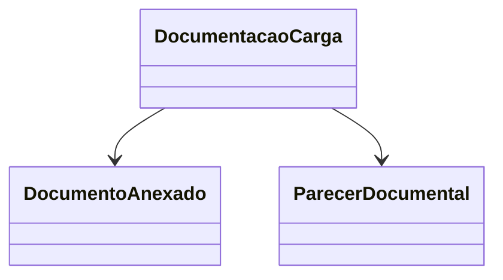

# Modelagem com Domain Driven Design

## Contexto do Domínio

O domínio **Documentação das Cargas e Produtos** é responsável por gerenciar todo o processo documental relacionado às cargas químicas que ingressam no ambiente portuário.

Seu principal objetivo é garantir que cada carga possua toda a documentação necessária para iniciar o processo de validação, permitindo que as informações enviadas pelo embarcador sejam organizadas, armazenadas e analisadas de forma estruturada.

Este domínio contempla o envio da documentação pelo embarcador, o gerenciamento dos documentos anexados e a emissão do parecer documental pelo Analista.

As informações produzidas por este domínio são utilizadas posteriormente pelo domínio **Inspeção**, responsável pela avaliação física da carga, e pelo domínio **Cargas Químicas**, onde o Responsável Técnico consolida todas as evidências para emitir o **Parecer Técnico da Carga**.

---

## Fluxo do Processo

Embora este documento descreva apenas o domínio **Documentação das Cargas e Produtos**, ele faz parte de um fluxo maior de validação das cargas químicas.

O processo inicia com o envio da documentação pelo embarcador, segue para a análise documental, passa pela inspeção física da carga e, por fim, é consolidado pelo Responsável Técnico, responsável pela decisão final sobre a movimentação da carga.

```text
Embarcador
      │
      ▼
Documentação da Carga
      │
      ▼
Parecer Documental
      │
      ├──────────────────────────────┐
      │                              │
      ▼                              │
             Fiscal                  │
                │                    │
                ▼                    │
        Laudo de Inspeção            │
                │                    │
                └──────────┬─────────┘
                           ▼
               Parecer Técnico da Carga
                           │
                           ▼
      Aprovar / Reprovar / Solicitar Correção
                           │
                           ▼
              Atualizar Status da Carga
```

As entidades apresentadas nas próximas seções representam apenas a parte do fluxo pertencente ao domínio **Documentação das Cargas e Produtos**, destacando como as informações são produzidas e posteriormente consumidas pelos demais domínios do sistema.

---

# Entidades

O domínio é composto por entidades que representam as etapas do processo documental. Cada uma possui responsabilidades específicas e colabora para garantir a consistência das informações durante todo o ciclo de validação.

---

## Documentação da Carga

### Responsabilidade

A **Documentação da Carga** representa o processo documental de uma carga química específica.

Ela reúne todos os documentos enviados pelo embarcador, controla o andamento da análise documental e centraliza as operações relacionadas ao gerenciamento da documentação daquela carga.

Por representar o principal objeto de negócio deste domínio, atua como a entidade central do processo documental.

### Atributos

| Atributo | Descrição |
|----------|-----------|
| id | Identificador único da documentação. |
| carga | Carga química à qual a documentação pertence. |
| embarcador | Usuário responsável pelo envio da documentação. |
| dataEnvio | Data em que a documentação foi enviada. |
| status | Situação atual da documentação durante o processo de análise. |

### Comportamentos

- enviarDocumentacao()
- adicionarDocumento()
- removerDocumento()
- substituirDocumento()



### Relacionamentos

A Documentação da Carga:

- pertence a uma Carga Química;
- é enviada por um Embarcador;
- possui um ou mais Documentos Anexados;
- possui um Parecer Documental.

### Regras de Negócio

- Toda documentação deve estar vinculada a uma carga química.
- Toda documentação deve possuir pelo menos um documento anexado.
- Apenas o embarcador responsável pode adicionar, remover ou substituir documentos.
- Após o início da análise documental, a documentação permanece bloqueada para alterações.

---

## Documento Anexado

### Responsabilidade

O **Documento Anexado** representa cada arquivo enviado pelo embarcador como parte da documentação da carga.

Esses documentos servem como evidências para comprovar que a carga atende às exigências legais, regulatórias e operacionais antes de seguir para as próximas etapas do processo.

Exemplos de documentos anexados incluem certificados, licenças, fichas de segurança (FISPQ), declarações e outros documentos obrigatórios definidos pelas normas aplicáveis.

### Atributos

| Atributo | Descrição |
|----------|-----------|
| id | Identificador único do documento. |
| nome | Nome do documento. |
| tipo | Categoria do documento (FISPQ, Certificado, Licença, etc.). |
| arquivo | Arquivo enviado pelo embarcador. |
| dataEmissao | Data de emissão do documento. |
| dataValidade | Data de validade do documento, quando aplicável. |
| status | Situação atual do documento (Válido, Vencido, Pendente, etc.). |

### Comportamentos

- anexarArquivo()
- substituirArquivo()
- validarValidade()



### Relacionamentos

O Documento Anexado:

- pertence a uma única Documentação da Carga.

### Regras de Negócio

- Todo documento anexado deve pertencer a uma documentação.
- Apenas documentos válidos podem ser considerados durante a análise documental.
- Um documento pode ser substituído antes do início da análise.
- O histórico de substituições deve ser preservado.

---

## Parecer Documental

Após o envio da documentação, inicia-se a etapa de análise documental.

O resultado dessa análise é registrado por meio do **Parecer Documental**, que representa formalmente a conclusão da avaliação realizada pelo Analista.

Seu objetivo é indicar se a documentação atende aos requisitos necessários para que a carga prossiga para a etapa de inspeção.

### Responsabilidade

Registrar o resultado da análise documental realizada sobre a documentação enviada pelo embarcador.

### Atributos

| Atributo | Descrição |
|----------|-----------|
| id | Identificador único do parecer. |
| documentacao | Documentação analisada. |
| analista | Usuário responsável pela análise. |
| resultado | Resultado da análise documental. |
| justificativa | Fundamentação da decisão. |
| dataAnalise | Data de emissão do parecer. |

### Comportamentos

- emitirParecer()
- registrarPendencia()



### Relacionamentos

O Parecer Documental:

- pertence a uma Documentação da Carga;
- é emitido por um Analista;
- será utilizado posteriormente pelo Responsável Técnico durante a emissão do Parecer Técnico da Carga.

### Regras de Negócio

- Apenas usuários com perfil de Analista podem emitir pareceres documentais.
- Todo parecer deve possuir um resultado definido.
- Pareceres classificados como **Não Conforme** exigem justificativa.
- Um parecer somente pode ser emitido após o envio da documentação.

---

# Objetos de Valor

Além das entidades, este domínio utiliza Objetos de Valor para representar conceitos que descrevem o estado da documentação durante seu ciclo de vida.

## Status da Documentação

Representa a situação atual da documentação.

```typescript
enum StatusDocumentacao {
    PENDENTE,
    EM_ANALISE,
    CONFORME,
    NAO_CONFORME
}
```

### Regras

- Toda documentação deve possuir um status.
- O status deve representar corretamente a etapa atual da análise.
- Apenas transições válidas podem ser realizadas.

---

## Resultado do Parecer

Representa o resultado da análise documental.

```typescript
enum ResultadoParecer {
    CONFORME,
    NAO_CONFORME
}
```

### Regras

- Apenas o Analista pode definir o resultado do parecer.
- Pareceres classificados como **Não Conforme** exigem justificativa obrigatória.

---

# Agregado

As entidades deste domínio possuem forte dependência entre si e compartilham regras de negócio que precisam permanecer consistentes durante todo o processo documental.

Por esse motivo, elas são organizadas em um único agregado.

## Agregado Documentação da Carga

A **Documentação da Carga** atua como **Aggregate Root**, concentrando todas as operações relacionadas ao gerenciamento documental.

Nenhuma alteração nos Documentos Anexados ou no Parecer Documental deve ocorrer sem passar pela Documentação da Carga, garantindo a integridade das regras de negócio.

O agregado é composto pelos seguintes elementos:

- Documentação da Carga (**Aggregate Root**)
- Documento Anexado
- Parecer Documental



## Consistência do Agregado

O agregado garante que:

- toda documentação pertença a uma única carga;
- toda documentação possua pelo menos um Documento Anexado;
- apenas o embarcador possa alterar os documentos enviados antes da análise;
- apenas Analistas possam emitir Pareceres Documentais;
- um parecer somente seja emitido após o envio da documentação.

---

# Integração com os Demais Domínios

O domínio **Documentação das Cargas e Produtos** representa a primeira etapa do processo de validação de uma carga química.

Após a emissão do **Parecer Documental**, a carga segue para o domínio **Inspeção**, onde o Fiscal realiza a avaliação física e registra o **Laudo de Inspeção**.

Em seguida, o domínio **Cargas Químicas** reúne o **Parecer Documental** e o **Laudo de Inspeção** para que o Responsável Técnico emita o **Parecer Técnico da Carga**, responsável pela decisão final sobre a movimentação da carga.
