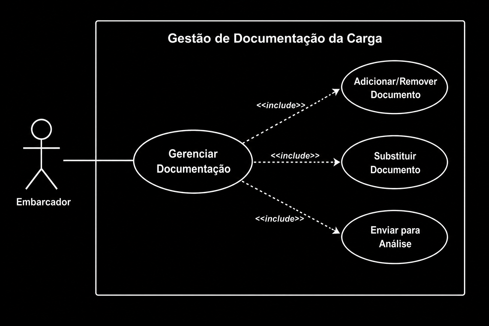
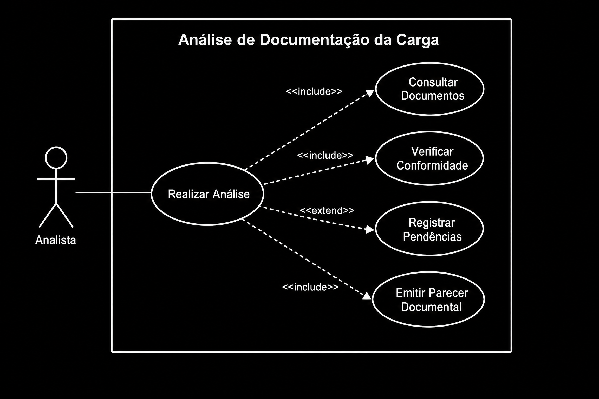
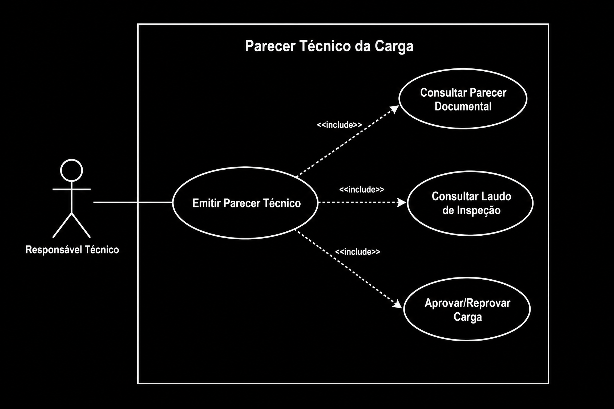

# Casos de Uso

Neste documento, serão apresentados os casos de uso do domínio **Documentação das Cargas e Produtos**, descrevendo as interações entre os atores e o sistema durante o processo de envio, análise e validação da documentação das cargas químicas.

---

## Caso de Uso: Registrar Documentação da Carga

**Atores:** Embarcador

### Descrição

Este caso de uso permite que o embarcador registre a documentação de uma carga química no sistema.

Durante esse processo, o embarcador seleciona a carga previamente cadastrada, anexa todos os documentos obrigatórios e envia a documentação para análise. Após o envio, a documentação fica disponível para validação pelo Analista e não poderá mais ser alterada até o término da análise documental.

#### Diagrama de Caso de Uso

---

## Caso de Uso: Analisar Documentação da Carga

**Atores:** Analista

### Descrição

Este caso de uso permite que o Analista realize a validação da documentação enviada pelo embarcador.

O Analista consulta todos os documentos anexados, verifica sua conformidade com as exigências legais e operacionais e registra eventuais pendências identificadas durante a análise.

Ao concluir a validação, o Analista emite o **Parecer Documental**, indicando se a documentação está conforme ou se necessita de correções antes de prosseguir para as próximas etapas do processo.

#### Diagrama de Caso de Uso

---

## Caso de Uso: Consultar Parecer Documental

**Atores:** Responsável Técnico

### Descrição

Este caso de uso permite que o Responsável Técnico consulte o Parecer Documental emitido pelo Analista.

O parecer apresenta o resultado da análise da documentação da carga e servirá como uma das evidências utilizadas na avaliação final da carga, juntamente com o **Laudo de Inspeção**, produzido pelo domínio **Inspeção**.

A partir dessas informações, o Responsável Técnico poderá prosseguir com o processo de decisão sobre a movimentação da carga no domínio **Cargas Químicas**.

#### Diagrama de Caso de Uso

