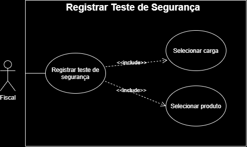
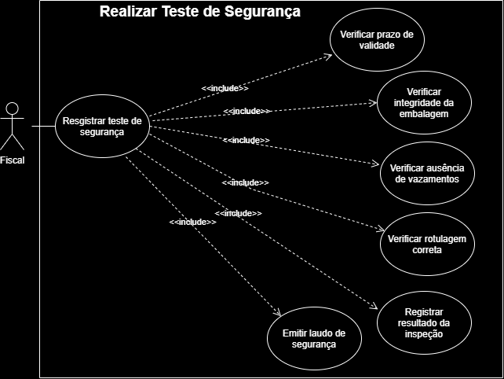
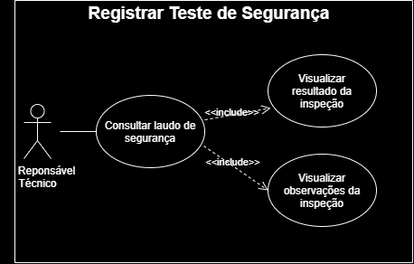

# Usuários e Operações

## Caso de Uso: Registrar Teste de Segurança

**Atores:** Fiscal

**Descrição:** Este caso de uso permite que o Fiscal registre um novo teste de segurança para uma carga ou produto químico no sistema.

Durante esse processo, o Fiscal seleciona a carga previamente cadastrada, identifica o produto químico associado e inicia o registro da inspeção de segurança, preparando a carga para a realização das verificações obrigatórias.

Após o registro, o teste de segurança fica disponível para execução e posterior emissão do Laudo de Segurança.

#### Diagrama de caso de uso:

---

## Caso de Uso: Realizar Teste de Segurança

**Atores:** Fiscal

**Descrição:** Este caso de uso permite que o Fiscal realize as verificações obrigatórias de segurança da carga e do produto químico.

Durante a inspeção, o Fiscal verifica requisitos como prazo de validade do produto, integridade da embalagem, ausência de vazamentos, rotulagem adequada e demais condições de segurança exigidas pelas normas portuárias.

Ao concluir a inspeção, o Fiscal registra o resultado das verificações e emite o Laudo de Segurança, indicando se a carga atende ou não aos requisitos necessários para prosseguir no processo.

#### Diagrama de caso de uso:

---

## Caso de Uso: Consultar Laudo de Segurança

**Atores:** Responsável Técnico

**Descrição:** Este caso de uso permite que o Responsável Técnico consulte o Laudo de Segurança emitido pelo Fiscal.

O laudo apresenta o resultado das verificações realizadas durante a inspeção de segurança da carga e do produto químico e servirá como uma das evidências utilizadas na avaliação final da carga, juntamente com o Parecer Documental, produzido pelo domínio Documentação das Cargas e Produtos.

A partir dessas informações, o Responsável Técnico poderá prosseguir com o processo de decisão sobre a movimentação da carga no domínio Cargas Químicas.

#### Diagrama de caso de uso:

