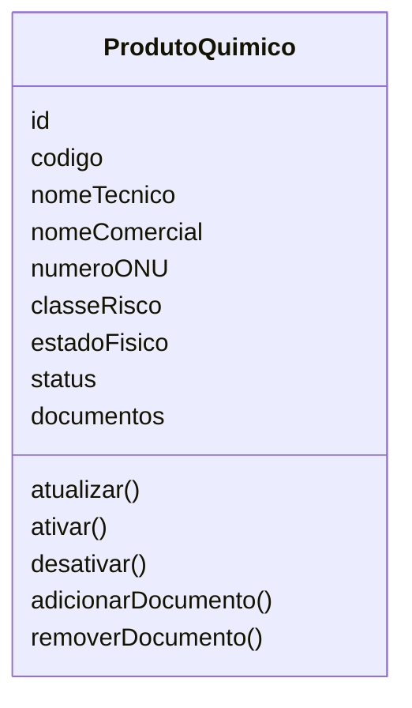
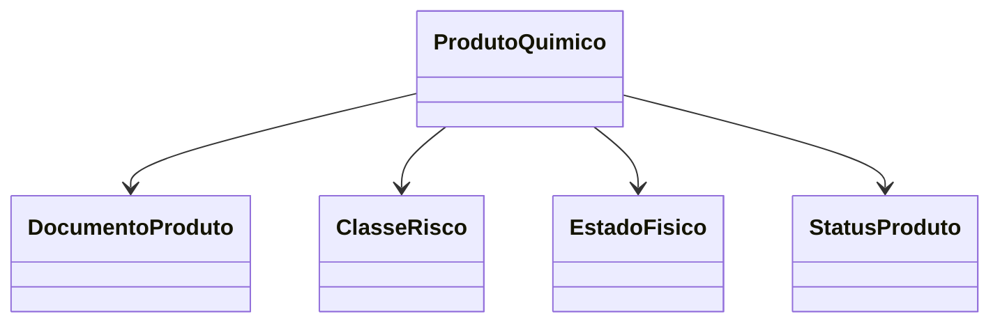

# Modelagem com Domain Driven Design

## Contexto do Domínio

O domínio **Produtos Químicos** é responsável por gerenciar o cadastro e a manutenção das informações dos produtos químicos utilizados nas operações portuárias.

Seu principal objetivo é garantir que cada produto químico esteja devidamente identificado, classificado e registrado no sistema, contendo informações como código, nome técnico, nome comercial, número ONU, classe de risco, estado físico, status e documentação associada.

Este domínio contempla o cadastro, consulta, atualização e gerenciamento do ciclo de vida dos produtos químicos, assegurando a integridade e a consistência das informações utilizadas pelos demais domínios do sistema.

As informações produzidas por este domínio são utilizadas posteriormente pelos domínios **Cargas Químicas**, para associação do produto às cargas transportadas, **Lotes**, para o controle das remessas de cada produto químico, e **Armazenamento**, para apoiar a definição das condições adequadas de estocagem conforme a classificação de risco e as características físico-químicas do produto.

## Entidades

### Produto Químico

**Responsabilidade:** Representar um produto químico cadastrado no sistema, contendo suas informações de identificação, classificação de risco, estado físico, número ONU e status, permitindo sua utilização nas operações portuárias.

**Atributos:**

- id: Identificador único do produto químico.
- código: Código interno do produto.
- nome técnico: Nome técnico do produto.
- nome comercial: Nome comercial do produto.
- número ONU: Número ONU do produto.
- classe de risco: Classe de risco do produto.
- estado físico: Estado físico do produto.
- status: Status atual do produto.
- documentos: Documentos vinculados ao produto.



**Relacionamentos:**

- Possui uma Classe de Risco.
- Possui um Estado Físico.
- Possui um Status do Produto.
- Possui zero ou mais Documentos do Produto.

**Regras:**

- Todo produto químico deve possuir um Código único.
- Todo produto químico deve possuir um Nome Técnico.
- Todo produto químico deve possuir um Número ONU.
- Todo produto químico deve possuir uma Classe de Risco.
- Todo produto químico deve possuir um Estado Físico.
- Apenas produtos ativos podem ser utilizados em novas operações.

---

## Objetos de Valor

### Classe de Risco

**Responsabilidade:** Representar a classificação de risco do produto químico de acordo com sua natureza e perigosidade.

A Classe de Risco é um Objeto de Valor, pois não possui identidade própria e existe apenas para representar a classificação de um produto químico.

**Valores possíveis:**

```typescript
enum ClasseRisco {
    EXPLOSIVOS,
    GASES,
    LIQUIDOS_INFLAMAVEIS,
    SOLIDOS_INFLAMAVEIS,
    SUBSTANCIAS_OXIDANTES,
    SUBSTANCIAS_TOXICAS,
    MATERIAIS_RADIOATIVOS,
    SUBSTANCIAS_CORROSIVAS,
    SUBSTANCIAS_PERIGOSAS_DIVERSAS
}
```

**Regras:**

- Todo produto deve possuir uma Classe de Risco.
- A Classe de Risco somente pode ser alterada por meio da entidade Produto Químico.

---

### Estado Físico

**Responsabilidade:** Representar o estado físico em que o produto químico se encontra.

```typescript
enum EstadoFisico {
    SOLIDO,
    LIQUIDO,
    GASOSO
}
```

**Regras:**

- Todo produto deve possuir um Estado Físico definido.

---

### Status do Produto

**Responsabilidade:** Representar a situação atual do cadastro do produto químico.

```typescript
enum StatusProduto {
    ATIVO,
    INATIVO,
    BLOQUEADO,
    EM_ANALISE
}
```

**Regras:**

- Todo produto deve possuir um Status definido.
- Apenas produtos com status ATIVO podem ser utilizados em operações.
- O Status deve ser alterado apenas por meio da entidade Produto Químico.

---

## Agregados

### Agregado Produto Químico

O Produto Químico é a raiz do agregado (Aggregate Root) e concentra todas as regras de negócio relacionadas ao cadastro e manutenção dos produtos químicos.

Ele é responsável por garantir a consistência das informações e controlar todas as alterações realizadas em seus elementos internos. Nenhuma entidade pertencente ao agregado deve ser modificada diretamente sem passar pela entidade Produto Químico.

O agregado é composto pelos seguintes elementos:

- Produto Químico (Aggregate Root)
- Documento do Produto (Entidade)
- Classe de Risco (Objeto de Valor)
- Estado Físico (Objeto de Valor)
- Status do Produto (Objeto de Valor)



### Regras protegidas pelo agregado

O agregado Produto Químico garante que:

- Todo produto possua um Código único.
- Todo produto possua um Nome Técnico.
- Todo produto possua um Número ONU válido.
- Todo produto possua uma Classe de Risco.
- Todo produto possua um Estado Físico.
- Apenas produtos ativos possam ser utilizados em operações.
- Toda alteração realizada no cadastro respeite as regras de negócio do domínio.
