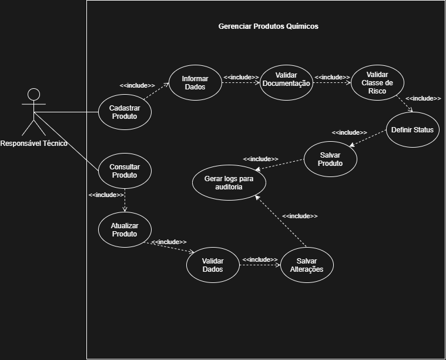
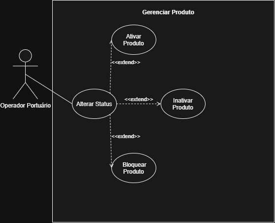

# Produtos Químicos

## Caso de Uso: Gerenciar Produtos Químicos

**Atores:** Responsável Técnico

**Descrição:** Este caso de uso permite que o responsável técnico realize o cadastro, consulta e atualização de produtos químicos utilizados nas operações portuárias.

Durante o cadastro, o responsável técnico informa os dados do produto, valida a documentação obrigatória, verifica a classe de risco e define o status inicial do produto. Após a conclusão do cadastro, o sistema registra os logs de auditoria para garantir a rastreabilidade das operações.

Na atualização, o responsável técnico pode consultar um produto previamente cadastrado, alterar suas informações, validar os novos dados e salvar as alterações, gerando novamente os logs de auditoria.

#### Diagrama de caso de uso:

---

## Caso de Uso: Alterar Status do Produto Químico

**Atores:** Operador Portuário

**Descrição:** Este caso de uso permite que o Operador Portuário altere o status de um produto químico cadastrado conforme as necessidades operacionais.

O operador poderá ativar, inativar ou bloquear um produto químico. Após a alteração do status, o sistema registra os logs de auditoria, garantindo a rastreabilidade das modificações realizadas.

#### Diagrama de caso de uso:

