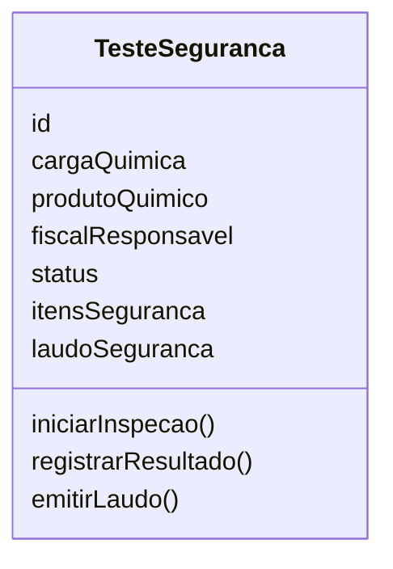
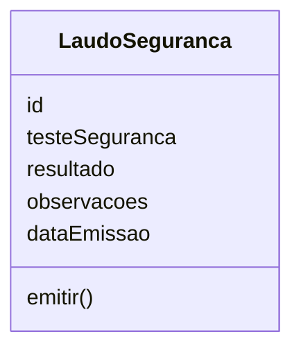
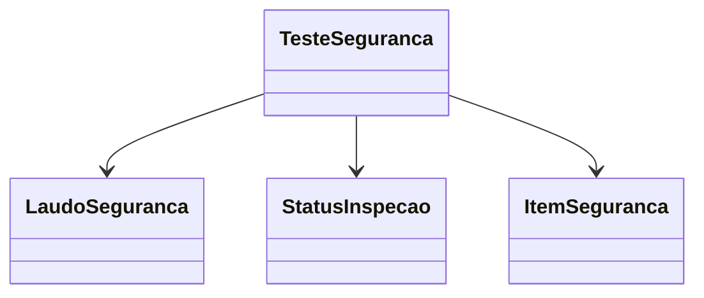

# Modelagem com Domain Driven Design

## Contexto do Domínio

O domínio **Testes de Segurança das Cargas e Produtos** é responsável por gerenciar a realização, o registro e a validação dos testes de segurança aplicados aos produtos e às cargas químicas durante o processo de movimentação portuária.

Seu principal objetivo é garantir que cada carga ou produto químico seja submetido aos testes exigidos pelas normas de segurança, registrando seus resultados para apoiar a tomada de decisão sobre a movimentação da carga.

Este domínio contempla o agendamento, execução, registro dos resultados e emissão do laudo dos testes de segurança, assegurando a integridade e a rastreabilidade das informações produzidas.

As informações produzidas por este domínio são utilizadas posteriormente pelo domínio **Cargas Químicas**, onde o Responsável Técnico utiliza os resultados dos testes juntamente com o parecer documental para emitir a decisão final sobre a carga.

## Entidades

### Teste de Segurança

**Responsabilidade:** Representar uma inspeção de segurança realizada em uma carga ou produto químico, registrando as verificações obrigatórias exigidas pelas operações portuárias e o resultado obtido durante a inspeção.

**Atributos:**

- id: Identificador único do teste de segurança.
- carga química: Carga química submetida à inspeção.
- produto químico: Produto químico avaliado durante a inspeção.
- fiscal responsável: Fiscal responsável pela realização da inspeção.
- status: Situação atual do teste de segurança.
- itens de segurança: Conjunto de verificações realizadas durante a inspeção.
- laudo de segurança: Laudo emitido após a conclusão da inspeção.



**Relacionamentos:**

- Pertence a uma Carga Química.
- Está associado a um Produto Químico.
- Possui um Fiscal responsável.
- Possui um Status da Inspeção.
- Possui um ou mais Itens de Segurança.
- Possui um Laudo de Segurança.

**Regras:**

- Todo teste de segurança deve estar vinculado a uma carga química.
- Todo teste de segurança deve estar associado a um produto químico.
- Todo teste deve possuir um Fiscal responsável.
- Todos os itens obrigatórios de segurança devem ser avaliados antes da emissão do laudo.
- O laudo somente pode ser emitido após a conclusão da inspeção.

---

### Laudo de Segurança

**Responsabilidade:** Representar o documento emitido ao final da inspeção de segurança, registrando o resultado das verificações realizadas e servindo como evidência para o processo de aprovação da carga química.

**Atributos:**

- id: Identificador único do laudo.
- teste de segurança: Teste de segurança ao qual o laudo pertence.
- resultado: Resultado final da inspeção.
- observações: Observações registradas pelo Fiscal durante a inspeção.
- data de emissão: Data e hora da emissão do laudo.



**Relacionamentos:**

- Pertence a um Teste de Segurança.

**Regras:**

- Todo laudo deve estar vinculado a um Teste de Segurança.
- Apenas testes concluídos podem gerar um Laudo de Segurança.
- Todo laudo deve possuir um resultado definido.
- Laudos com resultado REPROVADO devem conter uma justificativa.

---

## Objetos de Valor

### Status do Usuário

**Responsabilidade:** Representar a situação atual de uma inspeção de segurança durante seu ciclo de vida.

O Status da Inspeção é um Objeto de Valor, pois não possui identidade própria e existe apenas para representar a situação atual do teste de segurança.

**Valores possíveis:**

```typescript
enum StatusInspecao {
    EM_ANALISE,
    APROVADO,
    REPROVADO
}
```

**Regras:**

- Todo teste deve possuir um Status da Inspeção definido.
- O Status da Inspeção deve ser alterado apenas por meio da entidade Teste de Segurança.

---

### Item de Segurança

**Responsabilidade:** Representar um requisito obrigatório de segurança que deve ser verificado durante a inspeção da carga ou do produto químico.

O Item de Segurança é um Objeto de Valor, pois não possui identidade própria e existe apenas para representar um requisito avaliado durante a inspeção.

```typescript
enum ItemSeguranca {
    PRAZO_DE_VALIDADE,
    INTEGRIDADE_DA_EMBALAGEM,
    AUSENCIA_DE_VAZAMENTO,
    ROTULAGEM_CORRETA,
    CONDICOES_DE_TRANSPORTE,
    EQUIPAMENTOS_DE_SEGURANCA
}
```

**Regras:**

- Todo teste deve possuir um ou mais Itens de Segurança.
- Os Itens de Segurança somente podem ser alterados por meio da entidade Teste de Segurança.

---

## Agregados

### Agregado Teste de Segurança

O Teste de Segurança é a raiz do agregado (Aggregate Root) e concentra todas as regras de negócio relacionadas às inspeções de segurança realizadas nas cargas e produtos químicos.

Ele é responsável por garantir a consistência das informações e controlar todas as alterações realizadas em seus elementos internos. Nenhuma entidade pertencente ao agregado deve ser modificada diretamente sem passar pela entidade Teste de Segurança.

O agregado é composto pelos seguintes elementos:

- Teste de Segurança (Aggregate Root)
- Laudo de Segurança (Entidade)
- Status da Inspeção (Objeto de Valor)
- Item de Segurança (Objeto de Valor)



### Regras protegidas pelo agregado

O agregado Teste de Segurança garante que:

- Todo teste esteja vinculado a uma carga química.
- Todo teste esteja associado a um produto químico.
- Todo teste possua um Fiscal responsável.
- Todos os itens obrigatórios de segurança sejam avaliados antes da conclusão da inspeção.
- Apenas testes concluídos possam gerar um Laudo de Segurança.
- O resultado da inspeção seja registrado antes da emissão do laudo.
- Toda alteração realizada na inspeção respeite as regras de negócio do domínio.