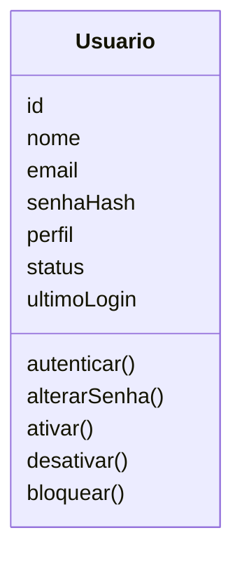
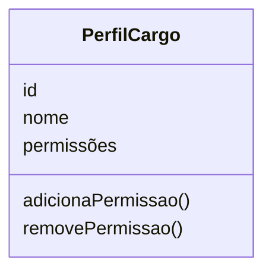
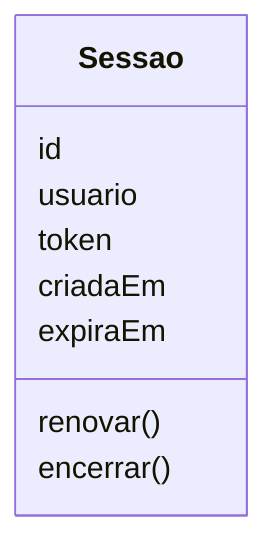
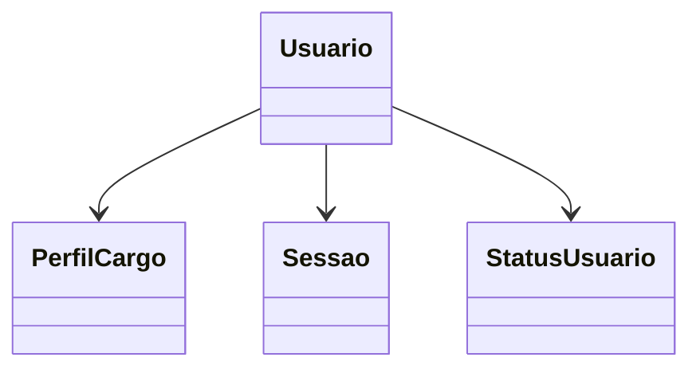

# Modelagem com Domain Driven Design

## Contexto do Domínio

O domínio **Usuários e Operações** é responsável por gerenciar o cadastro de usuários do sistema, controlando sua autenticação, suas sessões de acesso e as permissões associadas a cada perfil.

Seu principal objetivo é garantir que cada usuário esteja devidamente identificado, com credenciais seguras, e associado a um perfil que define exatamente quais ações ele pode realizar dentro do sistema — mantendo o controle de quem está ativo, bloqueado ou com sessão expirada.

Este domínio contempla o cadastro, a autenticação, o controle de sessões e o gerenciamento de perfis dos usuários — Operador Portuário, Embarcador/Motorista, Responsável Técnico, Gestor Operacional e Administrador do Sistema.

As informações produzidas por este domínio são utilizadas posteriormente pelos demais domínios do sistema — como **Cargas Químicas** e **Produtos Químicos** — para validar quem tem permissão para registrar, aprovar, movimentar ou gerenciar as informações de cada um desses domínios.

## Entidades

### Usuário

**Responsabilidade:** Representar uma pessoa cadastrada no sistema, com credenciais próprias e um perfil definido, responsável por controlar quem pode agir sobre as operações do domínio.

**Atributos:**

- id: Identificador único do usuário.
- nome: Nome do usuário.
- email: E-mail único do usuário.
- senhaHash: Hash da senha do usuário.
- perfil: Perfil/Cargo associado, que define suas permissões.
- status: Status atual do usuário (ativo, inativo ou bloqueado).
- ultimoLogin: Data e hora do último login realizado.



**Relacionamentos:**

- Possui um Perfil/Cargo.
- Possui zero ou mais Sessões.

**Regras:**

- Um usuário deve ter um e-mail único.
- Um usuário deve ter um perfil definido.
- Somente um usuário com status ativo pode autenticar-se no sistema.
- A senha do usuário deve atender aos critérios mínimos de segurança definidos pelo sistema.

---

### Perfil / Cargo

**Responsabilidade:** Definir o conjunto de permissões que um usuário pode executar dentro do sistema, de acordo com sua função (Operador Portuário, Embarcador/Motorista, Responsável Técnico, Gestor Operacional ou Administrador do Sistema).

**Atributos:**

- id: Identificador único do perfil.
- nome: Nome do perfil (ex.: Operador Portuário, Gestor Operacional).
- permissões: Conjunto de Permissões associadas a esse perfil.



**Regras:**

- Todo perfil deve ter um nome único.
- Um perfil deve possuir ao menos uma permissão associada.

---

### Sessão

**Responsabilidade:** Representar uma sessão de acesso ativa de um usuário autenticado no sistema, controlando sua validade e expiração.

**Atributos:**

- id: Identificador único da sessão.
- usuario: Usuário dono da sessão.
- token: Token de autenticação da sessão.
- criadaEm: Data e hora de criação da sessão.
- expiraEm: Data e hora de expiração da sessão.



**Relacionamentos:**

- Pertence a um Usuário.

**Regras:**

- Uma sessão só pode ser criada para um usuário com status ativo.
- Uma sessão expirada não pode ser reutilizada, apenas renovada por meio de novo login.
- Encerrar uma sessão não afeta as demais sessões ativas do mesmo usuário.

---

## Objetos de Valor

### Status do Usuário

**Responsabilidade:** Representar a situação atual de um usuário dentro do sistema.

O Status do Usuário é um Objeto de Valor, pois não possui identidade própria e existe apenas para representar a situação atual do usuário.

**Valores possíveis:**

```typescript
enum StatusUsuario {
ATIVO,
INATIVO,
BLOQUEADO
}
```

**Regras:**

- Todo usuário deve possuir um Status definido.
- O Status do Usuário deve ser alterado apenas por meio da entidade Usuário.
- Um usuário bloqueado não pode ser reativado automaticamente — requer ação do Administrador do Sistema.

---

### Permissão

**Responsabilidade:** Representar uma única ação autorizada dentro do sistema, associada a um recurso específico.

A Permissão é um Objeto de Valor, pois duas permissões com o mesmo recurso e ação são consideradas equivalentes, sem necessidade de identidade própria.

```typescript
class Permissao {
recurso: string;
acao: "CRIAR" | "LER" | "ATUALIZAR" | "EXCLUIR";
}
```

**Regras:**

- Toda permissão deve possuir um recurso e uma ação associados.
- Um perfil não pode ter permissões duplicadas para o mesmo recurso e ação.

---

## Agregados

### Agregado Usuário

O Usuário é a raiz do agregado (Aggregate Root) e concentra todas as regras de negócio relacionadas ao cadastro, autenticação, sessões e controle de acesso dos usuários do sistema.

Ele é responsável por garantir a consistência das informações e controlar todas as alterações realizadas em seus elementos internos. Nenhum elemento pertencente ao agregado deve ser modificado diretamente sem passar pela entidade Usuário.

O agregado é composto pelos seguintes elementos:

- Usuário (Aggregate Root)
- Perfil/Cargo (Entidade, referenciada)
- Sessão (Entidade)
- Status do Usuário (Objeto de Valor)



### Regras protegidas pelo agregado

O agregado Usuário garante que:

- Cada usuário possua um e-mail único no sistema.
- Todo usuário possua um perfil/cargo definido.
- Somente usuários com status ativo possam autenticar-se e criar novas sessões.
- Toda sessão criada esteja vinculada a um usuário válido e ativo.
