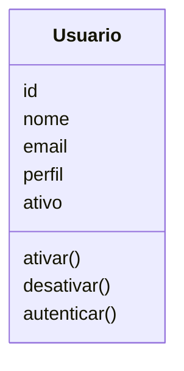
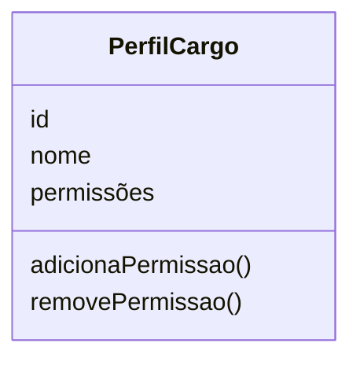
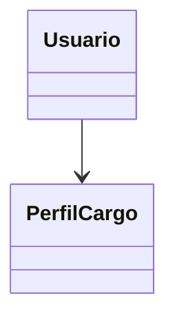

# Modelagem com Domain Driven Design

## Contexto do Domínio

O domínio **Usuários e Operações** é responsável por gerenciar o cadastro de usuários do sistema, controlando sua autenticação e as permissões associadas a cada perfil de acesso.

Seu principal objetivo é garantir que cada usuário esteja devidamente identificado e associado a um perfil que define exatamente quais ações ele pode realizar dentro do sistema, mantendo o controle de quem está ativo e apto a operar.

Este domínio contempla o cadastro, a autenticação e o gerenciamento de perfis dos usuários — Operador Portuário, Embarcador/Motorista, Responsável Técnico, Gestor Operacional e Administrador do Sistema.

As informações produzidas por este domínio são utilizadas posteriormente pelos demais domínios do sistema — como **Cargas Químicas** e **Produtos Químicos** — para validar quem tem permissão para registrar, aprovar, movimentar ou gerenciar as informações de cada um desses domínios.

## Entidades

### Usuário

**Responsabilidade:** Representar uma pessoa cadastrada no sistema, com um papel (perfil) definido, responsável por controlar quem pode agir sobre as operações do domínio.

**Atributos:**

- id: Identificador único do usuário.
- nome: Nome do usuário.
- email: E-mail único do usuário.
- perfil: Perfil/Cargo associado, que define suas permissões.
- ativo: Indica se o usuário está ativo e pode agir no sistema.

**Relacionamentos:**

- Possui um Perfil/Cargo.

**Regras:**

- Um usuário deve ter um e-mail único.
- Um usuário deve ter um perfil definido.
- Somente um usuário ativo pode agir no sistema.

---

### Perfil / Cargo

**Responsabilidade:** Definir o conjunto de permissões e ações que um usuário pode executar dentro do sistema, de acordo com sua função (Operador Portuário, Embarcador/Motorista, Responsável Técnico, Gestor Operacional ou Administrador do Sistema).

**Atributos:**

- id: Identificador único do perfil.
- nome: Nome do perfil (ex.: Operador Portuário, Gestor Operacional).
- permissões: Conjunto de ações permitidas para esse perfil.

**Regras:**

- Todo perfil deve ter um nome definido.
- Um perfil deve possuir ao menos uma permissão associada.

---

## Agregados

### Agregado Usuário

O Usuário é a raiz do agregado (Aggregate Root) e concentra todas as regras de negócio relacionadas ao cadastro, autenticação e controle de acesso dos usuários do sistema.

Ele é responsável por garantir a consistência das informações e controlar todas as alterações realizadas em seus elementos internos. Nenhum elemento pertencente ao agregado deve ser modificado diretamente sem passar pela entidade Usuário.

O agregado é composto pelos seguintes elementos:

- Usuário (Aggregate Root)
- Perfil/Cargo (Entidade, referenciada)

### Regras protegidas pelo agregado

O agregado Usuário garante que:

- Cada usuário possua um e-mail único no sistema.
- Todo usuário possua um perfil/cargo definido.
- Somente usuários ativos possam realizar ações no sistema.
