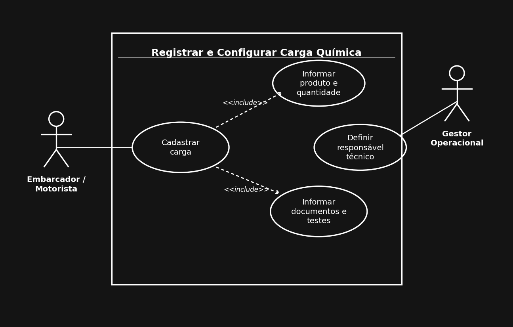
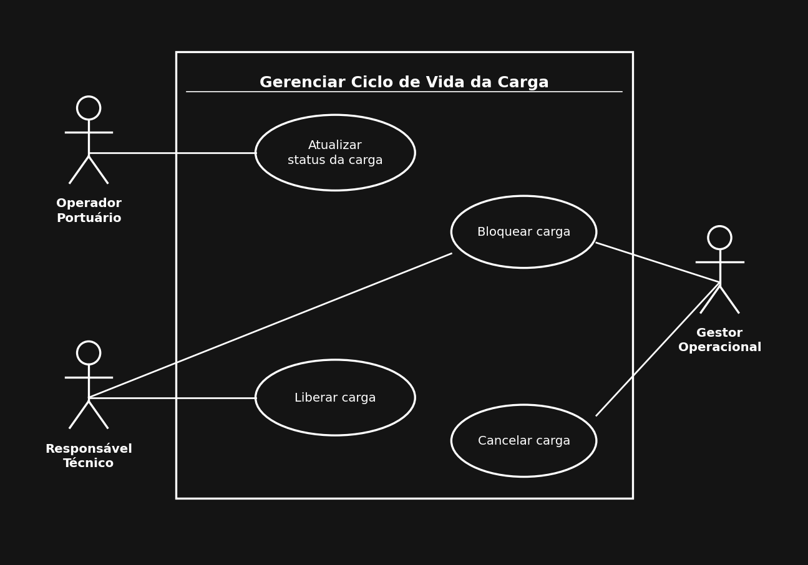
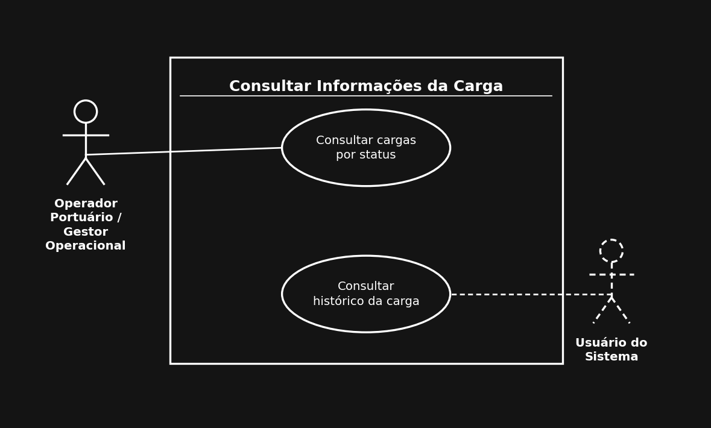
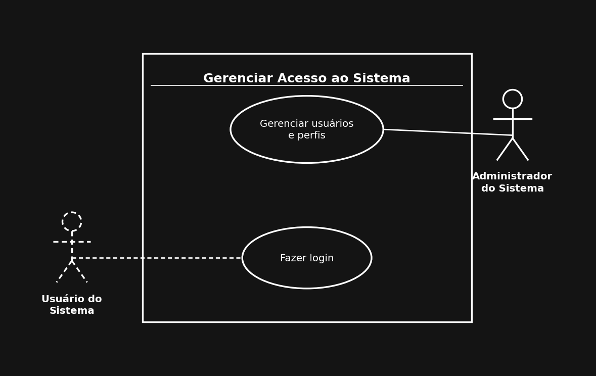

# Usuários e Operações

## Caso de Uso: Registrar e Configurar Carga Química

**Atores:** Embarcador/Motorista, Gestor Operacional

**Descrição:** Este caso de uso permite que o embarcador registre uma nova carga química no sistema, informando o produto associado e a quantidade transportada, além dos documentos e testes obrigatórios da carga.

Logo em seguida, o gestor operacional irá definir o responsável técnico vinculado a essa carga, para que ela possa avançar nas próximas etapas do fluxo.

#### Diagrama de caso de uso:

---

## Caso de Uso: Gerenciar Ciclo de Vida da Carga

**Atores:** Operador Portuário, Gestor Operacional, Responsável Técnico

**Descrição:** O operador portuário atualiza o status da carga conforme ela avança pelas etapas do fluxo operacional. O gestor operacional pode bloquear uma carga irregular ou cancelar definitivamente o processo, enquanto o responsável técnico é quem autoriza a liberação da carga para movimentação, podendo também bloqueá-la caso identifique alguma irregularidade.

#### Diagrama de caso de uso:

---

## Caso de Uso: Consultar Informações da Carga

**Atores:** Operador Portuário, Gestor Operacional, Usuário do Sistema

**Descrição:** Operadores e gestores podem consultar as cargas químicas filtrando pela etapa em que se encontram. Qualquer usuário autenticado no sistema pode consultar o histórico de mudanças de status de uma carga específica, desde que tenha permissão para visualizá-la.

#### Diagrama de caso de uso:

---

## Caso de Uso: Gerenciar Acesso ao Sistema

**Atores:** Usuário do Sistema, Administrador do Sistema

**Descrição:** Qualquer usuário cadastrado pode fazer login no sistema utilizando suas credenciais, desde que esteja ativo. O administrador do sistema é responsável por cadastrar, editar e desativar usuários, além de gerenciar os perfis que definem as permissões de cada um.

#### Diagrama de caso de uso:

