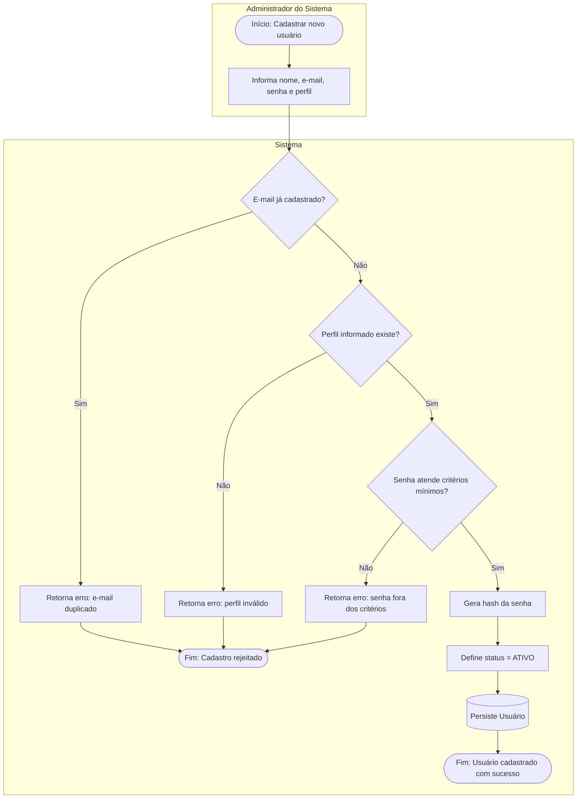
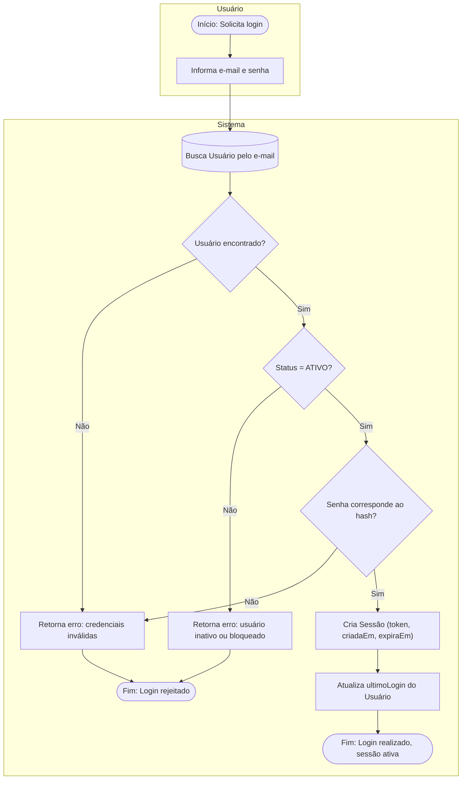
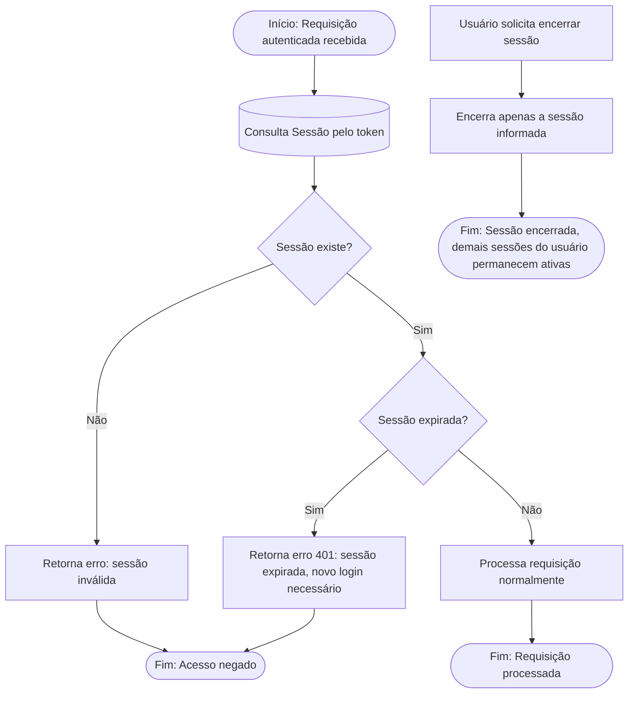
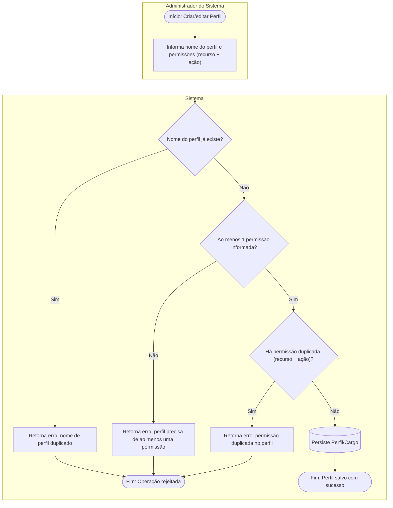
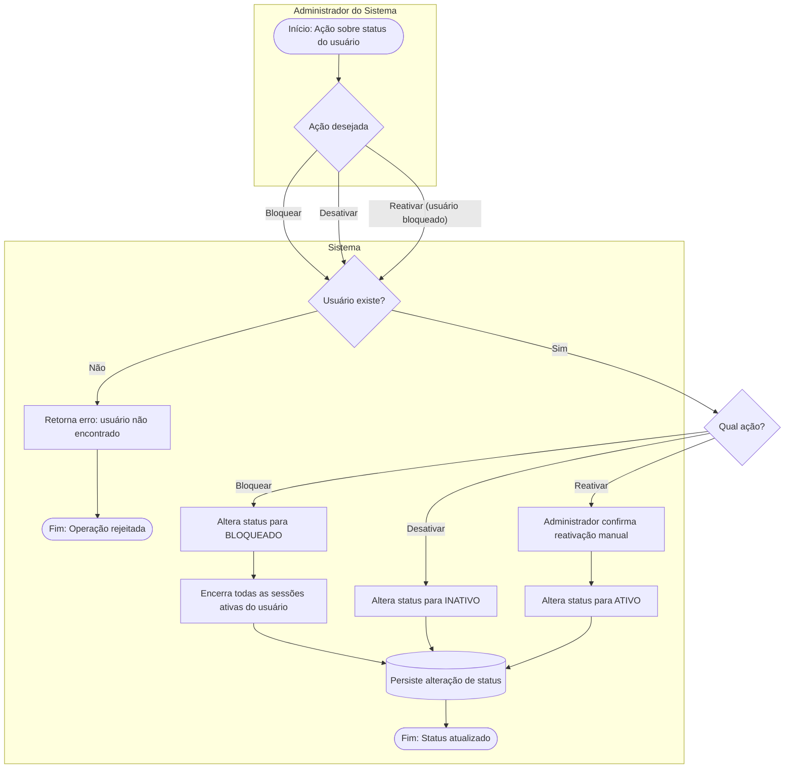

# Mapeamento de Processos — Usuários e Operações

Este documento apresenta o mapeamento dos processos (fluxogramas) do domínio **Usuários e Operações**, detalhando como cada entidade se comunica, quais decisões o sistema toma e quais regras de negócio são validadas em cada etapa.

O objetivo é servir de apoio visual à [Modelagem com DDD](02-modelagem-com-ddd.md) e aos [Casos de Uso](03-casos-de-uso.md) já documentados, deixando explícito o **fluxo** por trás de cada regra descrita em [Regras de Negócio](../04-regras-de-negócio.md).

## Legenda

| Símbolo (Mermaid) | Significado |
|---|---|
| `([Texto])` | Início / Fim do processo |
| `[Texto]` | Atividade / Ação do sistema ou ator |
| `{Texto}` | Decisão / Validação de regra de negócio |
| `[(Texto)]` | Persistência (leitura ou gravação em banco) |
| Subgraph (raia) | Ator responsável pela etapa (Administrador, Usuário, Sistema) |

---

## 1. Fluxo: Cadastro de Usuário

**Ator principal:** Administrador do Sistema
**Regras aplicadas:** e-mail único, perfil obrigatório, senha com critérios mínimos de segurança.

---

## 2. Fluxo: Autenticação (Login)

**Ator principal:** Usuário do Sistema (qualquer perfil)
**Regras aplicadas:** somente usuário ativo autentica; sessão só é criada para usuário válido e ativo.

---

## 3. Fluxo: Gestão de Sessão (Renovação e Encerramento)

**Ator principal:** Sistema (acionado por Usuário ou por expiração)
**Regras aplicadas:** sessão expirada não pode ser reutilizada, apenas renovada por novo login; encerrar uma sessão não afeta as demais sessões ativas do mesmo usuário.

---

## 4. Fluxo: Gerenciamento de Perfis e Permissões

**Ator principal:** Administrador do Sistema
**Regras aplicadas:** nome do perfil único, perfil deve ter ao menos uma permissão, permissões não podem se repetir (mesmo recurso + ação) em um perfil.

---

## 5. Fluxo: Bloqueio, Desbloqueio e Desativação de Usuário

**Ator principal:** Administrador do Sistema
**Regras aplicadas:** status alterado apenas via entidade Usuário; usuário bloqueado não pode ser reativado automaticamente — exige ação do Administrador.

---

## Rastreabilidade: Regra de Negócio × Processo

| Regra de Negócio | Processo onde é validada | Camada responsável (proposta) |
|---|---|---|
| Um usuário deve ter e-mail único | Cadastro de Usuário (Fluxo 1) | Domain (Agregado Usuário) |
| Um usuário deve ter um perfil definido | Cadastro de Usuário (Fluxo 1) | Domain (Agregado Usuário) |
| A senha deve atender aos critérios mínimos de segurança | Cadastro de Usuário (Fluxo 1) | Application (Serviço de Cadastro) |
| Somente usuário ativo pode autenticar-se | Autenticação (Fluxo 2) | Domain (Entidade Usuário) |
| Sessão só é criada para usuário válido e ativo | Autenticação (Fluxo 2) | Domain (Agregado Usuário) |
| Sessão expirada não pode ser reutilizada, apenas renovada | Gestão de Sessão (Fluxo 3) | Domain (Entidade Sessão) |
| Encerrar uma sessão não afeta as demais sessões ativas | Gestão de Sessão (Fluxo 3) | Domain (Entidade Sessão) |
| Todo perfil deve ter nome único | Gerenciamento de Perfis (Fluxo 4) | Domain (Entidade Perfil/Cargo) |
| Perfil deve possuir ao menos uma permissão associada | Gerenciamento de Perfis (Fluxo 4) | Domain (Entidade Perfil/Cargo) |
| Perfil não pode ter permissões duplicadas para o mesmo recurso e ação | Gerenciamento de Perfis (Fluxo 4) | Domain (Objeto de Valor Permissão) |
| Status do usuário só pode ser alterado pela entidade Usuário | Bloqueio/Desbloqueio (Fluxo 5) | Domain (Entidade Usuário) |
| Usuário bloqueado não é reativado automaticamente, exige ação do Administrador | Bloqueio/Desbloqueio (Fluxo 5) | Application (Serviço de Gestão de Acesso) |

---

## Próximos passos

- Validar com o restante do grupo se os fluxos de **Autenticação** e **Gestão de Sessão** cobrem também os requisitos de auditoria (log de login/logout), pendente de definição em conjunto com o domínio de Documentação/Auditoria.
- Alinhar com o domínio **Cargas Químicas** o ponto exato onde a permissão do usuário é consultada antes de ações como aprovar/bloquear carga (dependência entre domínios).
